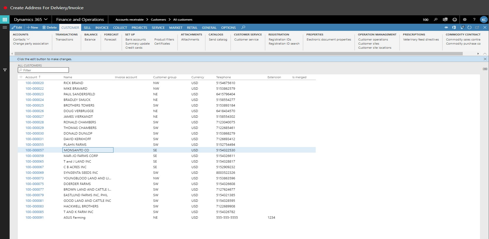
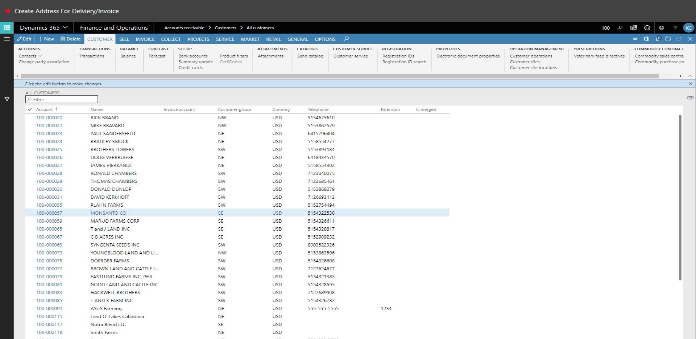
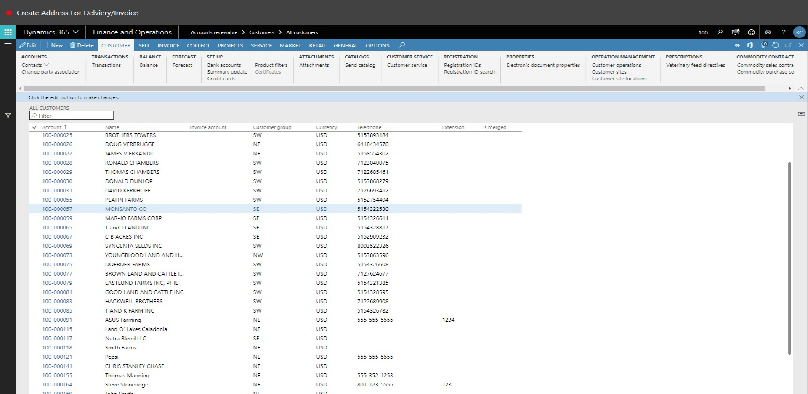
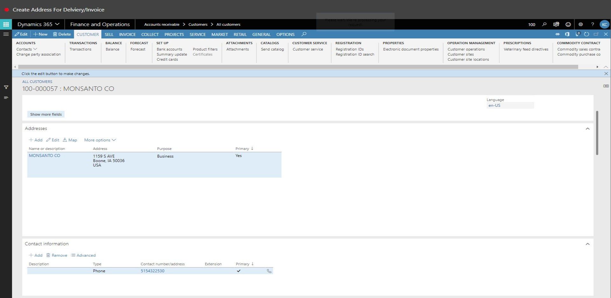
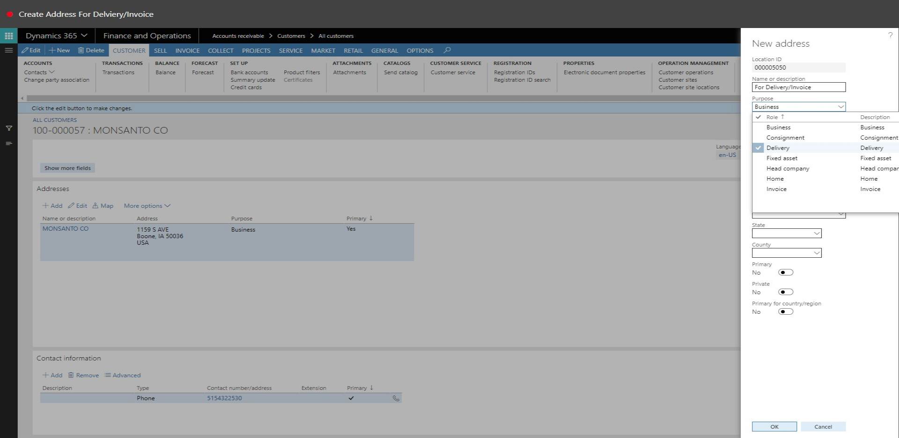
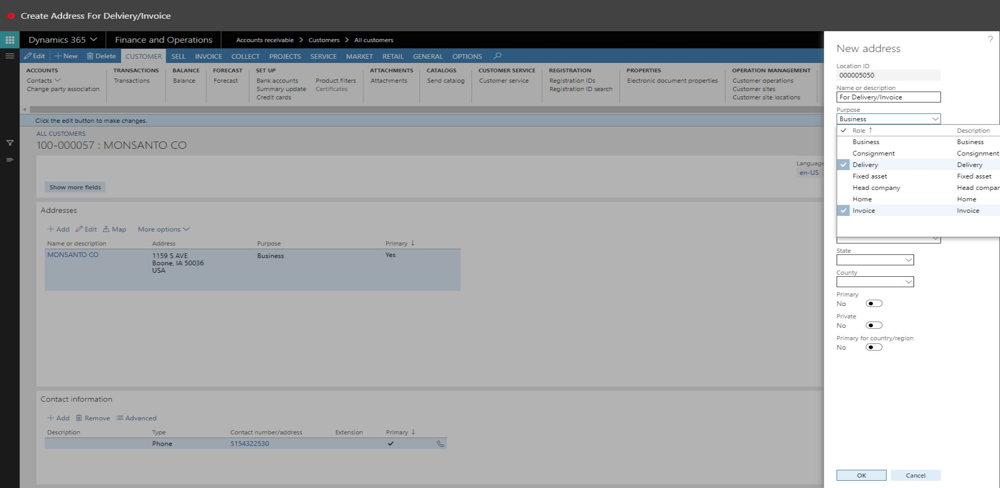
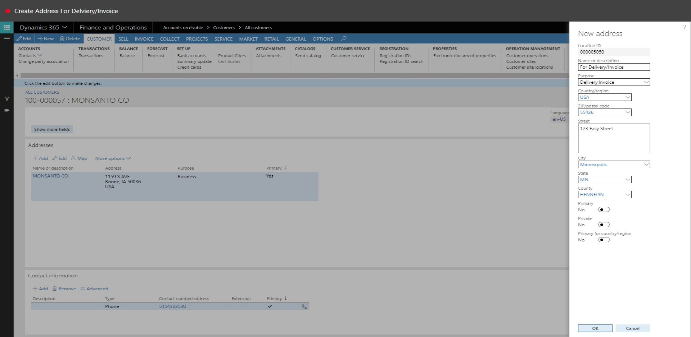

# Add Address for Delivery and Invoice
Brief introduction of the module, component or feature being documented.

This document explains ...

# Add Address for Delivery and Invoice

1. Go to Accounts receivable > Customers > All customers.
2. In the list, find and select the desired record.

3. In the list, click the link in the selected row.

4. In the list, click the link in the selected row.

5. In the list, click the link in the selected row.

6. In the list, click the link in the selected row.

7. Click Add.

8. In the Name or description field, type a value.
9. In the Purpose field, enter or select a value.

10. In the list, select row 3.

11. In the list, click the link in the selected row.

12. In the list, select row 7.

13. Click Select.

14. In the Zip/Postal code field, type a value.
15. In the Street field, type a value.
16. Click OK.

