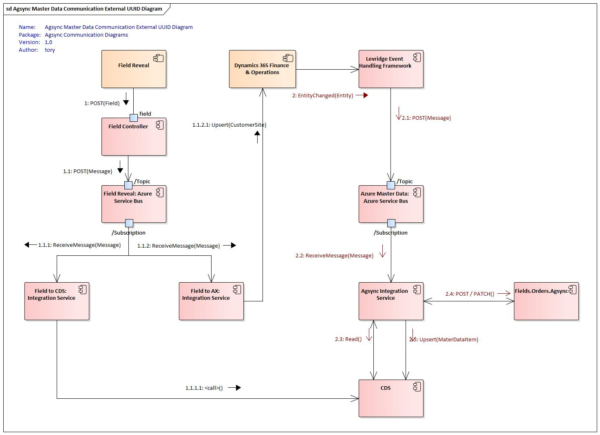
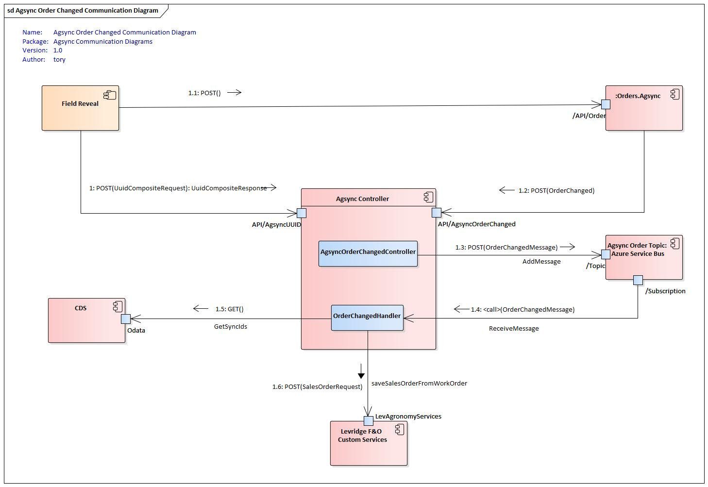

<!-- 
Add instance config reference
Add service bus setup reference (move from bottom)
Specify Hostfile with info for background task
Specific documentation for what Entities to setup in F&O. Include information on filtering customers, operations & sites
  -- Caveat on dependent entities will not necessarily be changed so they won't trigger change control
Add reference to azure key vault setup
Change CRM instructions to Create & Deploy CDS solution
Document Agsync JSON object
Document BOM setup in F&O
-->

## Agsync
AgSync is a dispatching application owned by Raven Industries. AgSync is used by ag retailers to dispatch applicators and their equipment to different fields. More specifically, within AgSync agronomists can schedule out the days for applicators and their equipment pointing them to field A, then B, then C based on the location of the fields and the machinery and products the applicator takes with them.  

Levridge has built an integration between D365 finance and AgSync to connect the systems together. Within the integration, there are multiple types of data moving both ways. Master data moves from D365 to AgSync telling AgSync what customers, fields and products the ag retailer has. AgSync uses work orders to schedule the work on specific fields. Once created, work orders are sent from AgSync to D365 as sales orders. 

It is a bidirectional integration that consists of a Topic for Master Data that goes from D365 F&O to AgSync and Work Orders that go from AgSync to D365 F&O. The Work Order integration utilize a background service running in the same application as the Webhook controller so there is no need for two integration application instances.

There are a few unique aspects to the AgSync integration that is different from other integrations:
- The Workorder integration service runs in the same app service as the controller and the Master Data integration service.
- The Workorder integration service does all the transformation directly rather than using an EntityMapper.
- The Workorder integration service makes a direct service call to D365 F&O rather than using a data source. 
- We are using CDS to provide lookup services for mapping entity identifiers between systems.
- We utilize a filter on the event in F&O to send only the customers that need to to be sent from F&O to AgSync.

This document will provide an overview of the integration framework used to move the data and then it will describe the data moving within the integration. Let's start with the technology behind the integration.

### Integration Description
Levridge's Integration Framework can be viewed in [Integration Overview](./Integration-Overview.md). 

#### Standard Master Data Integration 
The standard master data integration configuration is shown below.

#### External UUID Master Data Integration
There is an alternate configuration that may be required when integrating with 
Field Reveal when Field Reveal is the master source for customer fields.

In this scenario Field Reveal will provide the UUIDs it generates so we can provide
those values to Agsync when we create the corresponding records in Agsync.

This scenario is complicated and should be avoided if possible. The reason it is
necessary is because when Field Reveal creates a work order in Agsync directly
it uses an old Agsync API that uses a UUID as the Sync ID. Field Reveal generates 
the UUID and needs to provide those to Levridge so they can be used when creating
the master record in Agsync.

In this scenario, it is imperative that the Customer and Customer Operation is not sent
from F&O until they have been updated in Field Reveal and a Field created in Field Reveal.
Once a record is created in Agsync the UUID for it cannot be modified.

The order of creation is as follows:
1. Customer and Customer Operation are created in FinOps.
2. Grower and Farm are created in Field Reveal and SyncIds are added in Field Reveal.
3. Field is created in Field Reveal. 
   1. This will cause a Field record to be sent from Field Reveal to the Levridge [Field controller](./Field-Integration.md).
   2. The Field data will be placed on a service bus topic that has two subscriptions:
      1. One subscription will be serviced by the FieldToCDS integration service.
         1. This will use the UUID information to create a lookup record in CDS.
      2. The other subscription will be serviced by the FieldToAX integration service
         1. This will create the Customer Site in FinOps.
   3. When the record is created in FinOps it will trigger the event that sends the data to Agsync.
      1. The creation of the Customer Site entity causes the event to be evaluated.
      2. The filter that checks to make sure a Customer has an operation that has a site that corresponds to a field passes.
   4. The Customer, Operation and Site are all sent to the FinOpsToAgsync service bus topic.
   5. The AxToAgsync integration service receives the message and looks up the UUIDs from CDS then sends the records to Agsync for creation.
   6. Agsync creates the records and sends back a GUID.
   7. The AxToAgsync integration updates CDS with the GUID values.

This communication diagram depicts this interaction:

### Common Data Service (CDS)
The [Common Data Service (CDS)](https://docs.microsoft.com/en-us/powerapps/maker/common-data-service/data-platform-intro) is a solution from Microsoft built on top of the Power Platform. CDS tables are used in the integrations between D365 and AgSync to translate values that are different between the 2 systems. For example, in AgSync, customers have unique identifiers called GUIDs.  These values are different from the unique identifiers D365 has for the same customer accounts. Levridge has implemented new tables in CDS to translate the D365 Customer account to the AgSync GUID.   

For the CDS environment there are two purchasing options:  
1. If the ag retailer has an existing CRM/CE instance, use it. A portion of the CRM instance can be firewalled off for security purposes and then it can be used to host the CDS solution.
2. Buy a specific CDS environment for only the CDS solution. This is more expensive.

There are 7 types of data stored in CDS:
1. Dispatch Accounts
2. Customers
3. Customer Operations
4. Customer Sites
5. Customer Site Locations
6. Master Items
7. Workers

All these types are stored differently in AgSync than they are in D365 so they must be translated using the data in CDS. Products and Employees must be manually entered into the CDS database while Dispatch Accounts, Customers, Customer Operations Customer Sites and Customer Site Locations can be populated using a script that queries the data in AgSync and populates the data in CDS. All this data must exist in CDS prior to using the work order integrations. 

The Master Item entity translates AgSync operations to D365 Product and Service Items. This states which task you are performing and included in every work order. 
- Product ID Numbers (this relates to the Master item in D365). AgSync has the ability to generate blends (ex: blending multiple ingredients to produce the fertilizer to be used on a field). There is a Master Item Table in CDS configured specifically for the operation. If there is a blend flag on an order change, it will pull from the Master Item Table. 
                                               
The Worker Table is a translation table required to map the applicator (worker) set up in AgSync to D365. This provides the information of who applied the product to the field and their applicator license number. An applicator license number is required on the sales order. 

Three entities need to be manually entered in CDS. 

The CDS setup includes:
- CRM Levridge
- AgSync Solution
- Choose appropriate UI Form

Once the CDS solution is deployed to an environment, an [Application User](https://docs.microsoft.com/en-us/powerapps/maker/common-data-service/data-platform-intro) will need to be created. 

### Work Order Integration
Below is the process to generate a work order in AgSync: 
- Select Customer
- State where the application or service location will be completed out of
- Include what work is being done
- State the work order status (planned or released)
  - Planned: These are premade orders ready for a certain time. The action is not ready to be performed. Not all users can view planned status due to security measures in place (ex: dispatcher unable to see planned work status). 
  - Released: The work orders are released and assigned to complete field work. 
  - The work order comes to F&O regardless of status. 
- State the performed operation 
- State the products being utilized
- Indicate the impacted crop(s)
- Add in any additional notes
- Save Order

After a work order is saved, AgSync calls the Levridge AgsyncOrderChanged webhook sending over the work order data. The Levridge AgsyncOrderChanged webhook transforms the work order data and sends it to F&O where it creates or updates a corresponding sales order. If F&O accounts receivables are configured to perform a credit check and the credit check fails, F&O will send back a response indicating that the credit check did not pass. Then a rejection request is sent to Agsync to mark the work order as rejected. 

When F&O receives an updated work order from Agsync, F&O will remove all existing sales order line(s) and create new sale order line(s) to match the Agsync updated work order. This is done to keep the F&O sale order in sync with the possible changes that came through with Agsync updated work order. 
If a F&O sale's order has an active dispensing work order associated to it, then F&O will not delete or create new sales order line(s).

An important item to note: A business process needs to be in place in the situation if AgSync creates a scheduled work order which gets scheduled, and then a dispensing work order is created and gets sent to Kahler. F&O will not pick up new changes if AgSync tries to go back to a release status and make changes and try to reschedule it. AgSync needs to cancel the Kahler order and F&O dispensing order and reschedule their AgSync work order. 

### Microsoft Azure App Service
The [Levridge Integration Framework](./Integration-Overview.md) has been written as a web application that hosts HTTP endpoints as REST APIs and background processes that handle integrations. It is most commonly run in the cloud as an Azure App Serivce. It can also run as a windows service or as an IIS application. See [this article](./Integration-Overview.md) to learn more about the deployment options.

Most of the setup will occur in Azure App Service. This is a requirement for AgSync in which AgSync pulls from Levridge’s Azure Service Bus.  Azure App Service is an HTTP-based service for hosting web applications. Azure hosts our web app integration. The steps needed to create an App Service can be found under the [Integration Overview](./Integration-Overview.md).  

After the App ID has been generated along with the [deployed integration code to App Service](./Deploying-Integration-Framework.md), there is an application configuration file named [appsettings.json])./appsettings.json.md). This file is located within the generated Azure Service. In the App Services portion of the Azure Portal there is a Kudos button on the left-hand side, with a [function to ZipDeploy code](./Deploy-Integration-Framework-as-Zip-File.md). This is where one would deploy the integration code. After deployed, back in Azure Service and right below Kudos button, there is an App Service Editor where one would deploy the App Settings json file to, which will give a list of all the files part of the integration. One of those is called [AppSettings.json](./appsettings.json.md) where the configuration is made for the Azure Service.

### Configuration
- Set up the [logging level](./logging.md). 
- The next section to be configured would outline what direction information is flowing within the service itself. There is a [target configuration](./TargetConfig) and [source configuration](./SourceConfig) which is needed to specify:
    - Which system is the source system and which system is the target system. 
    - Which configuration section contains data connection information.
    - Which section contains the service bus configuration to use.

In the appsettings.json you will need to define the [InstanceConfig](./InstanceConfig.md)  [SourceConfig](./SourceConfig.md) and [TargetConfig](./TargetConfig.md) nodes as follows:

      "InstanceConfig": {
        "AzureTableConfiguration": "[section name to Azure Table Configuration",
        "LogRequestsAndResponses": [true or false]
        "EnableAppInsightsAdaptiveSampling": [true or false]
      },
      "SourceConfig": {
        "ServiceBusConfigName": "[section name with service bus topic and subscription for Agsync Master Data]",
        "ODataConfigName": "[section name with F&O data configuration]",
        "SystemName": "DynamicsAx",
        "Direction": "Source"
      },
      "TargetConfig": {
        "ODataConfigName": "[section name with Agsync endpoint configuration]",
        "CDSConfigName": "[section name with CDS data configuration]",
        "SystemName": "AgSync",
        "Direction": "Target",
      }

You must also include the controller entry to have the controller loaded:

    "Controllers": {
        "HostController": "Levridge.Integration.Host.DefaultController",
        "AgSyncConroller": "Levridge.Integration.Host.AgSyncController"
    }

You must also configure two objects for Agsync integration:

 - [AgSyncEndpoint](./AgSyncEndpoint.md)
 - [agsync](./agsyncConfigObject.md)

Here is a sample template for the entire appsettings.json file used for the integration
from FinOps to Agsync:

    {
        "Controllers": {
            "HostController": "Levridge.Integration.Host.DefaultController",
            "AgSyncConroller": "Levridge.Integration.Host.AgSyncController"
        },
        "Logging": {
            "Debug": {
                "LogLevel": {
                    "Default": "Information"
                }
            },
            "Console": {
                "IncludeScopes": true,
                "LogLevel": {
                    "Default": "Information"
                }
            },
            "LogLevel": {
                "Default": "Information"
            }
        },
        "AllowedHosts": "*",
        "SourceConfig": {
            "ServiceBusConfigName": "AgsyncMasterDataServiceBus",
            "ODataConfigName": "DynamicsAX",
            "SystemName": "DynamicsAx",
            "Direction": "Source"
        },
        "TargetConfig": {
            "ODataConfigName": "AgSyncEndpoint",
            "SystemName": "AgSync",
            "Direction": "Target",
            "CDSConfigName": "CDS"
        },
        "DynamicsAX": {
            "UriString": "[URL to D365 F&O]",
            "ActiveDirectoryResource": "[URL to D365 F&O]",
            "ActiveDirectoryTenant": "https://login.microsoftonline.com/[Customer_Tenant_ID]",
            "ActiveDirectoryClientAppId": "[Application ID used to register the application in AD]",
            "ActiveDirectoryClientAppSecret": "[Client Secret generated for the Application ID in AD]",
            "ODataEntityPath": "[URL to D365 F&O]/data/"
        },
        "CDS": {
            "UriString": "[URL to CDS or Localhost]",
            "ActiveDirectoryResource": "[URL to CDS]",
            "ActiveDirectoryTenant": "https://login.microsoftonline.com/[Customer_Tenant_ID]",
            "ActiveDirectoryClientAppId": "[Application ID used to register the application in AD]",
            "ActiveDirectoryClientAppSecret": "[Client Secret generated for the Application ID in AD]",
            "ODataEntityPath": "[URL to CDS]/api/data/v9.0/",
            "AssemblyName": "Levridge.ODataDataSources.CDS",
            "ClientClassesNameSpace": "Levridge.ODataDataSources.CDS",
            "MetadataResource": "CDSMetadata.xml"
        },
        "AgSyncEndpoint": {
           "MustUseWktProcessor": true,
            "baseUri": "https://fields.agsync.com/api/",
            "tokenUrl": "https://auth.agsync.com/core/connect/token",
            "ClientId": "[client ID assigned by Agsync]", // customer specific
            "ClientPass": "[Client Secret assigned by Agsync]", // customer specific
            "ValutURL": "[URL to customer Azure Key Vault]",
            "AgSyncTokenKey": "AgsyncAccessToken",
            "RedirectUri": "[URL to AgsyncAuth controller]", // customer specific
            "IntegrationId": "CustomerIntegrationID" // customer specific
        },
        "agsync": { // used by Webhook
            "MustUseWktProcessor": true,
            "ConnectionString": "[connection string to Agsync master data topic]",
            "TopicName": "[Agsync master data topic]",
            "RequiresSession": true,
            "RedirectUri": "[URL to AgsyncAuth controller]",
            "TokenUrl": "https://auth.agsync.com/core/connect/token",
            "AuthorizeUrl": "https://auth.agsync.com/core/connect/authorize",
            "baseUri": "https://fields.agsync.com/api/",
            "ClientId": "[client ID assigned by Agsync]",
            "ClientPass": "[Client Secret assigned by Agsync]",
            "ValutURL": "[URL to customer Azure Key Vault]",
            "AgSyncTokenKey": "AgsyncAccessToken"
        },
        "AgsyncMasterDataServiceBus": {
            "ConnectionString": "[connection string to Agsync master data topic]",
            "TopicName": "[Agsync master data topic]",
            "SubscriptionName": "[Agsync master data subscription name]",
            "RequiresSession": true
        }
    }

### Microsoft Azure Service Bus
Microsoft Azure Service Bus is a message bus for businesses to exchange documents and messages in the Cloud. There are two main tiers: 
- Standard Service Bus: Supports 250 Kilobytes of data
- Premium Service Bus: Supports 1 Megabyte of data

Most Levridge clients will be able to utilize the Standard Service Bus tier, however, if a client is integrating well-known-text (WKT) files with their work orders it may push the workorder size over the 250K data limit and they should look at upgrading to Premium Service Bus. Microsoft outlines how to [create an Azure Service bus](https://docs.microsoft.com/en-us/azure/service-bus-messaging/service-bus-quickstart-topics-subscriptions-portal).   

The Azure Key Vault is a tool for securely storing and accessing secrets. A secret is anything that you want to tightly control access to, such as API keys, passwords, or certificates. The vault enables us to securely store passwords, certificates, etc. with secure access. The key vault stores the authorization credentials for AgSync and by providing the secret to AgSync it lets AgSync know it is Levridge talking to them. This is required for all AgSync integrations. One can read how to setup the [Azure Key Vault](./KeyVault.md).

When customer entities are sent from D365 to the Azure service bus, the agsync integration queries CDS to find the stored Customer ID. If there is no matching customer record the record is sent as a Create to AgSync. The customer is created in AgSync and the response from Agsync contains the Agsync specific ID for that customer. The newly generated AgSync ID is saved in combination with the D365 customer account in CDS. If CDS did have an existing record for the D365 customer, the message is updated to include the Agsync ID for that customer and the messages is sent to Agsync as an Update.

Once a sales order is created in F&O, we will message back to AgSync and update them with the sales order number and the dispensing work order number (if available at the time of creation). This requires an entity setup in the event framework.

Integration purchase requirements include: 
1. CDS Instance 
    - CRM License
2. Azure Subscription 
    - Service Bus
    - App Service
    - Key Vault
3. AgSync Subscription
 
### Setup
Internal setup time for configuration is 24 hours. To integrate from D365 F&O to Agsync you will need to:

 - [Create an Azure Service bus topic](https://docs.microsoft.com/en-us/azure/service-bus-messaging/service-bus-quickstart-topics-subscriptions-portal)
 - [Create a subscription on the topic above](https://docs.microsoft.com/en-us/azure/service-bus-messaging/service-bus-quickstart-topics-subscriptions-portal)
 - [Configure Event Endpoint in F&O](./Configuring-Levridge-Entity-Event-Endpoint.md)
 - [Configure Levridge Entity Events](./Configuring-Levridge-Entity-Events.md)
   - Create Filter on Entity Event to only send agronomy customers 
   <!-- TODO: Document how to create filter -->
 - Get Client ID and CLient password from Agsync
 - Get Customer Specific Integration ID from Agsync
 - Client Redirect URL is [Azure Webapp base URL]/api/AgsyncAuth
 - [Setup Azure Keyvault](./AzureKeyVault.md) 
 - [Create an application ID](https://docs.microsoft.com/en-us/azure/active-directory/develop/quickstart-register-app) for the integration framework to authenticate to D365 CRM
 - [Create an application user in D365 CRM](https://docs.microsoft.com/en-us/dynamics365/customer-engagement/developer/use-multi-tenant-server-server-authentication#create-an-application-user--associated-with-the-registered-application--in-) and assign the proper role(s)

A webhook is an API provided by the Levridge Integration Framework that gives AgSync the ability to send workorders to Levridge. AgSync sends workorders to the Levridge API  which places the order on the service bus. 

The customer’s specific URL needs to be whitelisted by AgSync. To whitelist a URL, one would log into AgSync and create a helpdesk ticket requesting AgSync to add the AgsyncOrderChanged URL into their setup file. The expected service time is between 24-48 hours. Escalate after 48 hours.

General setup timelines:
- Deploying code to App Service takes the longest. 400 table lines for all three. 
- The worker table is refreshed once a quarter 
- Service item data is refreshed once a year
- Master item data is refreshed once every three year

Data Moving Within the Integration:
There are 4 types of master records sent from D365 to AgSync:
1. Customers
2. Customer Operations
3. Customer Sites
4. LevAgSyncSalesDetailEntity
    - The LevAgSyncSalesDetailEntity stores sales, order number, dispensing work order numbers, and a unique work order ID that identifies the AgSync work order that needs to update. 

A Dispensing Account ID field has been added in F&O on the customer account under the sales order tab. Its purpose is to indicate which dispensing branch the customer receives services from. The dispensing branch within AgSync can be set up as either: 
- An inventory site indicating where the product is physically located
- Commission/Sales groups indicating the agronomist that sold the service to the customer (Confirm and clarify this statement) 

#### Integration Framework Setup for Sending Customers: 
“Out of the Box Customer V3” is being utilized and the code in the integration is choosing the data fields the entities pass through. The Dispatching Account ID is included on the customer form to only send accounts that have a dispatching account tied to it to AgSync. This is filtered by the Event Framework V3 Entity. An example is a client might have 100K in their database but for work order purposes there are only 30K that will ever work with AgSync. Filtering is again used in the Event Framework V3 Entity in the Customer Operation. This is a more sophisticated filter due to multiple types of operations an individual customer could have. 

Customer Operation is setup by four different filters: 
1. Customer Operation Type
2. A filter is added so customer information which do not have a site is not sent. 
    - Example: Customer operations will not be sent to AgSync if they do not have sites tied to them. 
3. Customer Site Types
4. Dispensing Site ID 

#### Release Status Process
- A work order is created at release status. 
- Take release in AgSync and schedule work order. (Scheduling is assigning it out to an applicator to be applied).
- Dispatcher is going to see all released orders. 
- Dispatcher takes orders, creates task packet, assigns to worker, annotates which piece of application equipment is going to be running, and saves as scheduled packet.
- The message is once again generated to webhook in F&O. 
- Status is updated to “scheduled” if a blend. 
    - This creates an automatically explode bomb at scheduled date. (ex: if a client is using automatic fertilizer, dispensing ticket is released at the scheduled state which kicks off another integration to Kahler, so they can blend and send product out to field that is going to be applied.)

### Controllers
#### Agsync Auth Controller
The AgsyncAuth controller is used to generate a token needed to integrate with Agsync.

#### Agsync Auth Test Controller
The AgsyncAuthTest controller is used to ...

#### Agsync Order Changed Controller
The AgsyncOrderChanged controller is used by Agsync to send work orders as they are created or updated.
This controller will bundle the work order into a message and place it in the message topic.

#### Agsync Sync Accounts Controller
The AgsyncSyncAccounts controller is used to query Agsync for master data and write the information into CDS.
This is done during go-live to populate the lookup data in CDS.

#### Agsync UUID Controller
The AgsyncUUID controller provides UUIDs based on Sync Ids passed to the controller. This is used by 
Field Reveal to obtain the UUID from the Sync ID entered into Field Reveal.