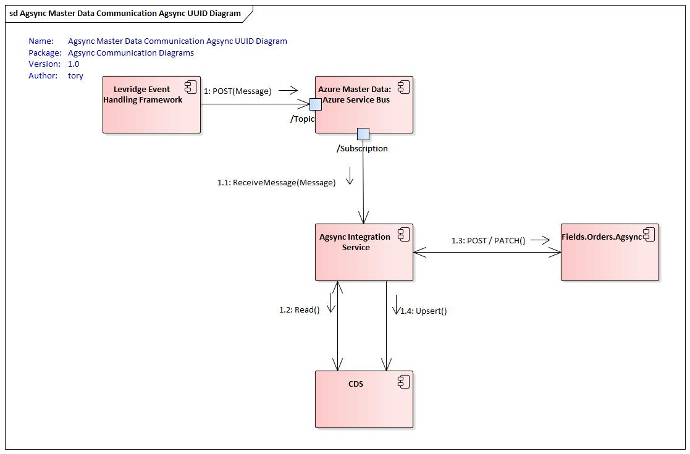

<!-- 
Add instance config reference
Add service bus setup reference (move from bottom)
Specify Hostfile with info for background task
Specific documentation for what Entities to setup in F&O. Include information on filtering customers, operations & sites
  -- Caveat on dependent entities will not necessarily be changed so they won't trigger change control
Add reference to azure key vault setup
Change CRM instructions to Create & Deploy CDS solution
Document Agsync JSON object
Document BOM setup in F&O
-->

## Agsync
The Scale integration is a bidirectional integration that consists of a Topic for
Master Data that goes from D365 F&O to Agsync and Service Calls for Work Orders that go from 
Agsync to D365 F&O. The Work Order integration utilize a background service running
in the same application as the Webhook controller so there is no
need for two integration application instances.

There are a few uniqe aspects to the Agsync integration that is different from other integrations:
- The Workorder integration service runs in the same app service as the controller and the Master Data integration service
- The Workorder integration service does all the transformation directly rather than using an EntityMapper
- The Workorder integration service makes a direct service call to D365 F&O rather than using a data source
- We are using CDS to provide lookup services for mapping entity identifiers between systems.
- We utilize a filter on the event in F&O to send only the customers 
  that need to sent from F&O to Agsync.

### Integration Description
#### Standard Master Data Integration 
The standard master data integration configuration is shown below.
 

#### External UUID Master Data Integration
There is an alternate configuration that may be required when integrating with 
Field Reveal when Field Reveal is the master source for customer fields.

In this scenario Field Reveal will provide the UUIDs it generates so we can provide
those values to Agsync when we create the corresponding records in Agsync.

This scenario is complicated and should be avoided if possible. The reason it is
necessary is because when Field Reveal creates a work order in Agsync directly
it uses an old Agsync API that uses a UUID as the Sync ID. Field Reveal generates 
the UUID and needs to provide those to Levridge so they can be used when creating
the master record in Agsync.

In this scenario, it is imperative that the Customer and Customer Operation is not sent
from F&O until they have been updated in Field Reveal and a Field created in Field Reveal.
Once a record is created in Agsync the UUID for it can not be modified.

The order of creation is as follows:
1. Customer and Customer Operatoin are created in FinOps.
2. Grower and Farm are created in Field Reveal and SyncIds are added in Field Reveal.
3. Field is created in Field Reveal. 
   1. This will cause a Field record to be sent from Field Reveal to the Levridge [Field controller](./Field-Integration.md).
   2. The Field data will be placed on a service bus topic that has two subscriptions
      1. One subscription will be serviced by the FieldToCDS integration service
         1. This will use the UUID information to create a lookup record in CDS
      2. The other subscription will be serviced by the FieldToAX integration service
         1. This will create the Customer Site in FinOps
   3. When the record is created in FinOps it will trigger the event that sends the data to Agsync
      1. The creation of the Customer Site entity causes the event to be evaluated
      2. The filter that checks to make sure a Customer has an operation that has a site that corresponds to a field passes
   4. The Customer, Operation and Site are all sent to the FinOpsToAgsync service bus topic
   5. The AxToAgsync integration service receives the message and looks up the UUIDs from CDS then sends the records to Agsync for creation
   6. Agsync creates the records and sends back a GUID.
   7. The AxToAgsync integration updates CDS with the GUID values.

This communication diagram depicts this interaction:

#### Work Order Integration

### Controllers
#### Agsync Auth Controller
The AgsyncAuth controller is used to generate a token needed to integrate with Agsync.

#### Agsync Auth Test Controller
The AgsyncAuthTest controller is used to ...

#### Agsync Order Changed Controller
The AgsyncOrderChanged controller is used by Agsync to send work orders as they are created or updated.
This controller will bundle the work order into a message and place it in the message topic.

#### Agsync Sync Accounts Controller
The AgsyncSyncAccounts controller is used to query Agsync for master data and write the information into CDS.
This is done during go-live to populate the lookup data in CDS.

#### Agsync UUID Controller
The AgsyncUUID controller provides UUIDs based on Sync Ids passed to the controller. This is used by 
Field Reveal to obtain the UUID from the Sync ID entered into Field Reveal.

### Setup
To integrate from D365 F&O to Agsync you will need to:

 - [Create an Azure Service bus topic](https://docs.microsoft.com/en-us/azure/service-bus-messaging/service-bus-quickstart-topics-subscriptions-portal)
 - [Create a subscription on the topic above](https://docs.microsoft.com/en-us/azure/service-bus-messaging/service-bus-quickstart-topics-subscriptions-portal)
 - [Configure Event Endpoint in F&O](./Configuring-Levridge-Entity-Event-Endpoint.md)
 - [configure Levridge Entity Events](./Configuring-Levridge-Entity-Events.md)
   - Create Filter on Entity Event to only send agronomy customers 
   <!-- TODO: Document how to create filter -->
 - Get Client ID and CLient password from Agsync
 - Get Customer Specific Integration ID from Agsync
 - Client Redirect URL is [Azure Webapp base URL]/api/AgsyncAuth
 - [Setup Azure Keyvault](./AzureKeyVault.md) 
 - [Create an application ID](https://docs.microsoft.com/en-us/azure/active-directory/develop/quickstart-register-app) for the integration framework to authenticate to D365 CRM
 - [Create an application user in D365 CRM](https://docs.microsoft.com/en-us/dynamics365/customer-engagement/developer/use-multi-tenant-server-server-authentication#create-an-application-user--associated-with-the-registered-application--in-) and assign the proper role(s)

### Configuration
In the appsettings.json you will need to define the [InstanceConfig](./InstanceConfig.md)  [SourceConfig](./SourceConfig.md) and [TargetConfig](./TargetConfig.md) nodes as follows:

      "InstanceConfig": {
        "AzureTableConfiguration": "[section name to Azure Table Configuration",
        "LogRequestsAndResponses": [true or false]
        "EnableAppInsightsAdaptiveSampling": [true or false]
      },
      "SourceConfig": {
        "ServiceBusConfigName": "[section name with service bus topic and subscription for Agsync Master Data]",
        "ODataConfigName": "[section name with F&O data configuration]",
        "SystemName": "DynamicsAx",
        "Direction": "Source"
      },
      "TargetConfig": {
        "ODataConfigName": "[section name with Agsync endpoint configuration]",
        "CDSConfigName": "[section name with CDS data configuration]",
        "SystemName": "AgSync",
        "Direction": "Target",
      }

You must also include the controller entry to have the controller loaded:

    "Controllers": {
        "HostController": "Levridge.Integration.Host.DefaultController",
        "AgSyncConroller": "Levridge.Integration.Host.AgSyncController"
    }

You must also configure two objects for Agsync integration:

 - [AgSyncEndpoint](./AgSyncEndpoint.md)
 - [agsync](./agsyncConfigObject.md)

Here is a sample template for the entire appsettings.json file used for the integration
from FinOps to Agsync:

    {
        "Controllers": {
            "HostController": "Levridge.Integration.Host.DefaultController",
            "AgSyncConroller": "Levridge.Integration.Host.AgSyncController"
        },
        "Logging": {
            "Debug": {
                "LogLevel": {
                    "Default": "Information"
                }
            },
            "Console": {
                "IncludeScopes": true,
                "LogLevel": {
                    "Default": "Information"
                }
            },
            "LogLevel": {
                "Default": "Information"
            }
        },
        "AllowedHosts": "*",
        "SourceConfig": {
            "ServiceBusConfigName": "AgsyncMasterDataServiceBus",
            "ODataConfigName": "DynamicsAX",
            "SystemName": "DynamicsAx",
            "Direction": "Source"
        },
        "TargetConfig": {
            "ODataConfigName": "AgSyncEndpoint",
            "SystemName": "AgSync",
            "Direction": "Target",
            "CDSConfigName": "CDS"
        },
        "DynamicsAX": {
            "UriString": "[URL to D365 F&O]",
            "ActiveDirectoryResource": "[URL to D365 F&O]",
            "ActiveDirectoryTenant": "https://login.microsoftonline.com/[Customer_Tenant_ID]",
            "ActiveDirectoryClientAppId": "[Application ID used to register the application in AD]",
            "ActiveDirectoryClientAppSecret": "[Client Secret generated for the Application ID in AD]",
            "ODataEntityPath": "[URL to D365 F&O]/data/"
        },
        "CDS": {
            "UriString": "[URL to CDS or Localhost]",
            "ActiveDirectoryResource": "[URL to CDS]",
            "ActiveDirectoryTenant": "https://login.microsoftonline.com/[Customer_Tenant_ID]",
            "ActiveDirectoryClientAppId": "[Application ID used to register the application in AD]",
            "ActiveDirectoryClientAppSecret": "[Client Secret generated for the Application ID in AD]",
            "ODataEntityPath": "[URL to CDS]/api/data/v9.0/",
            "AssemblyName": "Levridge.ODataDataSources.CDS",
            "ClientClassesNameSpace": "Levridge.ODataDataSources.CDS",
            "MetadataResource": "CDSMetadata.xml"
        },
        "AgSyncEndpoint": {
           "MustUseWktProcessor": true,
            "baseUri": "https://fields.agsync.com/api/",
            "tokenUrl": "https://auth.agsync.com/core/connect/token",
            "ClientId": "[client ID assigned by Agsync]", // customer specific
            "ClientPass": "[Client Secret assigned by Agsync]", // customer specific
            "ValutURL": "[URL to customer Azure Key Vault]",
            "AgSyncTokenKey": "AgsyncAccessToken",
            "RedirectUri": "[URL to AgsyncAuth controller]", // customer specific
            "IntegrationId": "CustomerIntegrationID" // customer specific
        },
        "agsync": { // used by Webhook
            "MustUseWktProcessor": true,
            "ConnectionString": "[connection string to Agsync master data topic]",
            "TopicName": "[Agsync master data topic]",
            "RequiresSession": true,
            "RedirectUri": "[URL to AgsyncAuth controller]",
            "TokenUrl": "https://auth.agsync.com/core/connect/token",
            "AuthorizeUrl": "https://auth.agsync.com/core/connect/authorize",
            "baseUri": "https://fields.agsync.com/api/",
            "ClientId": "[client ID assigned by Agsync]",
            "ClientPass": "[Client Secret assigned by Agsync]",
            "ValutURL": "[URL to customer Azure Key Vault]",
            "AgSyncTokenKey": "AgsyncAccessToken"
        },
        "AgsyncMasterDataServiceBus": {
            "ConnectionString": "[connection string to Agsync master data topic]",
            "TopicName": "[Agsync master data topic]",
            "SubscriptionName": "[Agsync master data subscription name]",
            "RequiresSession": true
        }
    }
