# Assign an Item to a Procurement Category
Brief introduction of the module, component or feature being documented.

This document explains ...

## How to Assign an Item to a Procurement Category

1. Go to Product Information Management > Products > Released Products.
2. In the list, find and select the desired record.
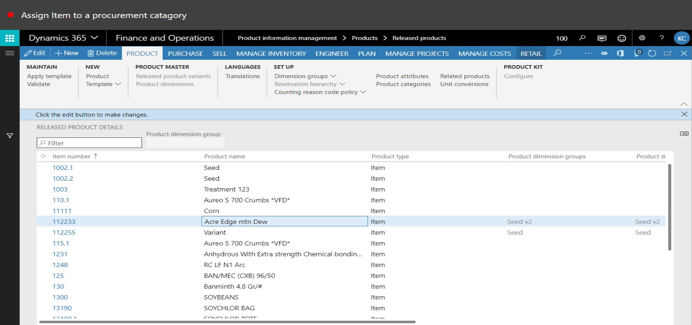
3. Click Product categories.
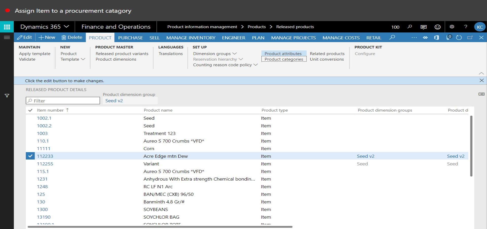
4. Click Edit.

5. In the Category field, enter or select a value.
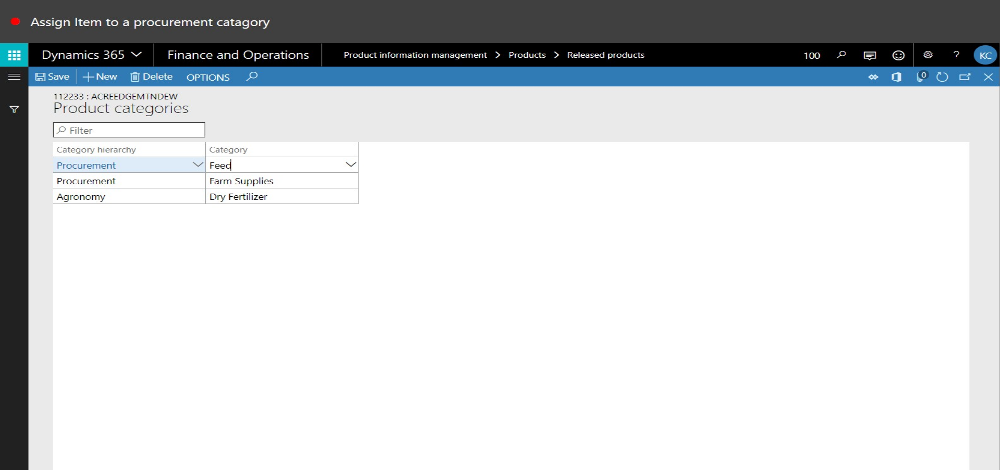
6. In the tree, select 'ALL (New Category)\Farm Supplies (New Category)'.
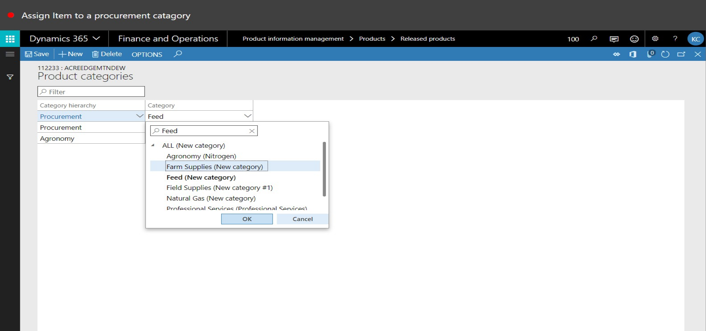
7. Click OK.
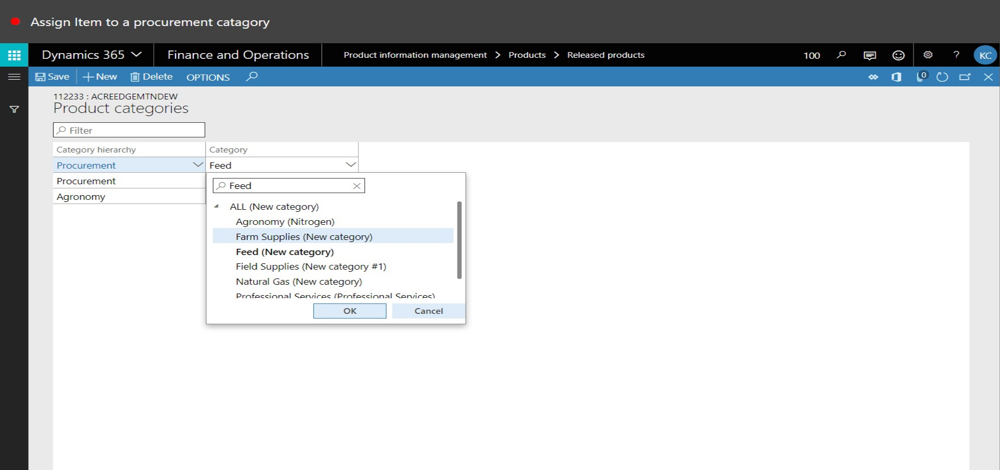
8. Click Save.
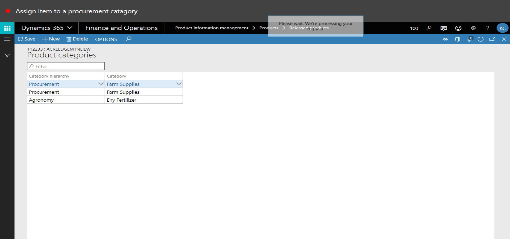
9. In the Category field, enter or select a value.

10. In the tree, select 'ALL (New Category)\Natural Gas (New Category)'.
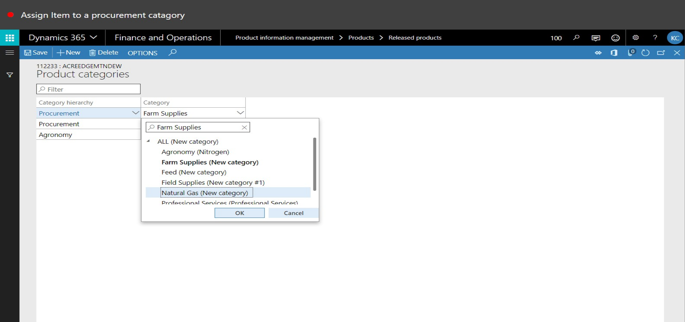
11. Click OK.

12. Click Save.
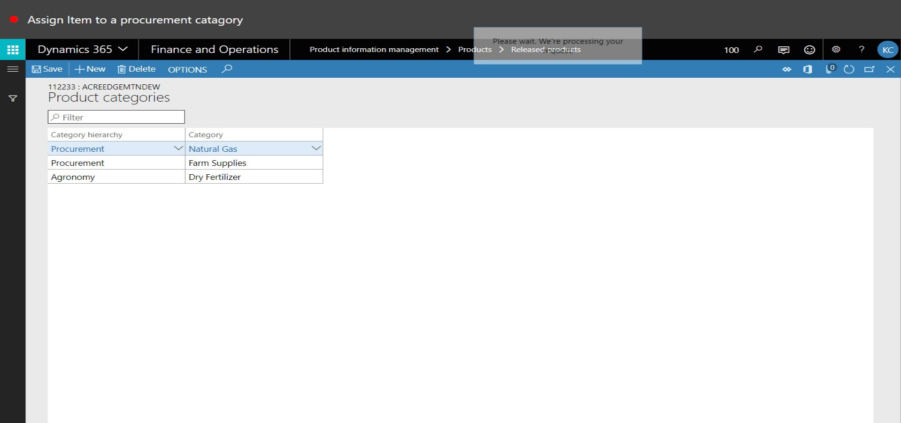
13. Close the page.
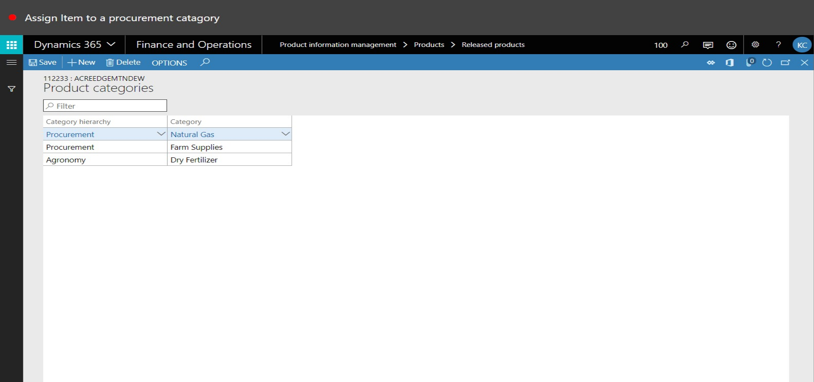
14. Close the page.
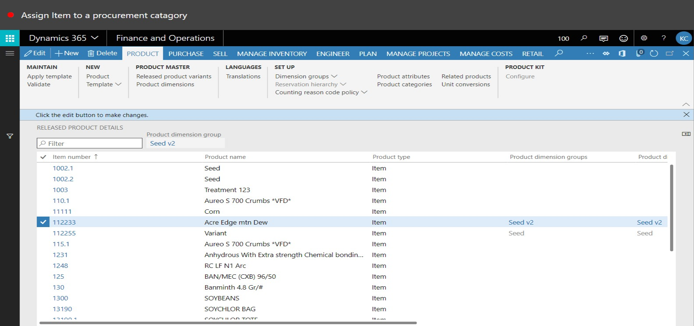
15. Go to Procurement and Sourcing > Procurement Categories.
16. In the tree, expand 'Landus\Corporate'.
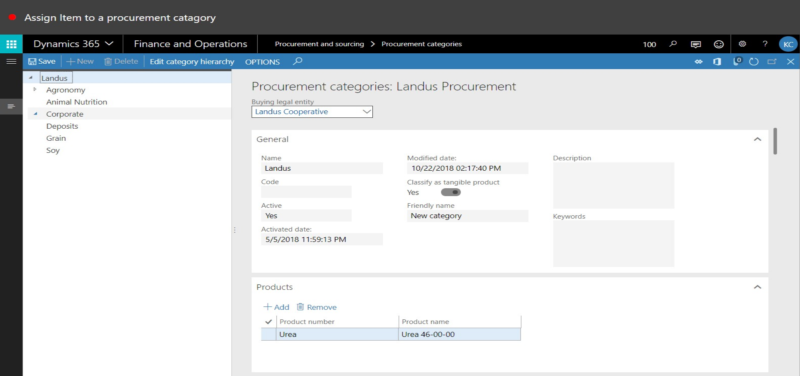
17. In the tree, select 'Landus\Corporate\Equipment lease'.
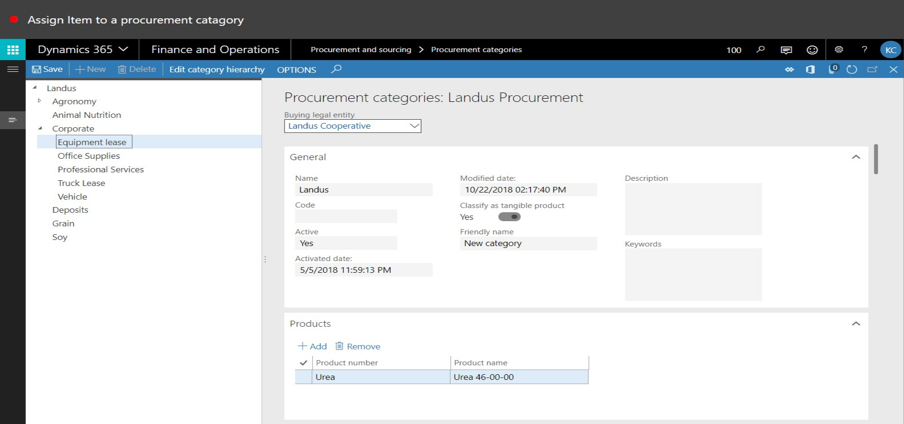
18. Click Add.
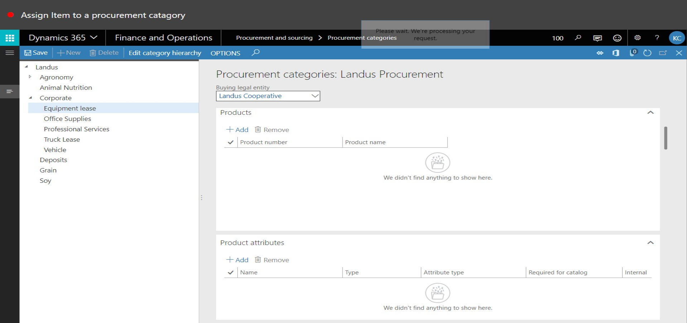
19. In the list, find and select the desired record.
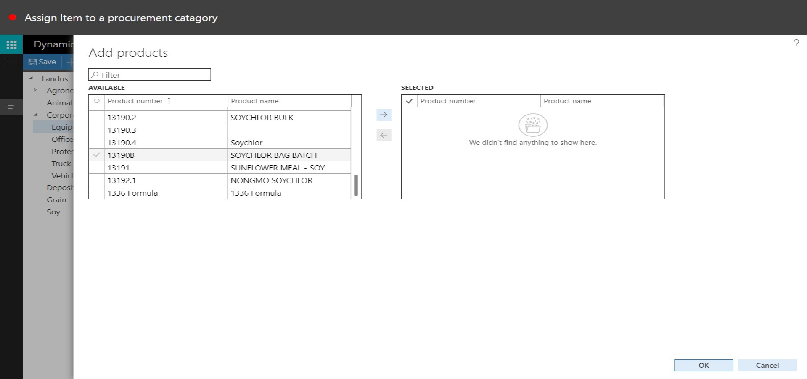
20. In the list, find and select the desired record.
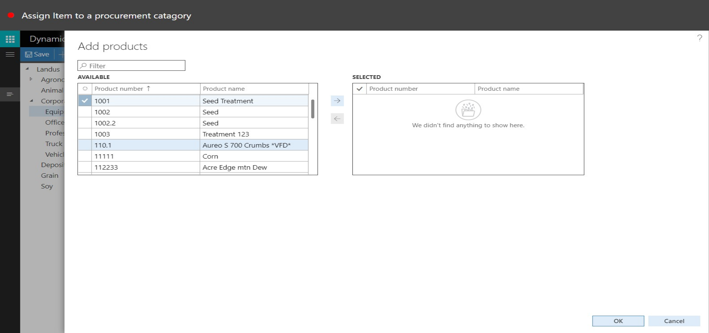
21. Click Add.
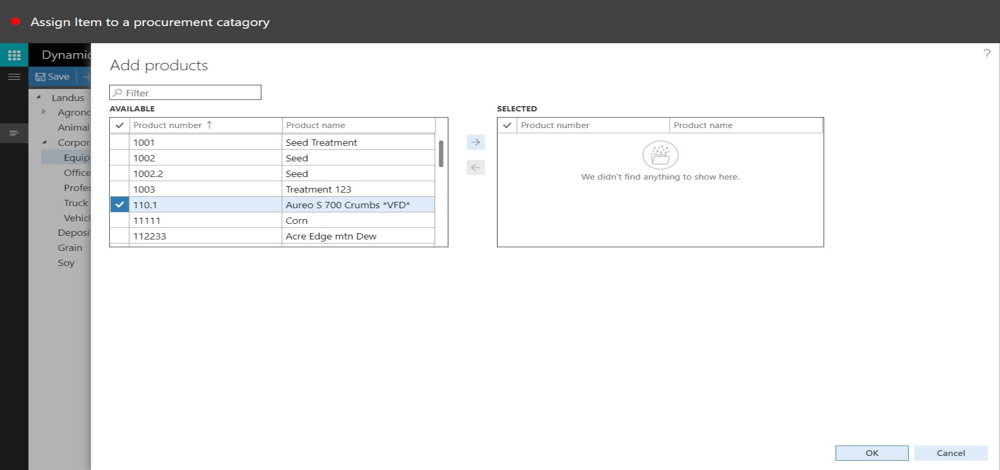
22. Click OK.
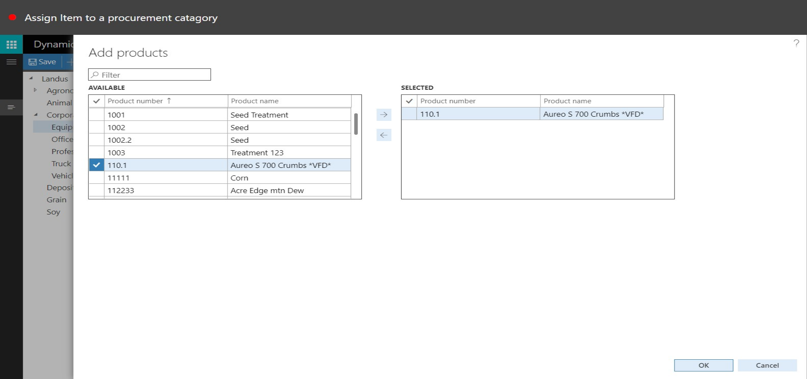
23. Click Save.
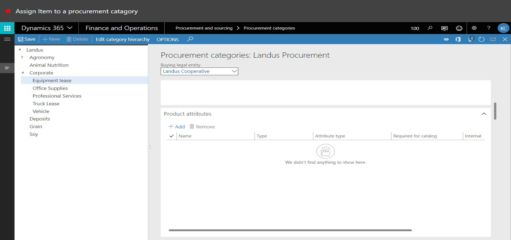
24. Close the page.
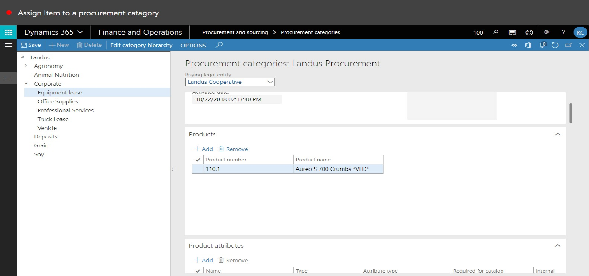
25. Go to Product Information Management > Products > Released Products.
26. Use the Quick Filter to find records. For example, filter on the Item number field with a value of '110.1'
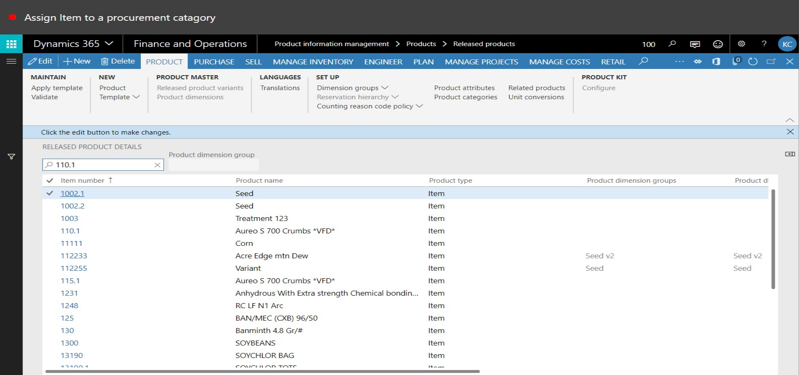
27. Click Product Categories.
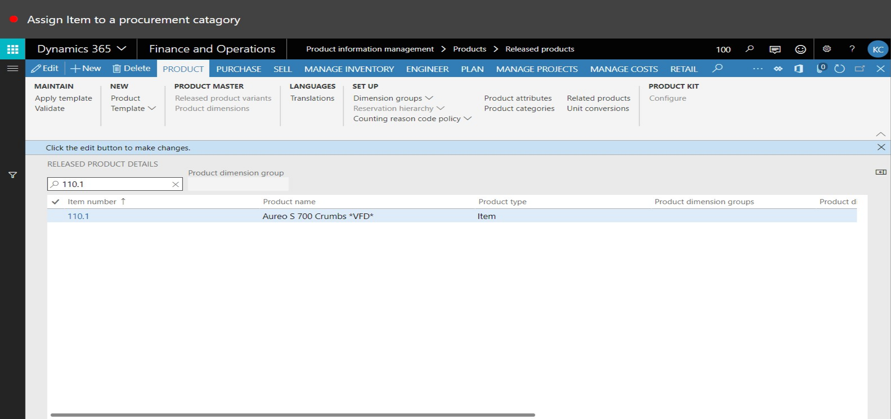