# Assign Posting Profile to Procurement Category
Brief introduction of the module, component or feature being documented.

This document explains ...

## How to Assign a Posting Profile to a Procurement Category

1. Go to Inventory Management > Setup > Posting > Posting.
2. Click the Purchase Order tab.
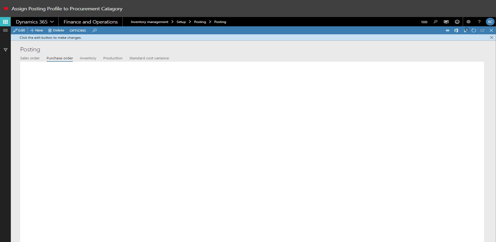
3. In the Select field, select an option.
4. Click New.
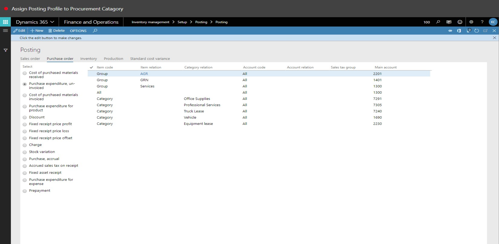
5. In the list, mark the selected row.
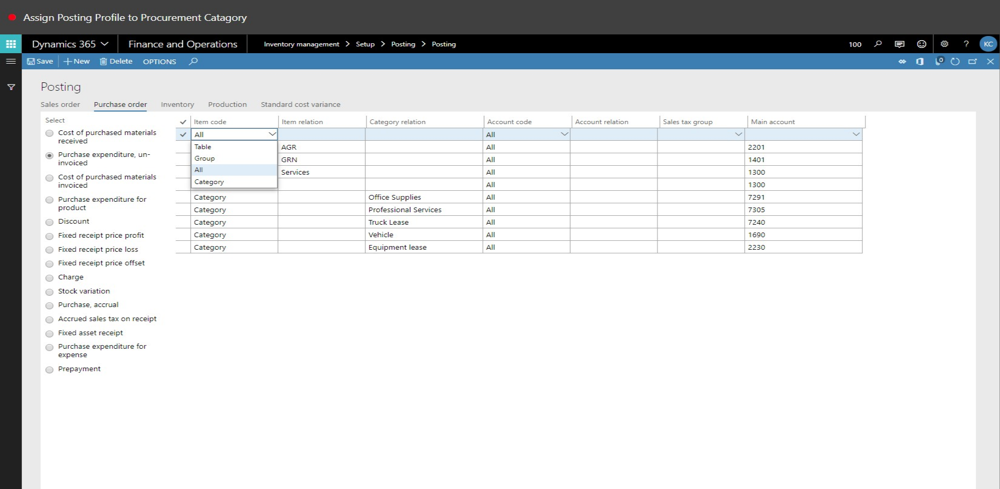
6. In the Item code field, select an option.
7. In the Category Relation field, enter or select a value.
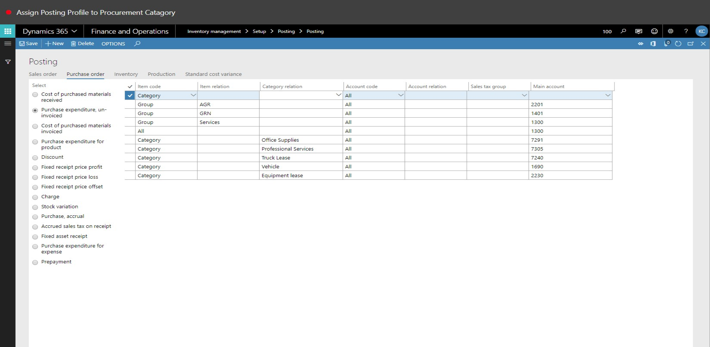
8. In the tree, expand 'Landus (New category)\Corporate (Corporate)'.
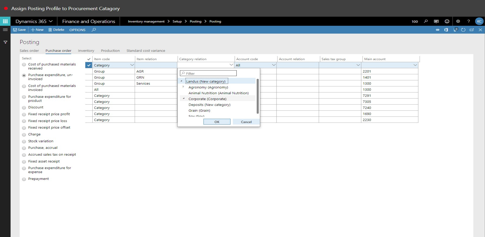
9. In the tree, select 'Landus (New category)\Corporate (Corporate)\Office Supplies (New category)'.
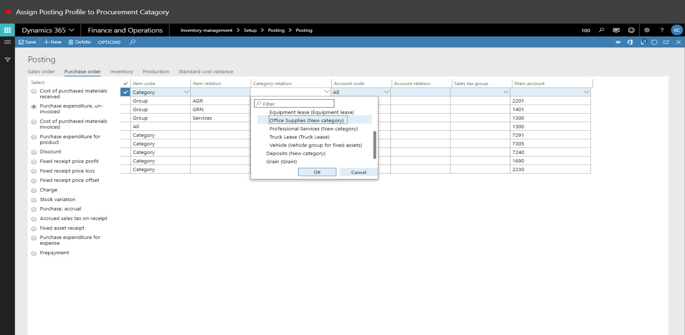
10. Click OK.
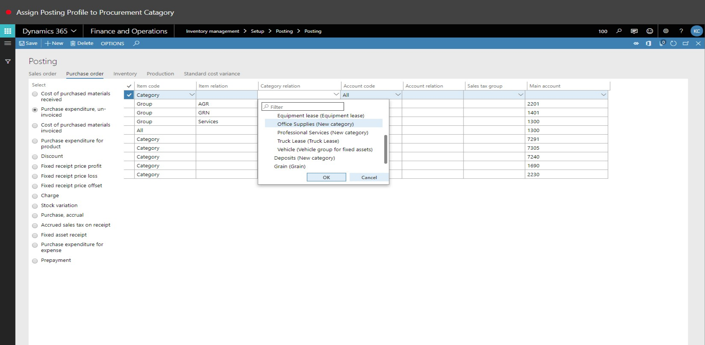
11. In the list, find and select the desired record.
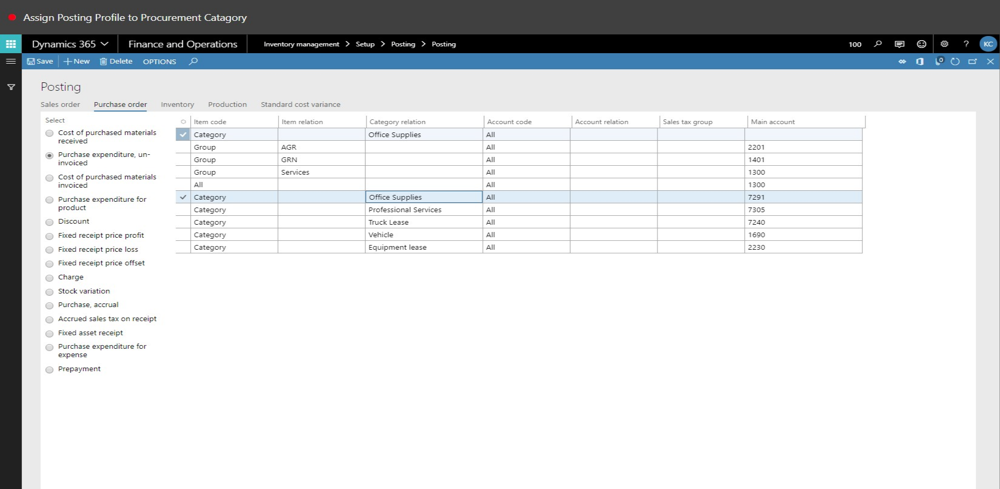
12. In the Category realtion field, enter or select a value.
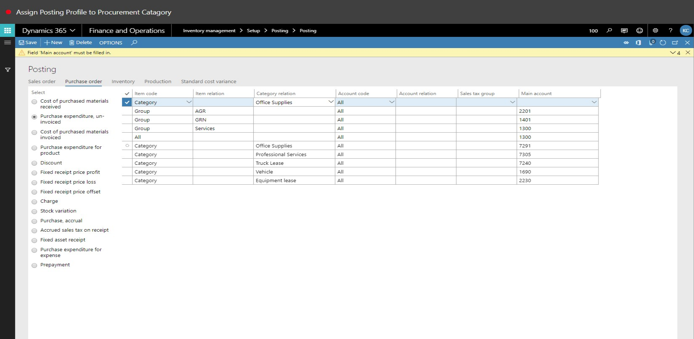
13. In the tree, select 'Lanuds (New Category)\Animal Nutrition (Animal Nutrition)'.
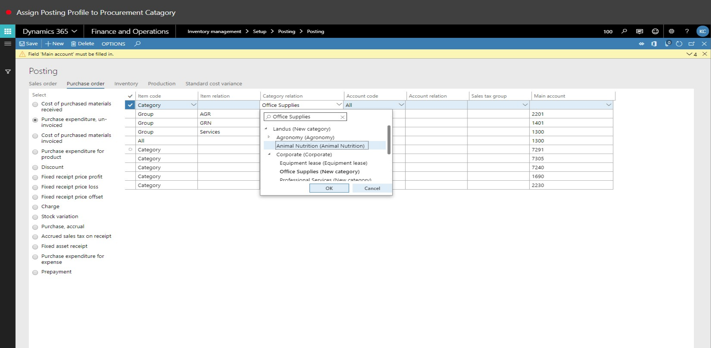
14. Click OK.
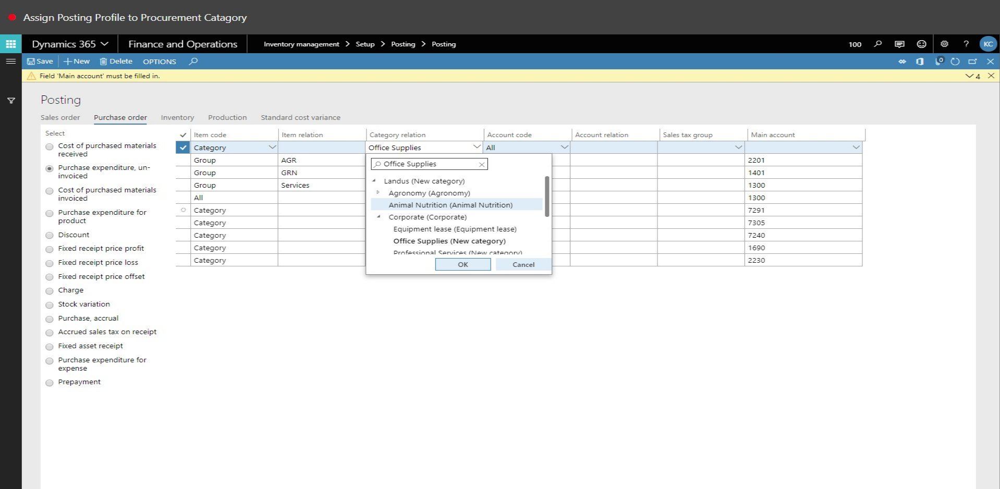
15. In the Main account field, specify the desired values.
16. Click Save.
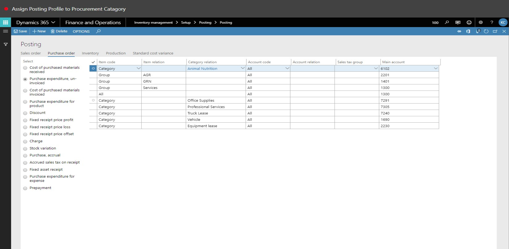
17. In the list, find and select the desired record.
18. Close the page.
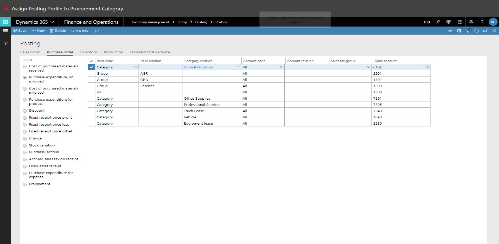