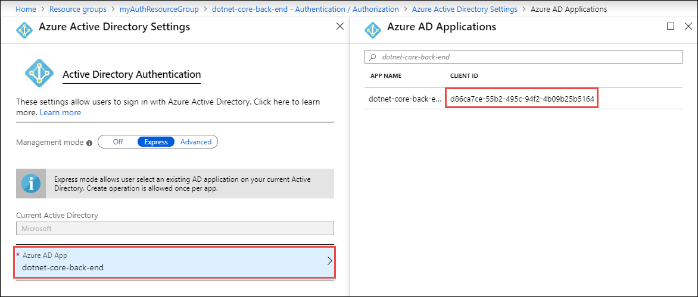

# AzureAd Settings
**Optional**
# Example
    "AzureAd": {
        "Instance": "https://login.microsoftonline.com/",
        "Domain": "stoneridgesoftware.com",
        "TenantId": "[Tenant ID GUID]",
        "ClientId": "[Client ID GUID]",
        "CallbackPath": "/signin-oidc",
        "SignedOutCallbackPath ": "/signout-callback-oidc"
    }

# Definition
## AzureAd

### Instance
**Required**

**No Default value**

The azure cloud instance to use for authentication. Most of the time this value should be
"https://login.microsoftonline.com/" for the Azure public cloud. There may be a use for 
country specific instances such as "https://login.microsoftonline.de/" for Azure AD Germany.

### Domain
**Required**

**No Default value**

The domain of the AD tenant used for authentication. This may be your domain (i.e. stoneridgesoftware.com)
or it may be sub-domain of onmicrosoft. (i.e. contoso.onmicrosoft.com)

### TenantId
**Required**

**No Default value**

The TenantId (aka audience) that will be used for authentication. The following values are valid:

  - "TenantId" as a GUID obtained from the Azure portal to sign in users in your organization
  - "organizations" to sign in users in any work or school account
  - "common" to sign in users with any work or school account or Microsoft personal account
  - "consumers" to sign in users with a Microsoft personal account only

### ClientId
**Required**

**No Default value**

The Client ID (aka application ID) assigned in the Azure Portal. This client ID is obtained
by [enabling Authentication and Authorization](./ControllerSecurity.md#Application_Managed_Identity) in the Azure Portal. 

Once Authentication is enabled you can obtain the ClientId from the Authentication / Authorization
section of the app service. Select Azure Active Directory and then select the Azure AD App.

### CallbackPath
**Optional**

**Default = false**

### SignedOutCallbackPath
**Optional**

**Default = false**
