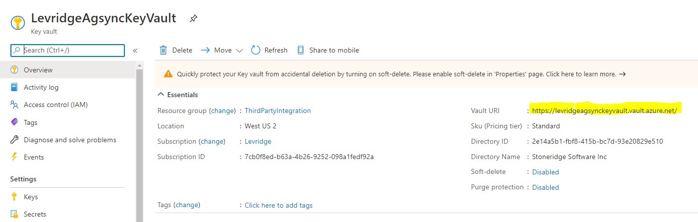
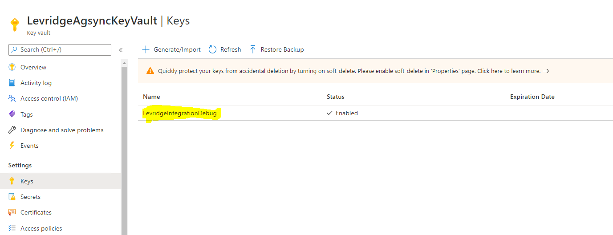

# Azure Key Vault
Azure Key Vault is a cloud service for securely storing and accessing secrets. 
A secret is anything that you want to tightly control access to, such as API keys, 
passwords, certificates, or cryptographic keys. 

# Overview
Key Vault service supports two types of containers: vaults and managed HSM pools. 
Vaults support storing software and HSM-backed keys, secrets, and certificates. 
Managed HSM pools only support HSM-backed keys. 
See [Azure Key Vault Overview](https://docs.microsoft.com/en-us/azure/key-vault/general/basic-concepts) for complete details.

## Configuration
There are two properties needed in the configuration to use the Azure Key Vault. 
- Vault URI
- Vault Key

Currently these values are part of each integration configuration that uses the Azure Key Vault.
These values will be provided in the integration configuration in the [appsettings.json](./appsettings.json.md) file.
Refer to the integration configuration for specific information required for the use 
of Azure Key Vault for that integration.

### Vault URI
The Vault URI can be obtained from the Azure Portal. It is in the Overview page of the Key Vault being used.
 

### Vault Key
The Vault Key is the name given to the secret being stored in the vault. This value is used
to store and retrieve the secret needed by the integration. This value is obtained 
from the Keys page of the Key Vault being used.
 

## Azure Key Vault Setup

>This section should include any instructions necessary to deploy this integration.
This section may not be needed if the deployment follows a standard deployment process
that is documented elsewhere. In this case it would be helpful to direct the reader
to that standard documentation.

