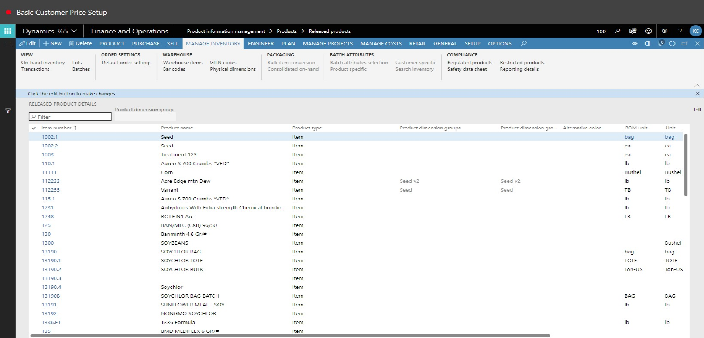
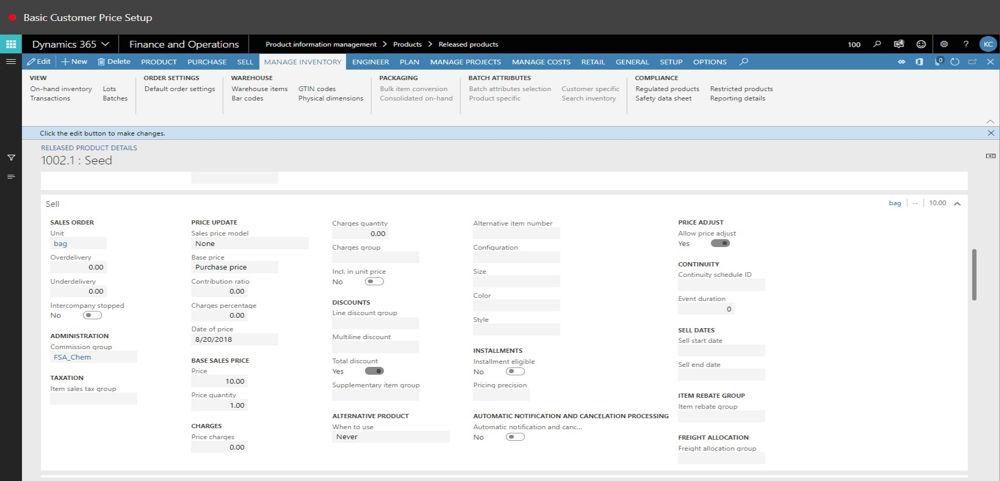
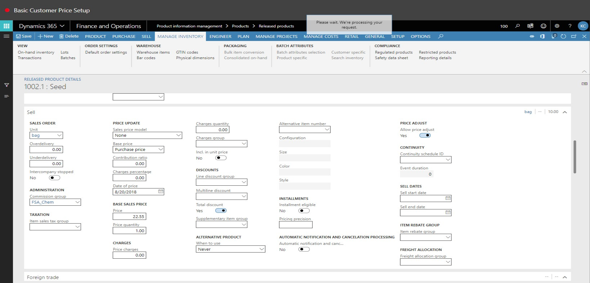
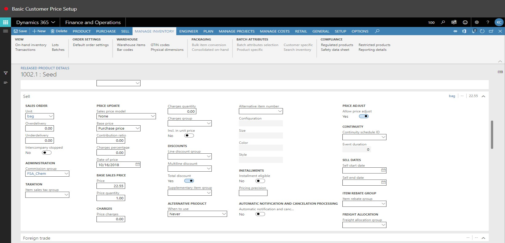
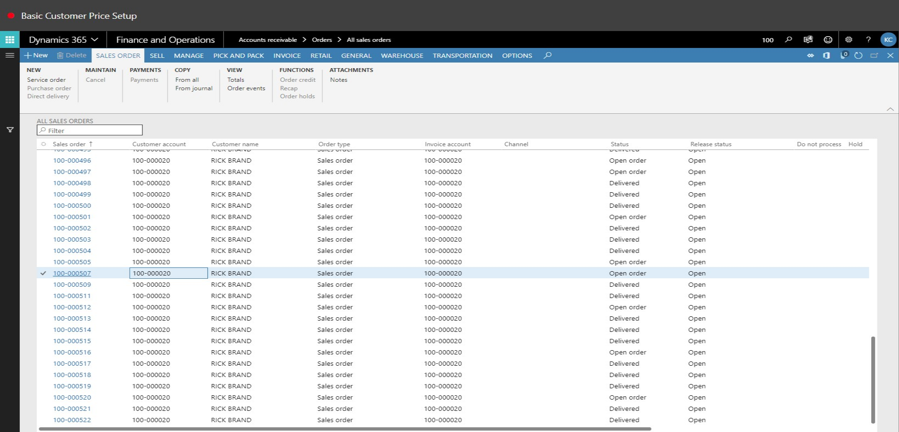
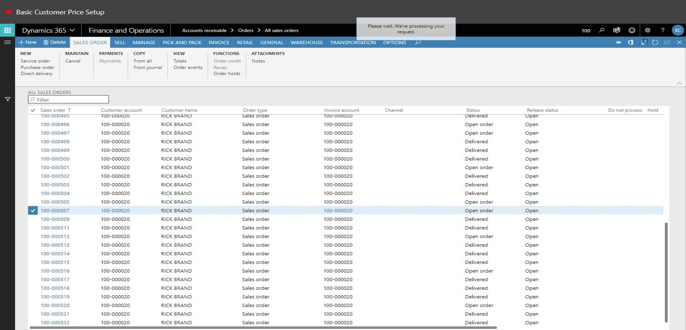
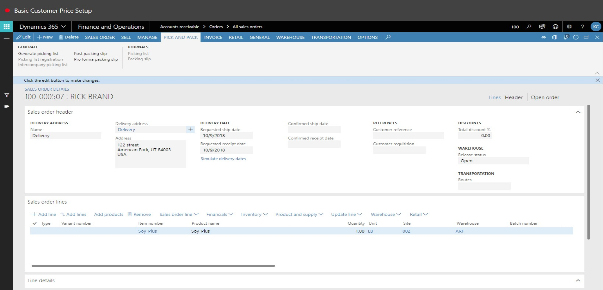
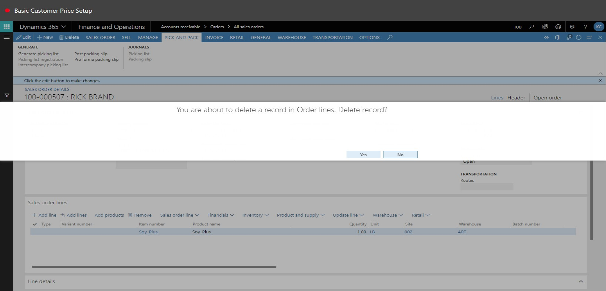
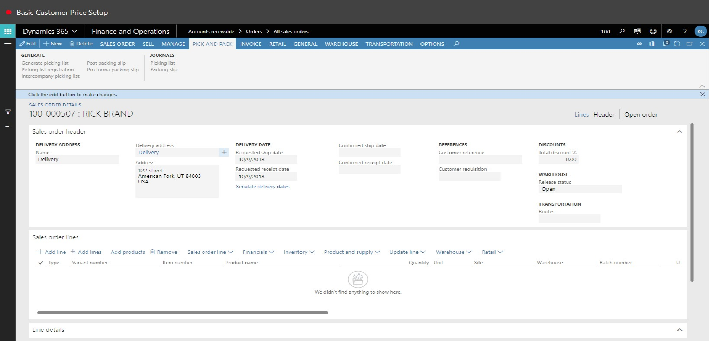

# Basic Customer Price Setup
Brief introduction of the module, component or feature being documented.

This document explains ...

## Basic Customer Price Setup

1. Go to Product information management > Products > Released products.
2. In the list, click the link in the selected row.

3. Click Edit.

4. In the Price field, enter a number.
5. Click Save.

6. Close the page.

7. Go to Accounts receivable > Orders > All sales orders.
8. In the list, find and select the desired record.

9. In the list, click the link in the selected row.

10. Click Remove.

11. Click Yes.

12. Click Add line.

13. In the Item number field, type a value.
14. In the Site field, type a value.
15. In the Warehouse field, type a value.