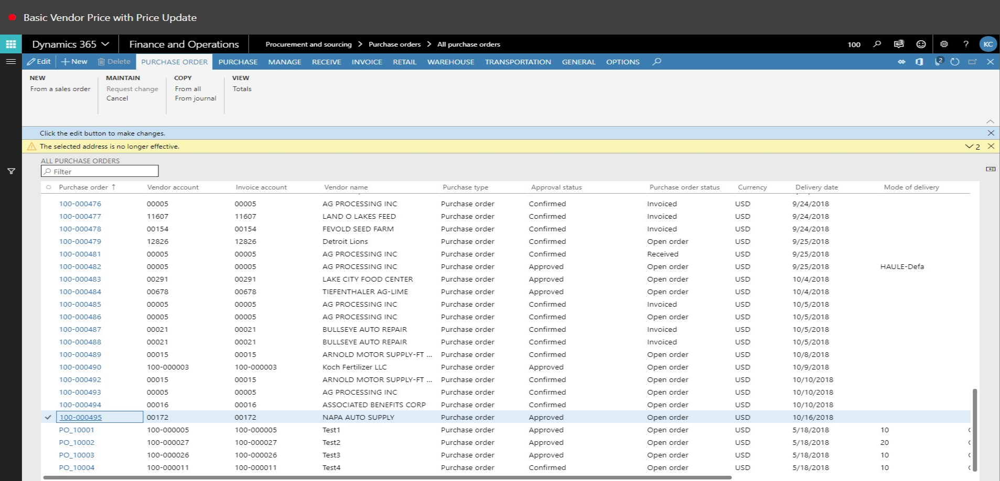
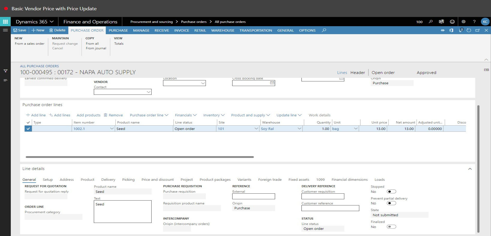
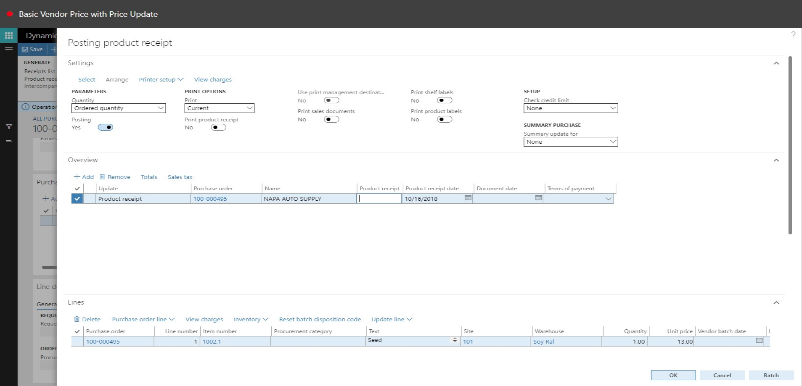

# Basic Vendor Price with Price Update
Brief introduction of the module, component or feature being documented.

This document explains ...

## Basic Vendor Price with Price Update

1. Go to Product Information Management > Products > Released Products.
2. In the list, click the link in the selected row.

3. Click Edit.

4. Select Yes in the Latest pruchase price field.
5. In the Price field, enter a number.
6. Click Save.

7. Close the page.

8. Go to Procurement and Sourcing > Puchase Orders > All purchase orders.
9. In the list, find and select the desired record.

10. In the list, click the link in the selected row.

11. Click Remove.

12. Click Yes.

13. Click Add line.

14. In the Item number field, type a value.
15. In the list, mark the selected row.

16. In the unit price field, enter a number.
17. Click Save.

18. On the Action Pane, click Purchase.

19. Click Confirm.

20. On the Action Pane, click Receive.

21. Click Product Receipt.

22. In the list, mark the selected row.

23. Open Product receipt column filter.

24. Sort A to Z

25. In the Product receipt field, type a value.
26. Click OK.

27. On the Action Pane, click Invoice.

28. Click Invoice.

29. In the Number field, type a value.
30. Click Post.

31. Click Update match status.

32. Click Post.

33. Close the page.

34. Close the page.

35. Go to Product Information Management > Products > Released Products.
36. In the list, click the link in the selected row.

