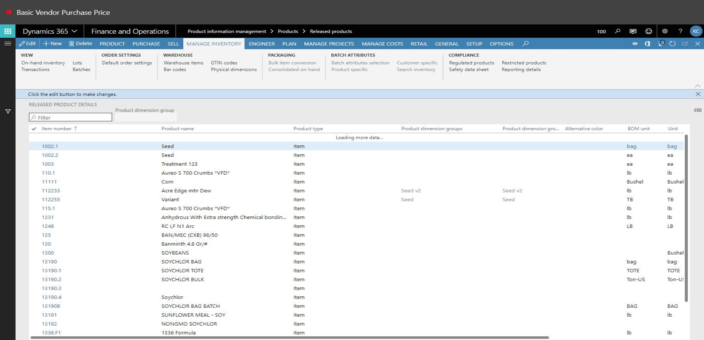
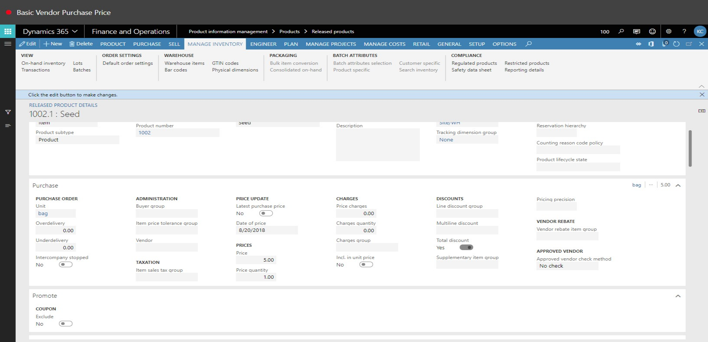
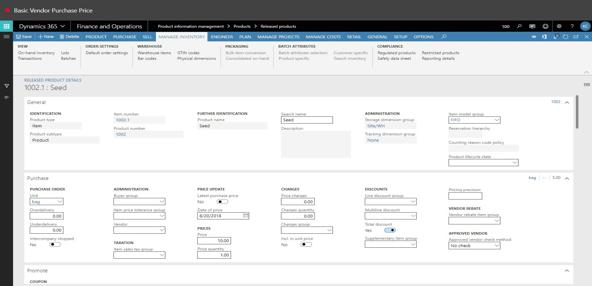
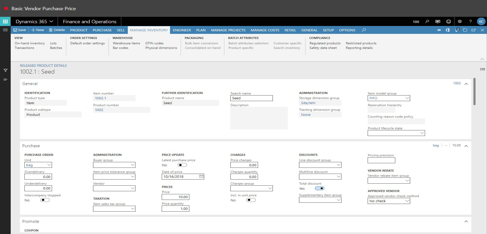
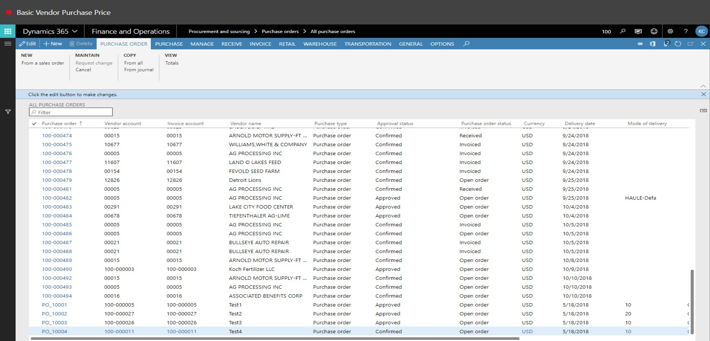
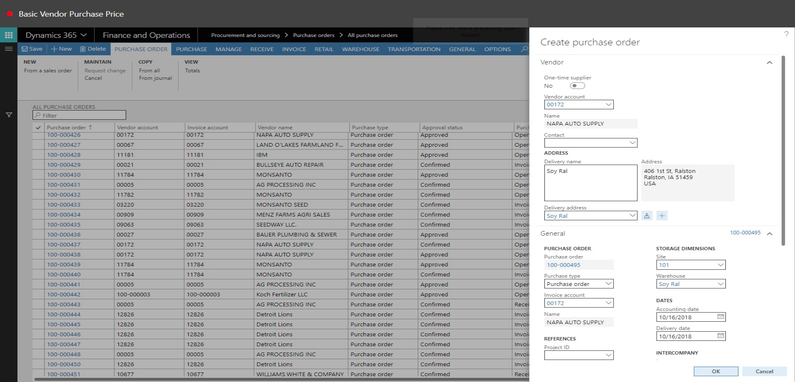

# Basic Vendor Purchase Price
Brief introduction of the module, component or feature being documented.

This document explains ...

## Basic Vendor Purchase Price

1. Go to Product information management > Products > Released products.
2. In the list, click the link in the selected row.

3. Click Edit.

4. In the Price field, enter a number.
5. Click Save.

6. Close the page.

7. Go to Procurement and sourcing > Purchase orders > All purchase orders.
8. Click New.

9. In the Vendor account field, type a value.
10. In the Warehouse field, type a value.
11. Click OK.

12. In the Item number field, type a value.
