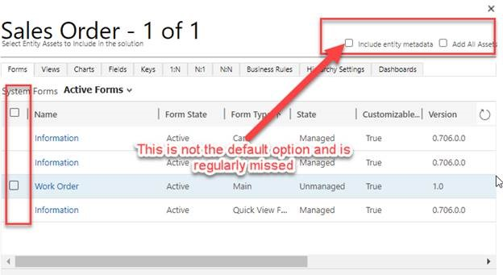
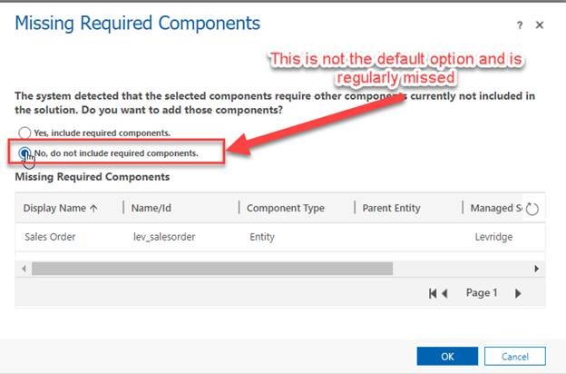
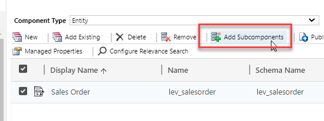
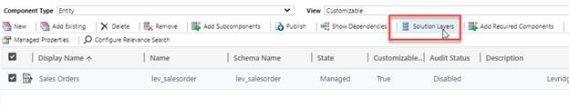
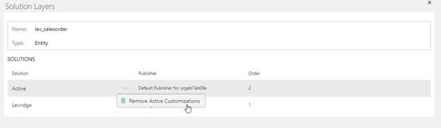
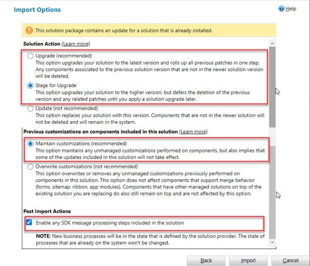


# CE Customization Best Practices

## Objectives
All Dynamics CE implementation modifications should be made in a development environment and then imported as a managed solution into Test and Production environments after the Levridge solution has been applied.  There are two goals when creating and merging implementation specific modifications with the Levridge solutions.

1. Retain customizations when Levridge upgrades are applied.
2. Prevent customizations from masking changes included in Levridge upgrades.
 
## Form Modifications
The best way to meet our objectives when modifying a Levridge form is to place all new fields within your own new “Section” on the form.  This will prevent subsequent updates of Levridge from removing or reordering your fields. 

## View Modifications
We recommend that if you want to add additional fields to a view, you instead create a copy of the Levridge view you want to use as a base and save your changes to this copy.  Your new view will not automatically receive modifications from subsequent Levridge upgrades, but this method will prevent upgrades from overwriting your modifications.

## Entity Modifications
It is important to choose which assets you will include in your solutions judiciously.  It is common for customizers to include inappropriate assets in their solution which cause a layer to be placed over the Levridge solution and masks desirable Levridge functionality.  When adding entities to your solution we recommend the following options be chosen initially.

   

   

Then, after the entity is in the solution you can selectively add only the subcomponents and required components that you want to customize.

   

## Inadvertent Unmanaged Layers
It is also common to make inadvertent unmanaged layers when working in a development environment.  If a customizer customizes a component and then immediately undoes that customization there is still an unmanaged layer left behind.  This becomes an issue when Levridge later releases an upgrade and this unmanaged layer masks included changes.  Dynamics CE now makes it easier to view and manipulate these unmanaged layers.  
Select a component and then press the solution layers button.

   

This will show you all managed and unmanaged layers applied to this component.  By clicking the ellipse and remove active customizations you can remove any inadvertent change you’ve made to the component.

   

## Importing Solutions
Understanding and choosing the appropriate options when importing a solution is important.  For Solution Action you want to choose Upgrade for the fastest completion time.  For more control you can perform a two step process by choosing Stage for upgrade.  This option leaves both versions of the solution applied to the environment.  This can be useful if you want to migrate data from a deprecated field or troubleshoot modification to your environment that are preventing a solution from being applied.

It’s particularly important to choose maintain customizations when importing into a development environment or your implementation specific customizations may be irrevocably lost.  Choosing to overwrite customizations may be appropriate against a test or production environment if inadvertent unmanaged layers have been created, but we prefer to investigate and manually remove these layers using the technique described above.

   

While these best practices will help you avoid the more common pitfalls, a comprehensive understanding of CE solution laying is the best way to administer a layered environment with confidence.  Resources for further reading about CE solutions include:

   - [Solution Lifecycle Management for Dynamics 365 for Customer Engagement apps](https://download.microsoft.com/download/1/F/3/1F32DC2E-57BB-4533-8996-ACB5F803CD58/SolutionLifecycleManagement.pdf) (You can also find the documentation under Stoneridge Teams > Playbook > General > Asset Library)

   - [How Managed Solutions Are Merged](https://docs.microsoft.com/en-us/power-platform/alm/how-managed-solutions-merged)
