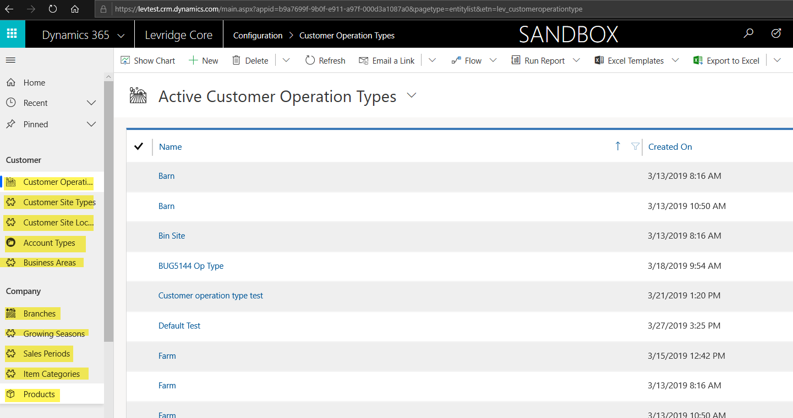

# Levridge CE Implementation Checklist
Listed are the steps one would want to take to implement CE.

1. CE Setup
  - Secure and Unsecure config populated in CE
  - [Address Data Mapping Configured](Address_Data_Mapping.md)
  - Set up flexgrids
  - [Remote printing setup](https://levridgesoftware.github.io/Levridge-CRM-Remote-Printing-Service/)
  - Base Data import

These steps fall within the [CE to AX Integration Checklist]

Entities in pink must be set up in CE.

Entities in yellow will integrate over from FinOps. 

Entities in green will integrate from Agsync.

Once item categories have been either created or 
imported in, the filtered xmls on the Plans and 
Batch Plans will need to be updated to reflect the 
item category GUIDs within your environment.  
 
- The Proposal OOB Proposal line Subgrids will also require filter updates to reflect the Item Category's in your environment.

