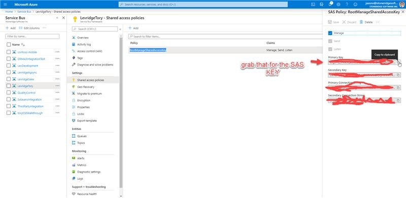
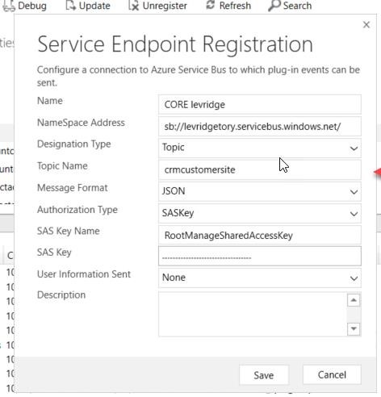

# CE Plugin Endpoint Configuration

In order to set up your CE to F&O endpoints, you will need to get your shared access key from your service bus endpoint. This is located in the Azure portal.
 
[Use the Azure portal to create a Service Bus topic and subscriptions to the topic](https://docs.microsoft.com/en-us/azure/service-bus-messaging/service-bus-quickstart-topics-subscriptions-portal).  

Once you have your key you will use it to update the Core and Agronomy service endpoint registrations using the plugin registration tool. 
1.	Update the endpoint (levridgetory in the case with your customers endpoing)
2.	Update the topic name to what you are using (crm to ax)
3.	Past in the SAS Key you got from the Azure portal.
4.	Click Save.

