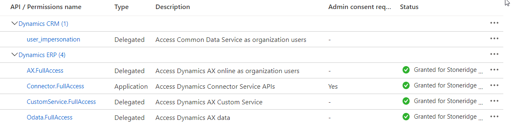


# CE to AX Integration Implementation Checklist

## Overview
Implementation checklist for the CE to AX Integration including CE specific items. 

1. Azure App Service(s)

<!-- need to do something -->
   * Created
   * Given Dynamics CE impersonation rights 
   * [Microsoft Tutorial: Register an app with Azure Active Directory](https://docs.microsoft.com/en-us/powerapps/developer/common-data-service/walkthrough-register-app-azure-active-directory)
   * Given AX rights

 
   5. User set up in AX
   6. Default Company set up in AX
   7. Set up as an application user in CE
      - [Create users and assign security roles](https://docs.microsoft.com/en-us/power-platform/admin/create-users-assign-online-security-roles#create-an-application-user)

2. Setup [Azure Service Bus](https://docs.microsoft.com/en-us/azure/service-bus-messaging/service-bus-messaging-overview)
   - Topic
   - Subscription

3. CE Setup
 - Secure and Unsecure config populated in CE
- [CE Plugin Dndpoint Configuration](CE_Plugin_Endpoint_Configuration.md)
- [CE Implementation Checklist](CE_Implementation_Checklist.md)
- [Create Initial Setup Records](CE_Setup_Records.md)
- [Pricing Service Setup](Pricing_Service_Setup.md)

4. F&O Setup
- Fill out Azure Active Directory Application in F&O
   - By allowing an external application to access your data you are affirming that you understand that the data handling and compliance standards of the external application may not be the same as those provided by Microsoft. Please consult the documentation for the application that you are enabling to learn more. Your privacy is important to us. For more information, see privacy statement.
   - Set correct default company for application user in F&O

5. Integration setup
- [D365 F&O to D365 CE](D365-F&O-to-D365-CE.md)
- [D365 CE to D365 F&O](D365-CE-to-D365-F&O.md)
- [appsettings.json Configuration File](appsettings.json.md)
- Create source and target config for F&O to CE
- Create source and target config for CE to F&O
- [Logging Settings](Logging.md)
   - Use warning or error for product
- Set [Instance Config](InstanceConfig.md)
