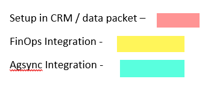
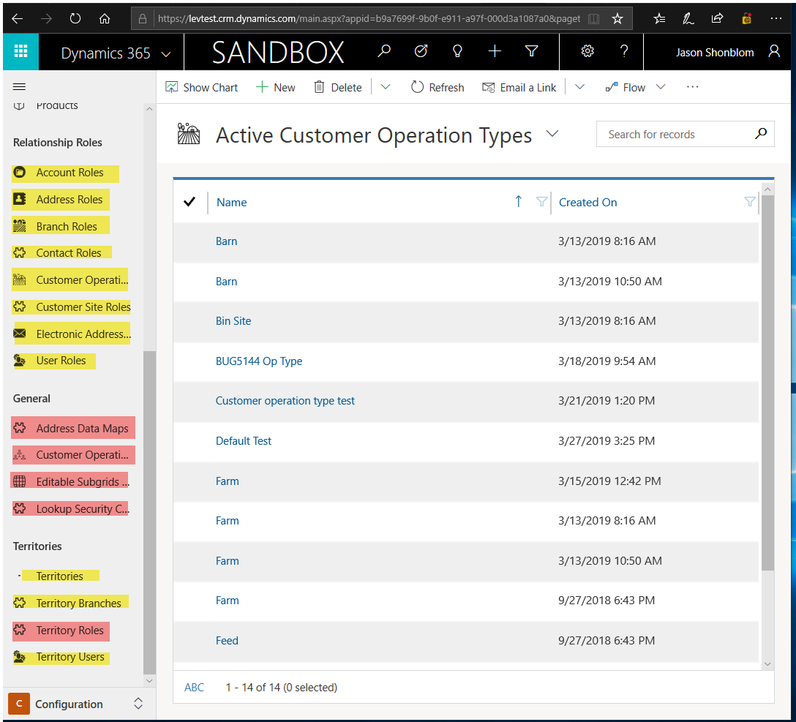

# Configuration Setup CRM
To begin configuration setup in CRM, first 
import LevCore Solution followed by importing
Agronomy Solution.

Migrate the ESG Configuration data using the Configuration Migration Tool.
   - This tool can be downloaded at https://docs.microsoft.com/en-us/dynamics365/customer-engagement/developer/download-tools-nuget

Ensure an Application User has been created with admin 
security roles assigned. 

If integrating records from CRM to AX, you will need to 
create steps on the service endpoint using the Plugin
 Registration tool.

Steps will also need to be created on plugins which 
require the pricing service. The configuration will 
look like this:
```
   {
     "clientappid": "da7c3de3-5555-49ab-8465-d01e8cd22e58",
     "clientappsecret": "dradgg38ddszLzgqbcZ3/8sG2FbC/BSWxnCtXzJsWP8=",
     "tenant": "https://login.microsoftonline.com/5555a5b1-fbt8-465b-ad9d-21e21129e610/oauth2/token",
     "uristring": "https://environment22c2251c662a7e541devaos.cloudax.dynamics.com/api/services/LevPricingServices/PricingService/getPricing",
     "resource": "https:// environment22c2251c662a7e541devaos.cloudax.dynamics.com",
     "username": "John.smith@email.com",
     "password": "plaintextpassword"
   }
```

Setup the data through integrations, create it in CRM, 
or import data packets.



Entities in pink must be set up in CRM.

Entities in yellow will integrate over from FinOps. 

Entities in green will integrate from Agsync.





Once item categories have been either created or 
imported in, the filtered xmls on the Plans and 
Batch Plans will need to be updated to reflect the 
item category GUIDs within your environment.  
 
- The Proposal OOB Proposal line Subgrids will also require filter updates to reflect the Item Category's in your environment.