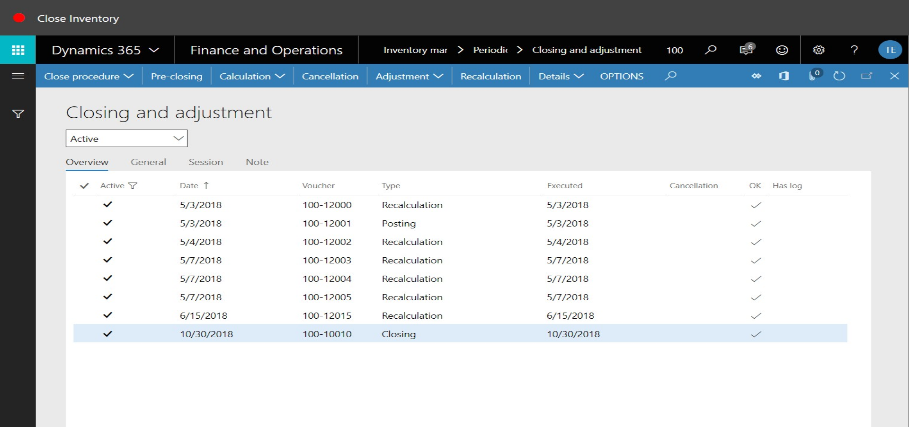
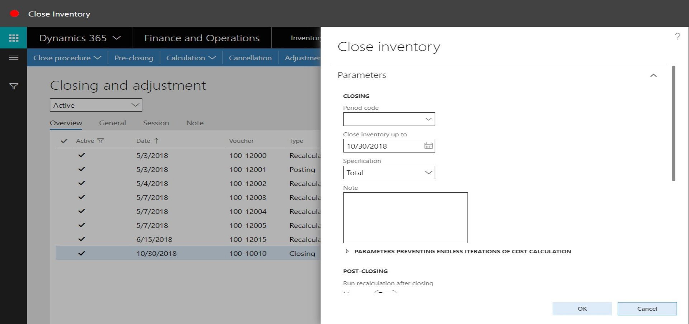
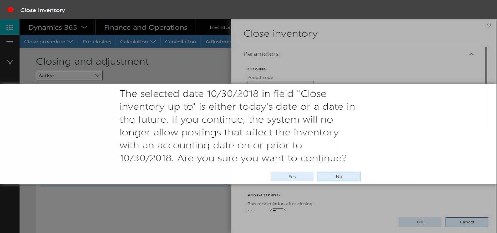
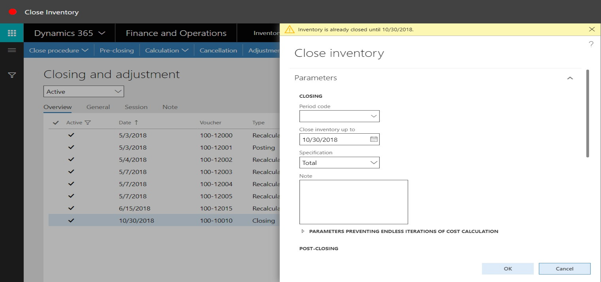

# Close Inventory
Brief introduction of the module, component or feature being documented.

This document explains ...

## How to Close Inventory

1. Go to Inventory Management > Periodic Tasks > Closing and Adjustment.
2. Click Close Procedure.

3. Click Close Inventory.

4. Expand the Run in the background section.

5. In the Close Inventory up to field, enter a date.
6. Click OK.

7. Click Yes.

8. Click Cancel.

