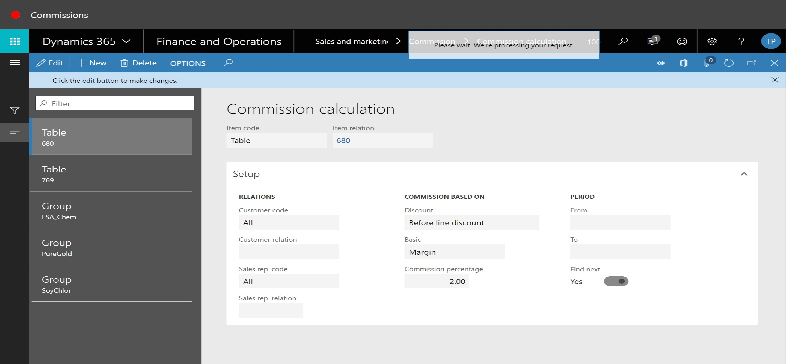
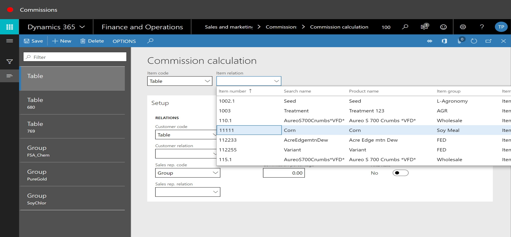
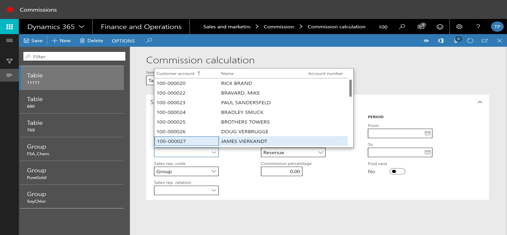
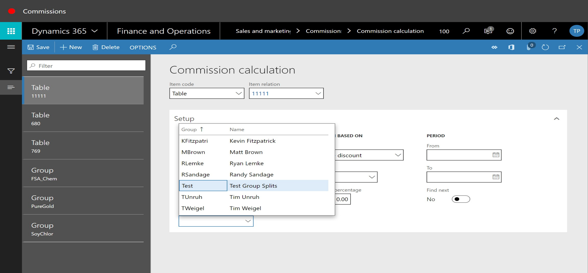
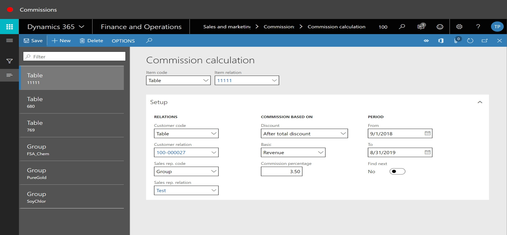

# Commissions

1. Go to Sales and marketing > Commissions > Commission Calculation.
2. Click New.

3. In the item relation field, enter or select a value.

4. In the customer relation field, enter or select a value.

5. In the sales rep. relation field, enter or select a value.

6. In the Discount field, select an option.
7. In the commission percentage field, enter a number.
8. In the From field, enter a date.
9. In the To field, enter a date.
10. Click Save

## Levridge Commission Enhancements provide the following features: 

### Region/Sales Group Setup

- A new region setup may be used in the sales group setup.  This allows users to determine which sales agents receive a commission by the location the order is shipped to using a region/territory setup.
- Commission calculations may be based on customer operations or address

### Commission Program Setup

- Commission calculation off sales, margin or quantity, with the ability to do price or quantity breaks
- Commission may be calculated at point of sale or a specified time period.  Payments can now be made at any time the commissions are calculated.
- Salespersons may have more than one commission percentage depending on sales, margin or quantity thresholds
- Salesperson may receive commission percentage, amount or amount per unit sold
- Bonuses may now be added in addition to commission programs

### Commission Advances

- Commission transactions may be added as an ‘advance’.  Future commissions will be applied to the advance.

### Commission Correction and Adjustment

- Commission calculations process includes exceptions and adjustment

### Commission Reporting & Payment

- Commission reporting now includes reporting based on commission programs, summary report, and enhanced commission transaction detail report.
- Commission now go through a review and approval process, and can be paid through the Accounts Payable payment process or by generating a file to upload to your payroll system.
