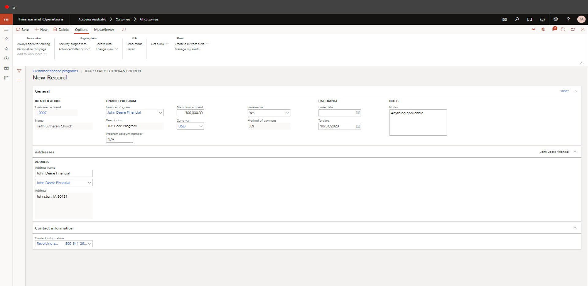
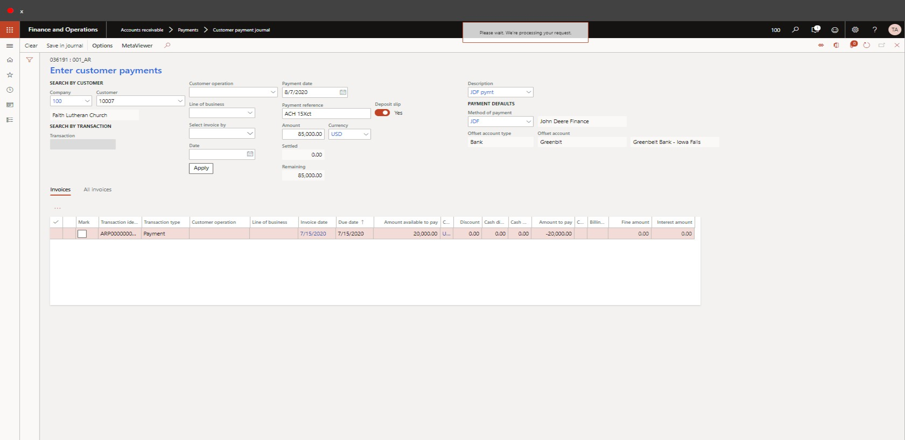

# Create, Maintain, Monitor Customer Programs
This document explains how to create, maintain, and monitor customer programs. 

## Create a New Customer Program
1.	Go to Accounts receivable > Customers > All customers.
2.	In the list, find and select the desired record.
3.	On the Action Pane, click Agriculture.
4.	Click Customer finance programs.
5.	Click New.
6.	In the Finance program field, enter or select a value.
7.	In the Program account number field, type a value.
    a.	Required field. Enter N/A if an account number is not relevant.
8.	In the Maximum amount field, enter a number. 
9.	In the Renewable field, select an option (Yes/No).
10.	In the From date field, enter a start date.
11.	In the To date field, enter a date.
12.	In the Notes field, type a value, if applicable. 
13.	In the Address field, select a value. – Would like this to default if there is only one value
14.	In the Contact information field, select a value. – Would like this to default if there is only one value
15.	Click Save.
 
16. Close the page. 

## View or Edit a Customer Program
1.	Go to Accounts receivable > Customers > All customers.
2.	In the list, find and select the desired record.
3.	On the Action Pane, click Agriculture.
4.	Click Customer finance programs.
5.	View program information or edit as appropriate.
6.	If applicable, Click Recalculate balances. – Would like to add a batch process 
7.	Status of "Active" is defaulted from the base program value. Date columns, as well as most other data is available to sort/filter to limit this view over time.

8.	To view all customer transactions or the transactions that account for the "Amount used" and/or "Uncollected amount" follow these steps:
    a.	Go to Accounts receivable > Customers > All customers.
    b.	In the list, find and select the desired record.
    c.	On the Action Pane, click Customer.
    d.	Click Transactions.
    e.	Default view displays "All" transactions.
        i.	Hint: the user may personalize the transaction list to include and display the Method of payment.
        ii.	Corrections: when the Method of payment is visible in the list, it is available for edit with appropriate security access. This allows for transactions not assigned correctly to be adjusted to the intended Method of payment. If adjustment is made, the "Recalculate balances" process must be executed in order to update the displayed values for Amount used and Uncollected amount.  
    f.	Select show "Open", if applicable to display unapplied payments and unpaid/unsettled invoices
9.	For the date range applicable to the Finance program (& the Method of payment), the Amount used is the sum of all sales order, free text, or credit memo transactions. 
10.	For the date range applicable to the Finance program (& the Method of payment), the Uncollected amount is the sum of all sales order, free text, or credit memo transactions where the balance of the transaction is not = zero. PLUS any payments with the same criteria. 

## View All Customer Finance Programs
1.	Go to Accounts receivable > Financing > Customer finance programs.
2.	Click Recalculate balances. Would like to add a batch process
3.	This is available for export to excel.
4.	Status of "Active" is defaulted from the base program value. Date columns, as well as most other data is available to sort/filter to limit this view over time.

## Process Finance Program Payments
1.	Go to Accounts receivable > Payments > Customer payment journal.
2.	Click New.
3.	In the list, select the applicable journal.
4.	Click Enter customer payments.
5.	In the Customer field, specify the value or search for a value.
6.	In the Payment reference (check # or ACH trans code) field, enter a value.
7.	In the Amount (of payment) field, enter a number.
8.	In the Description field, type a value such a JDF payment.
9.	In the Method of payment field, enter or select the value which represents the Finance program.
10.	If applicable, Mark any transactions for settlement.
    a.	Hint: the user may personalize the transaction list to include and display the Method of payment.
11.	If not settled, the payment credit will be available for manually matching of current or future transactions.
12.	Click Save in journal.
 
13. Close the page.
14. When the journal has been completed. Click Post. 

