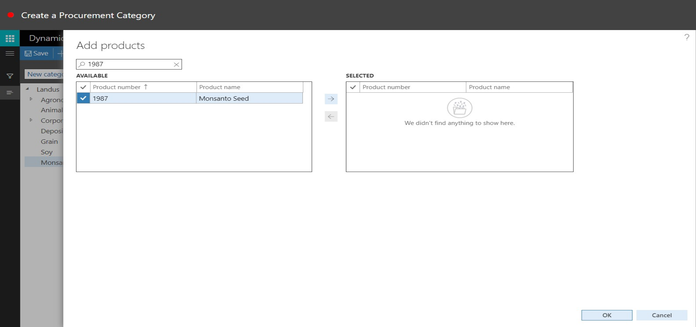
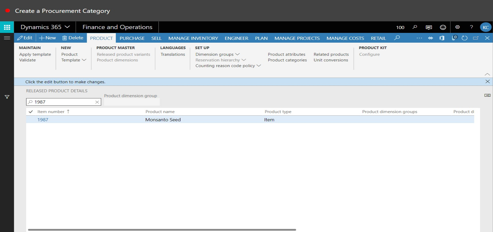

# Creating a Procurement Category
Brief introduction of the module, component or feature being documented.

This document explains ...

## How to Create a Procurement Category, Assign an Item, and Assign a GL

1. Go to Product Information Management > Setup > Categories and Attributes > Category Hierarchies.
2. In the list, find and select the desired record.

3. In the list, click the link in the selected row.

4. Click New category node.

5. In the Name field, type a value.
6. Click Save.

7. Click Save.

8. Click Add.

9. Use the Quick Filter to find records. For example, filter on the Product number field with a value of '1987'.

10. In the list, mark the selected row.

11. Click Add.

12. Click OK.

13. Close the page.

14. Close the page.

15. Go to Product Information Management > Products > Released Products.
16. Use the Quick Filter to find records. For example, filter on the Item number field with a value of '1987'.

17. Click Product categories.

18. Click New.

19. In the Category hierarchy field, enter or select a value.

20. In the list, select row 2.

21. In the list, click the link in the selected row.

22. In the Category field, enter or select a value.

23. In the tree, select 'Landus (New Category)\Monsanto (New Category)'.

24. Click OK.

25. Click Save.

26. Click Delete.

27. Click Save.

28. Close the page.

29. Close the page.

30. Go to Inventory Management > Setup > Posting > Posting.
31. Click the Purchase order tab.

32. In the Select field, select an option.
33. Click New.

34. In the list, mark the selected row.

35. In the Item code field, select an option.
36. In the Category relation field, enter or select a value.

37. In the tree, select 'Lanuds (New Category)\Monsanto (New Category)'.

38. Click OK.

39. In the Main account field, specify the desired values.
40. Click Save.

41. Close the page.

