# Customer Creation
Brief introduction of the module, component or feature being documented.

This document explains ...

## Customer Creation

1. Go to Accounts receivable > Customers > All Customers.
2. Click New.
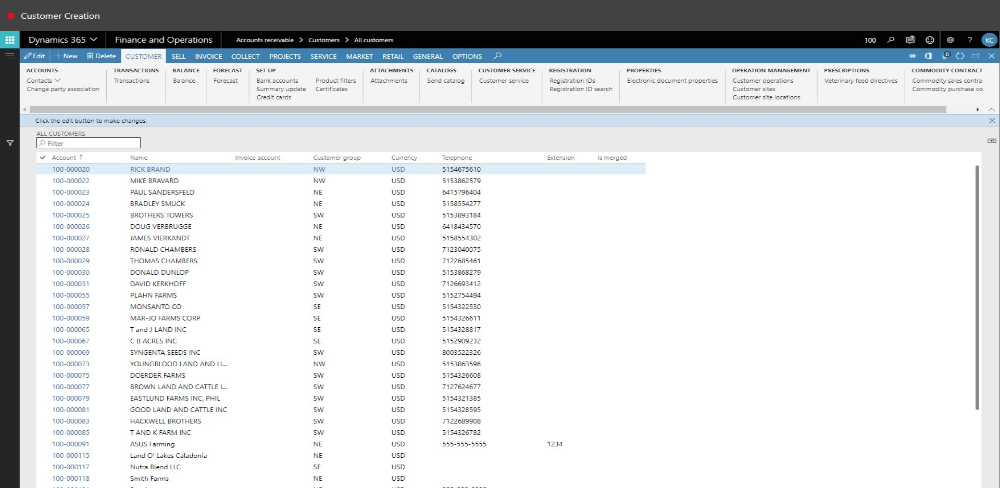
3. Click OK.
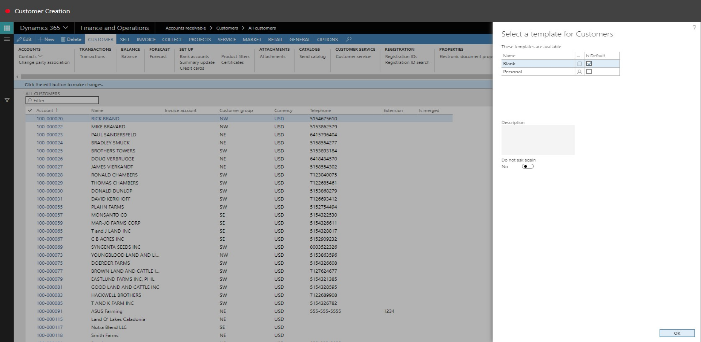
4. In the First name field, type a value.
5. In the Last name field, type a value.
6. In the Customer group field, enter or select a value.

7. In the list, click the link in the selected row.
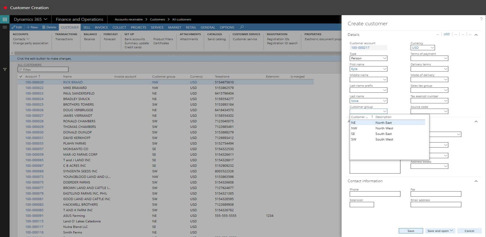
8. In the Terms of payment field, enter or select a value.
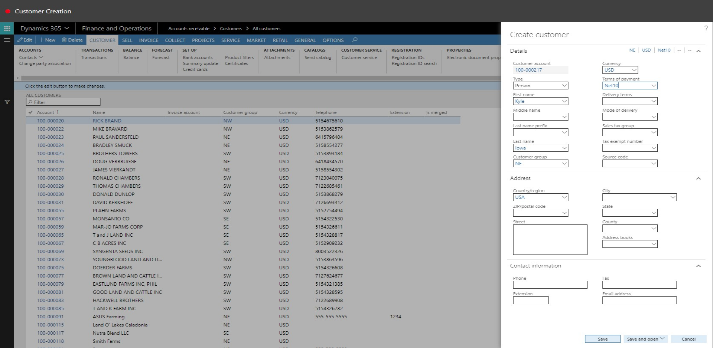
9. In the list, click the link in the selected row.
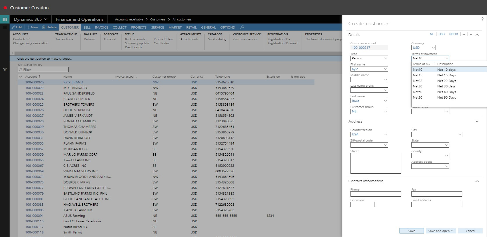
10. In the ZIP/postal code field, type a value.
11. In the Street field, type a value.
12. In the Street field, type a value.
13. Click Save.
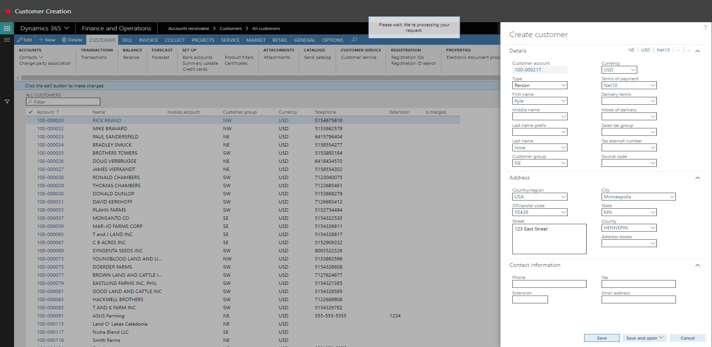
14. Expand the Addresses section.
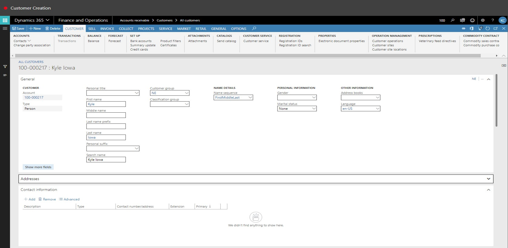
15. Click Add.
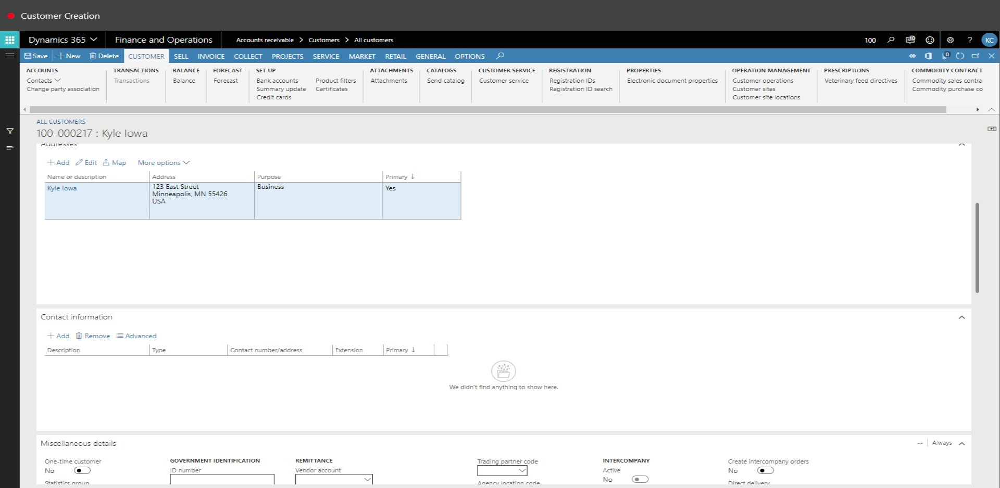
16. In the Description field, type a value.
17. In the Contact number/address field, type a value.
18. Select the Primary check box.
19. Click Add.
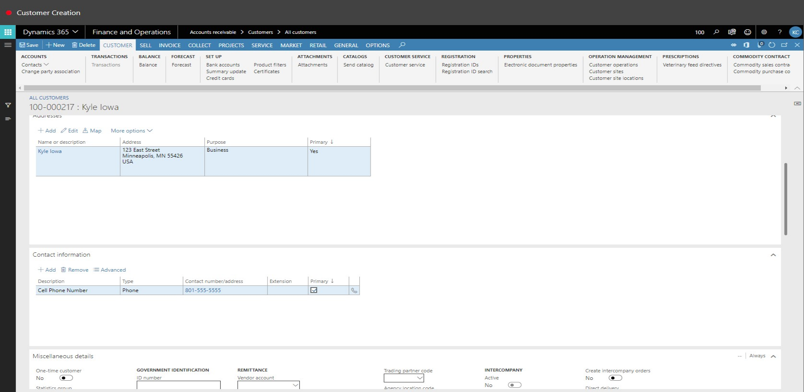
20. In the Type field, select an option.
21. In the Contact number/address field, type a value.
22. Expand the Credit and collections section.
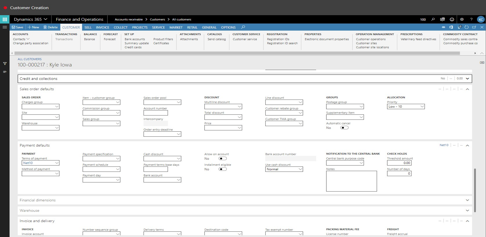
23. In the Credit limit field, enter a number.
24. In the Credit rating field, type a value.
25. In the Method of payment field, enter or select a value.
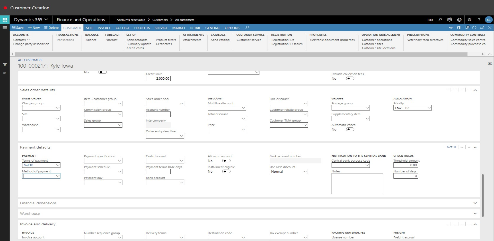
26. In the list, select row 3.
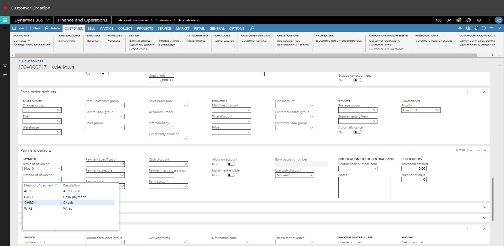
27. In the list, click the link in the selected row.
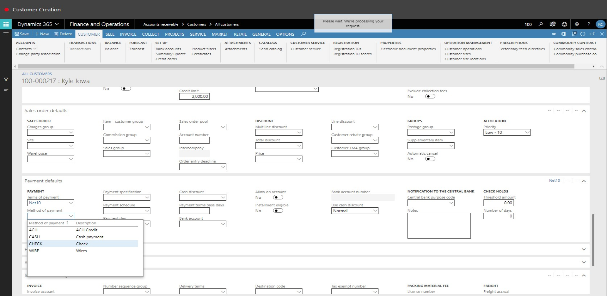
28. Expand the Financial dimensions section.
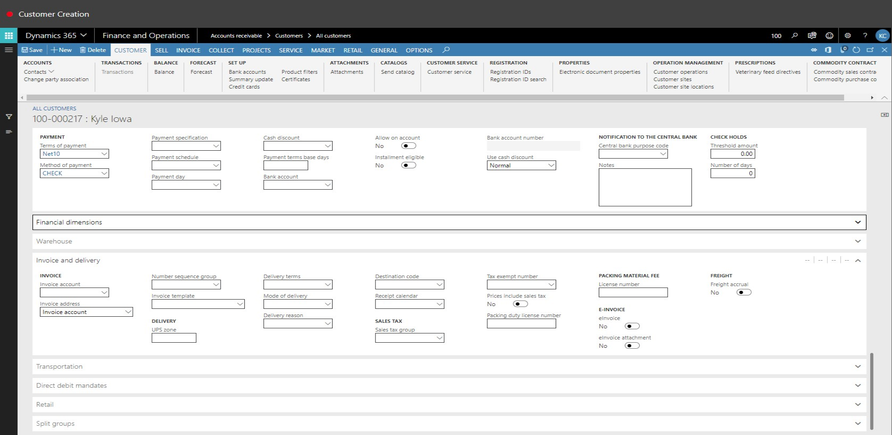
29. In the LocationSite value field, enter or select a value.
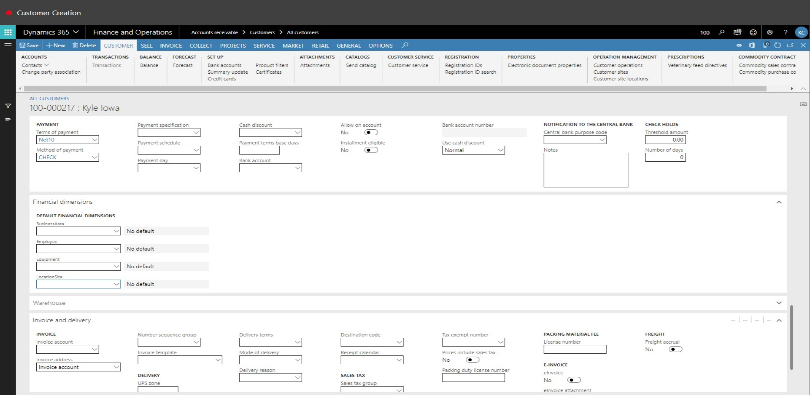
30. In the list, select row 5.
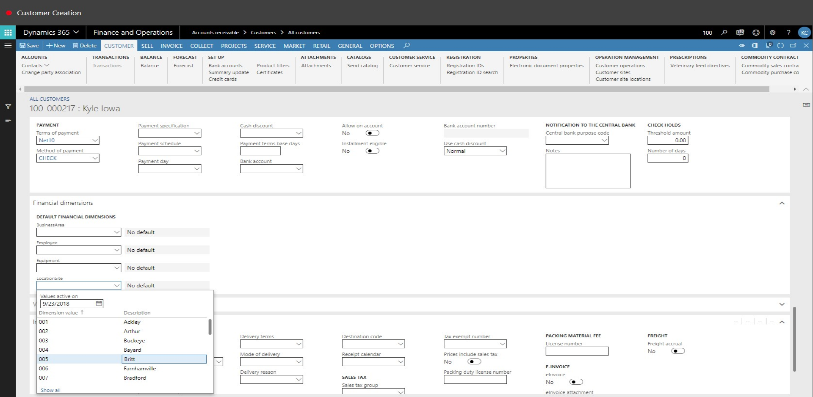
31. In the list, click the link in the selected row.
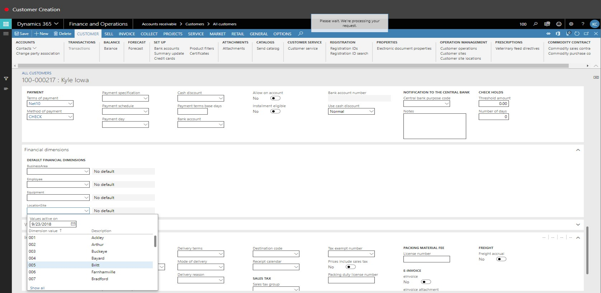
32. Close the page.
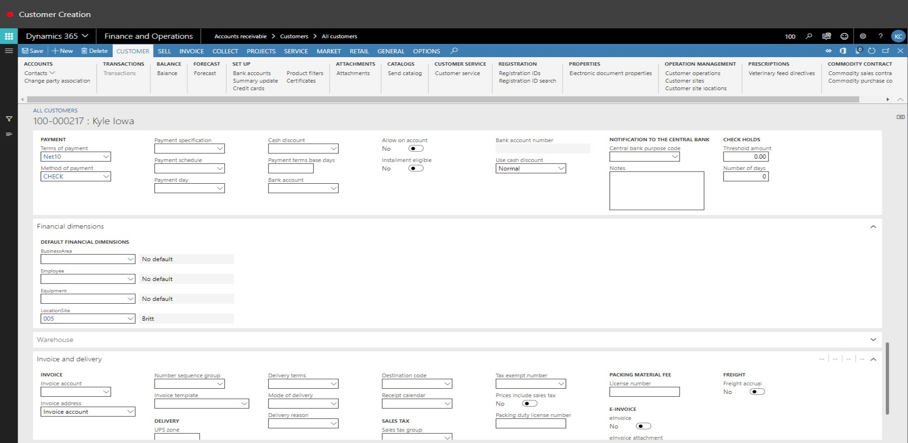
