# Customer Creation Organzation
Brief introduction of the module, component or feature being documented.

This document explains ...

## Customer Creation Organization

1. Go to Accounts Receivable > Customers > All Customers.
2. Click New.
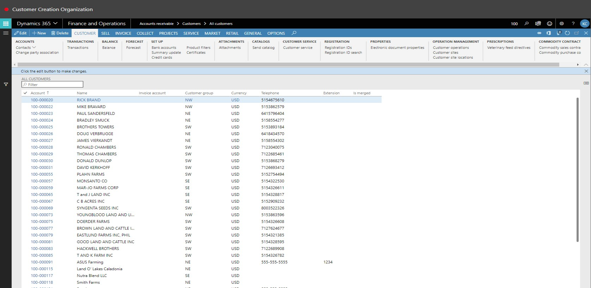
3. Click OK.
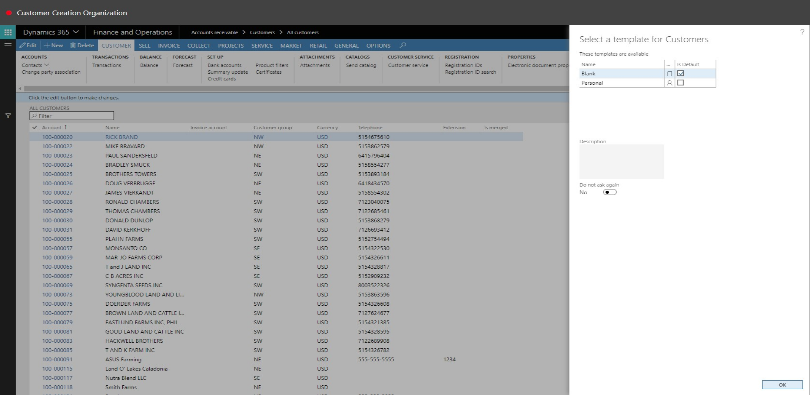
4. In the Type field, select an option.
5. Click OK.
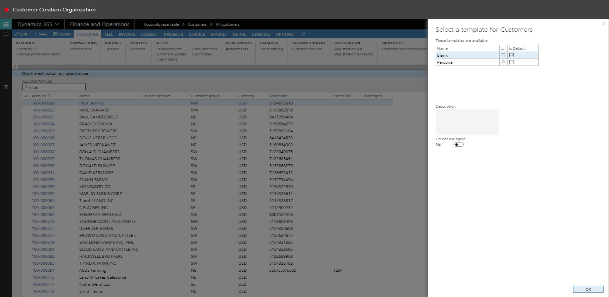
6. In the Name field, type a value.
7. In the Customer group field, enter or select a value.
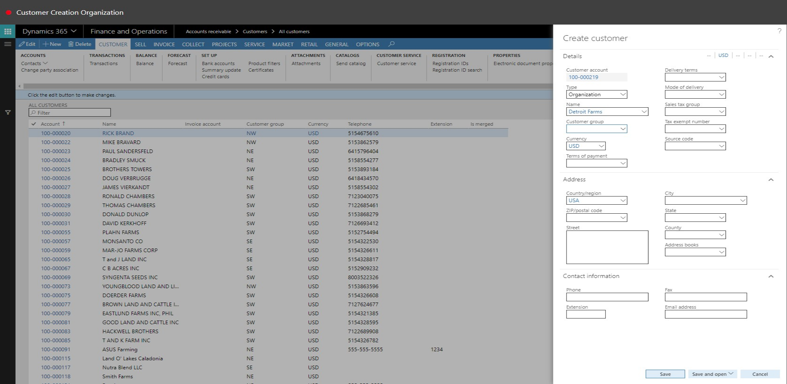
8. In the list, select row 2.

9. In the list, click the link in the select row.

10. In the Terms of Payment field, enter or select a value.

11. In the list, click the link in the select row.
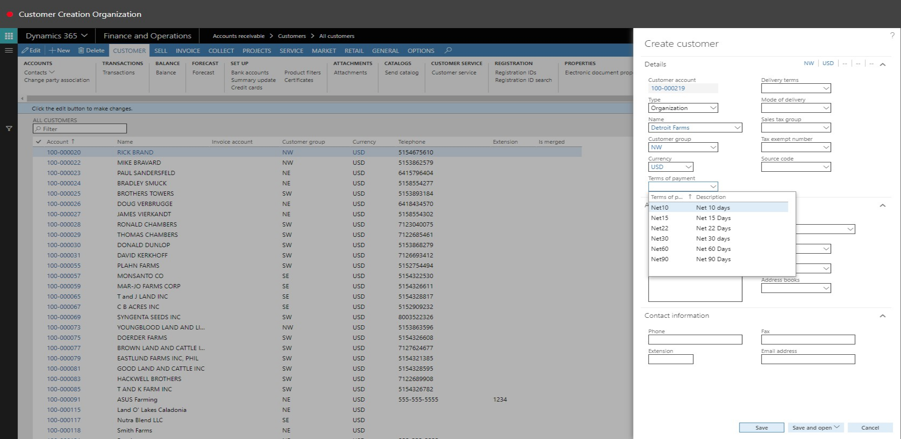
12. In the ZIP/postal code field, type a value.
13. In the Street field, type a value.
14. Click Save.
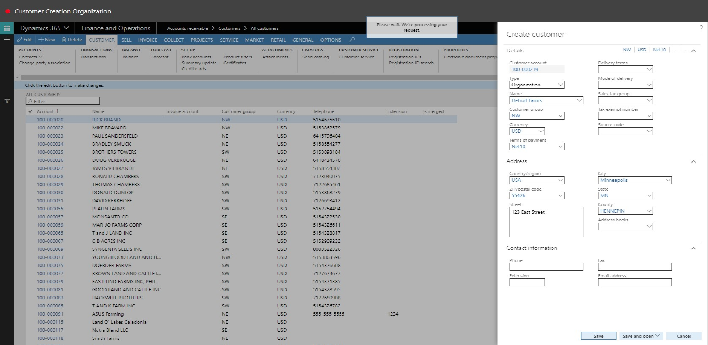
15. Click Show more fields.
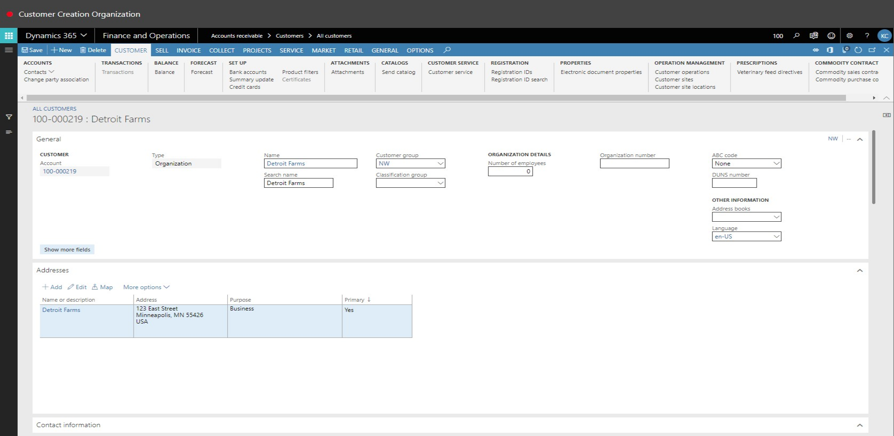
16. Click Add.
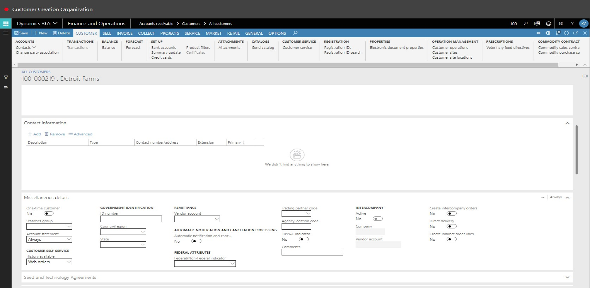
17. In the Description field, type a value.
18. In the Contact number/address field, type a value.
19. Select the Primary check box.
20. Click Add.
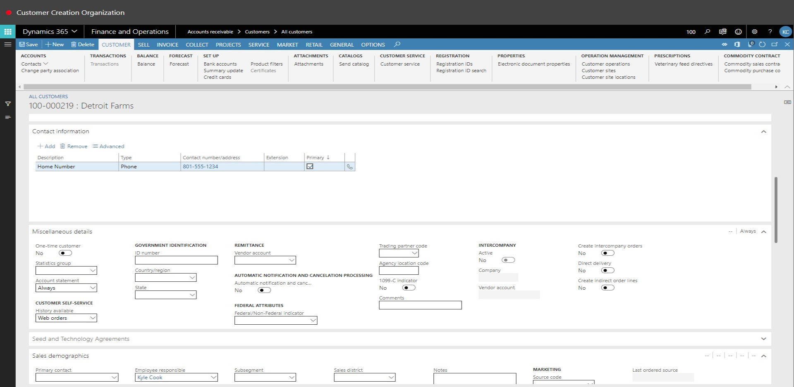
21. In the Type field, select an option.
22. In the Contact number/address field, type a value.
23. In the Sales group field, enter or select a value.
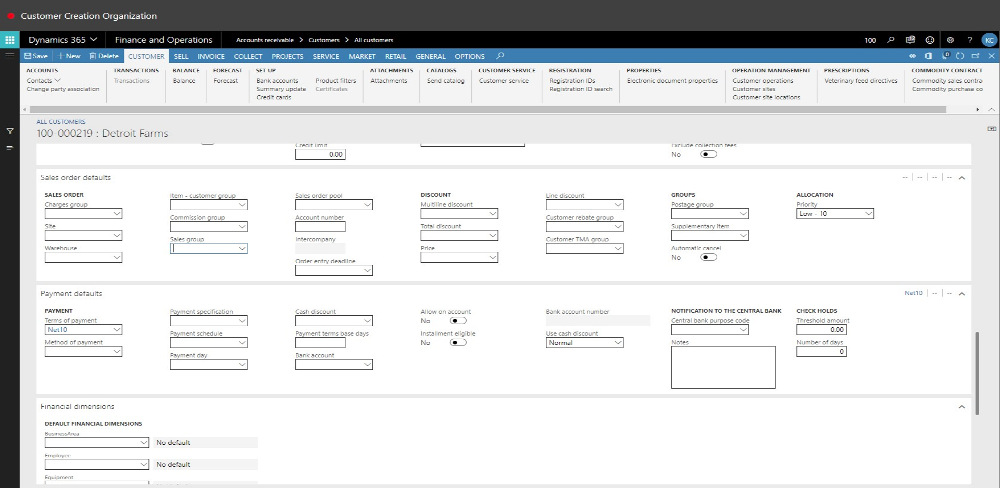
24. In the list, select row 2. 
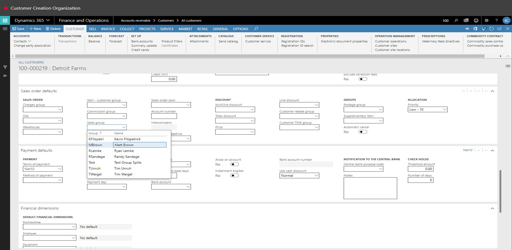
25. In the list, click the link in the selected row.
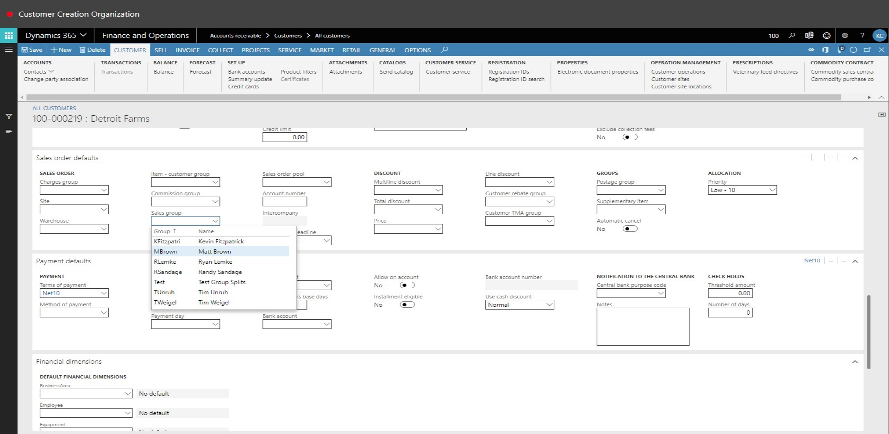
26. In the Method of payment field, enter or select a value.
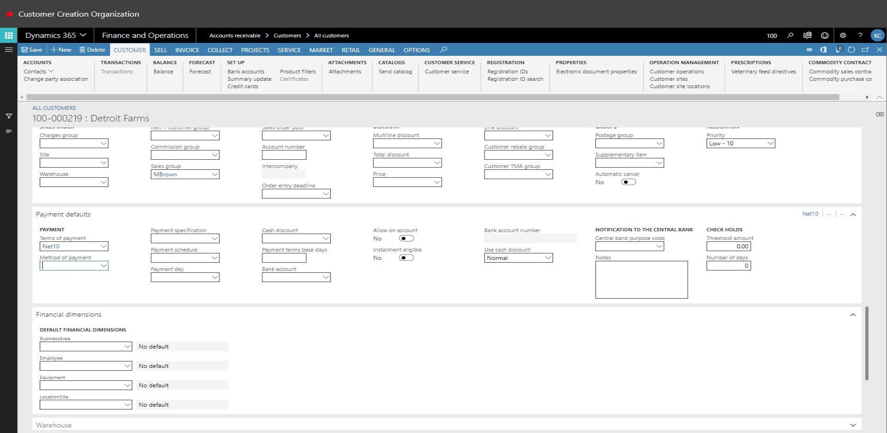
27. In the list, select row 3.
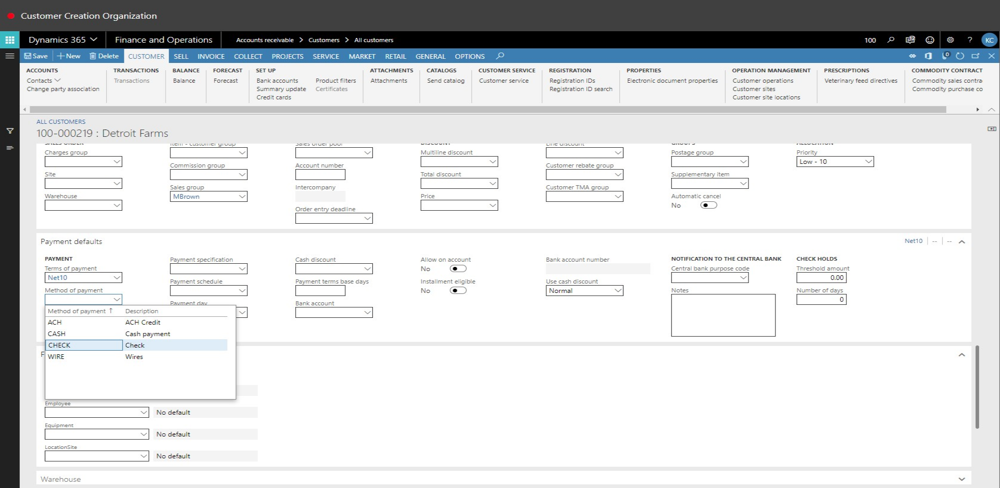
28. In the list, click the link in the selected row.
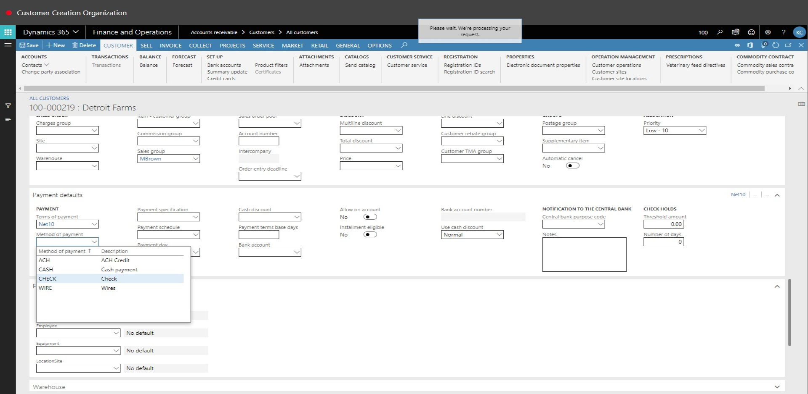
29. In the LocationSite value field, enter or select a value.
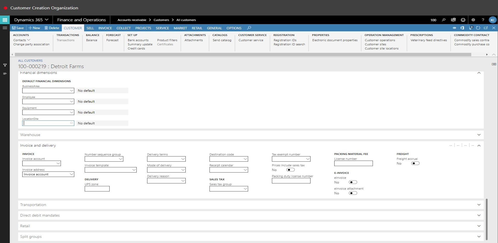
30. In the list, click the link in the selected row.
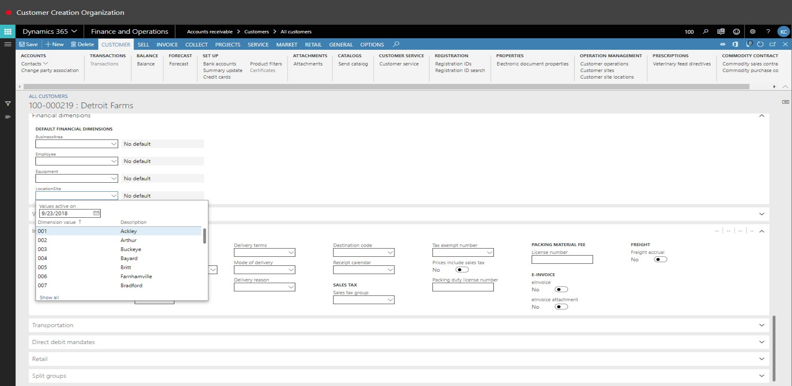
31. Click Save.
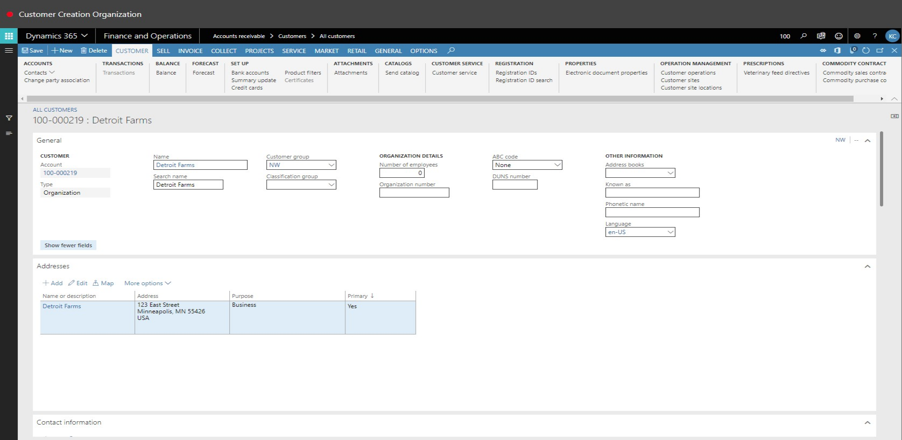
