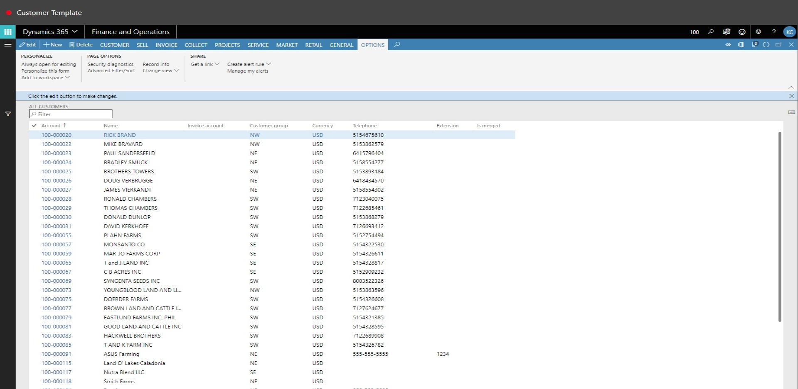
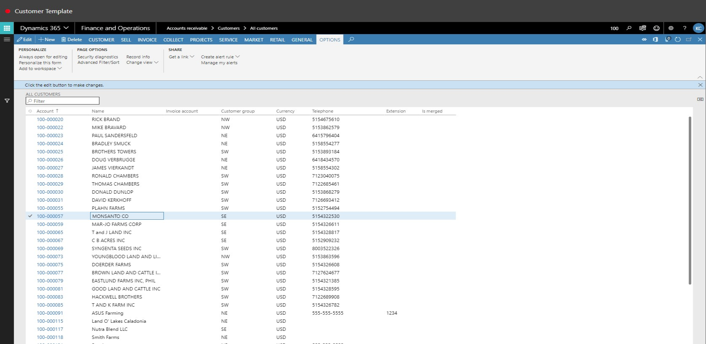
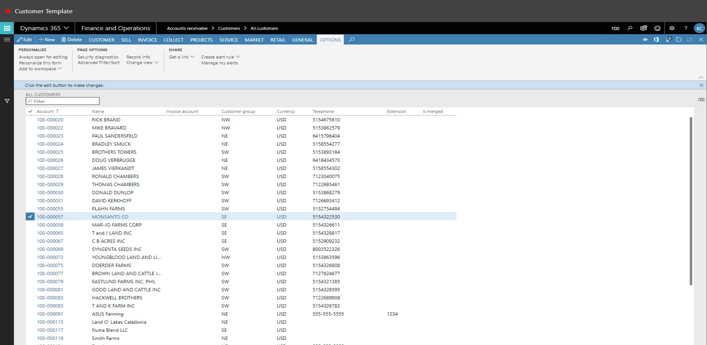
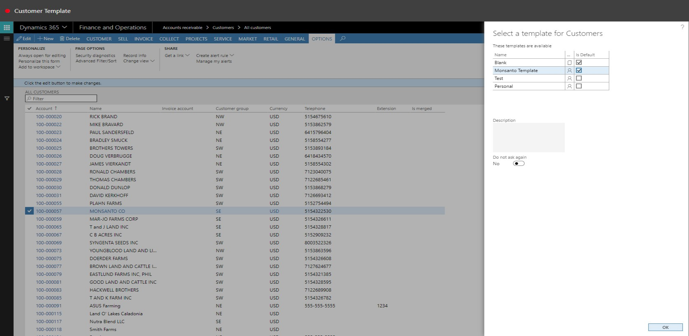
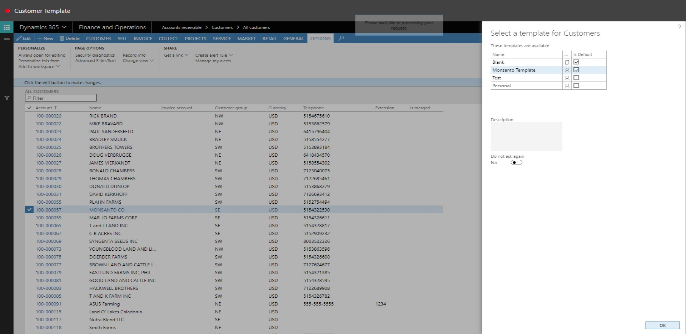
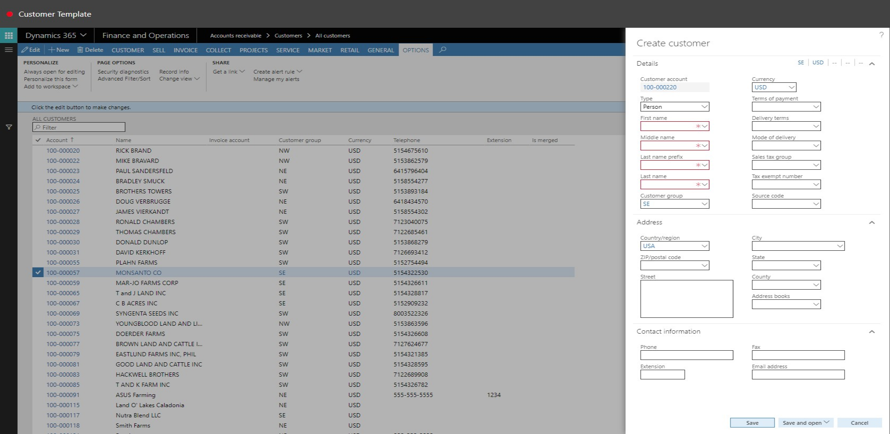

# Customer Template
Brief introduction of the module, component or feature being documented.

This document explains ...

## Customer Template

1. Close the page.

2. Go to Accounts Receivable > Customers > All Customers.
3. In the list, find and select the desired record.

4. Click Record Info.

5. Click New.

6. In the list, find and select the desired record.

7. Select the Is Default check box.
8. Click OK.

9. Click Cancel.

