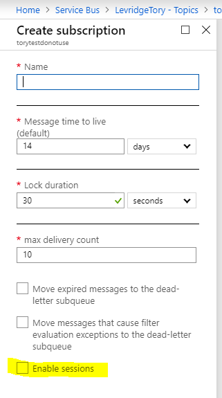
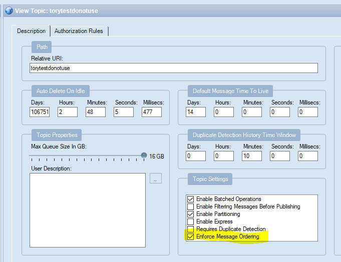

## D365 CE to D365 F&O
### Setup
To integrate from D365 CE to D365 F&O you will need to:
 - Configure Azure Service Bus Endpoint in CE
 - Configure Azure Service Bus plug-in on the appropriate entities
 - [Create an application ID](https://docs.microsoft.com/en-us/azure/active-directory/develop/quickstart-register-app) for the integration framework to authenticate to D365 F&O
 - [Create an Azure Active Directory Application in D365 F&O](https://docs.microsoft.com/en-us/dynamics365/unified-operations/dev-itpro/data-entities/services-home-page#authentication)
 - Create an Azure Service bus topic
 - Create a subscription on the topic above
 
Note: Because CE does not support sending messages to topics with 
subscriptions that require sessions, it is important to make sure that 
the subscription is created **without** enabling sessions.

In order to support message ordering without the use of sessions
the [TopicDescription.SupportOrdering](https://docs.microsoft.com/en-us/dotnet/api/microsoft.azure.servicebus.management.topicdescription.supportordering?view=azure-dotnet) property
must be set to true on the topic. You will need to use the service bus explorer to set this.

### Configuration
In the appsettings.json you will need to define the [SourceConfig](./SourceConfig.md) and [TargetConfig](./TargetConfig.md) nodes as follows:

    "SourceConfig": {
        "ServiceBusConfigName": [section name with service bus topic],
        "ODataConfigName": [section name with CRM data configuration],
        "SystemName": "DynamicsCRM",
        "Direction": "Source"
    },
    "TargetConfig": {
        "ODataConfigName": [section name with F&O data configuration],
        "CDSConfigName": [section name with CDS data configuration],
        "SystemName": "DynamicsAX",
        "Direction": "Target"
    }
