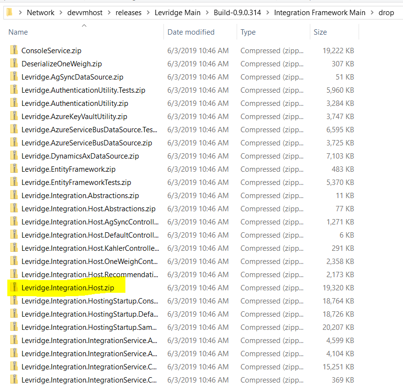
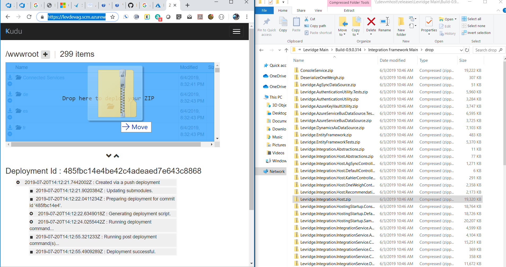

## Deploy Integration Framework as a Zip File
At Levridge we build the Integration Framework every night. The output of the build
is stored at [\\\\devvmhost\releases](file://devvmhost/releases/Levridge-Main/). 
Each build has two folders, "Integration Framework Main" and "Levridge Main". The
integration framework is in the "drop" sub-folder of "Integration Framework Main".

The entire integration framework is contained in the Levridge.Integration.Host.zip file.

To deploy the build:

 1. Open a browser and navigate to `https://<App Service Name>.scm.azurewebsites.net/ZipDeployUI`
    example: https://levdevag.scm.azurewebsites.net/ZipDeployUI 
 2. From the "Integration Main\drop" folder drag the Levridge.Integration.Host.zip and drop it on the file explorer area on the web page.

 3. When deployment is in progress, an icon in the top right corner shows you the progress 
 in percentage. The page also shows verbose messages for the operation below the explorer area. When it is finished, 
 the last deployment message should say "Deployment successful".
 4. Because this will overwrite the appsettings.json you will need to updated the settings to your desired configuration.

### Resources
[Microsoft documentation](https://docs.microsoft.com/en-us/azure/app-service/deploy-zip)