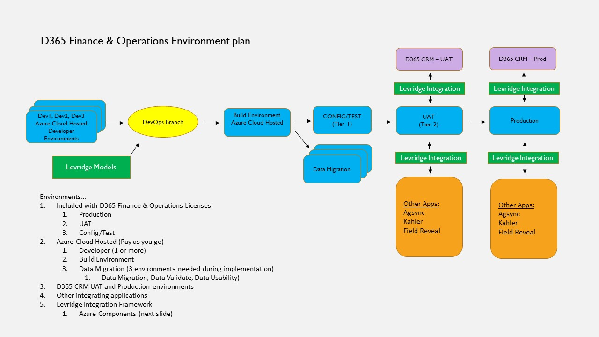

# Environments Planning
A standard D365 implementation is used when launching a Levridge environment plan. The standard D365 implementation guidelines are captured in the Stoneridge Software [Asset Library](https://teams.microsoft.com/_#/tab%3A%3A65b5d435-4201-42ef-8a5b-cd0720466fbd/General?threadId=19%3A94c20c3705b444129e55850b80f0ea8e%40thread.skype&ctx=channel). 

## Overview
D365 is set up with Levridge sitting on top of the functionality. With the start of a new project, the team performs a technical review of what is required and outlines a plan that fits the client’s needs. The team utilizes the latest [Microsoft Environment planning](https://docs.microsoft.com/en-us/dynamics365/fin-ops-core/fin-ops/imp-lifecycle/environment-planning) when implementing a new project due to information continually being revised and updated. The Microsoft Environment planning provides an overview of various aspects that you must consider while you plan for your project's environment. 

To help guarantee a successful cloud implementation, it is important that you discuss and plan your environment early in the project. 

## Getting Started

- Configure your Azure Subscription
  - Create a D365 Subscription
  - Create Azure Active Directory accounts
  - Request vCPU quota increase for planned environments
    - [Azure VM Quota Increase](https://docs.microsoft.com/en-us/azure/azure-portal/supportability/per-vm-quota-requests#:~:text=Request%20a%20standard%20quota%20increase%20from%20Subscriptions,-To%20request%20a&text=Select%20the%20subscription%20whose%20quota%20you%20want%20to%20increase.,%2DvCPUs)
- Deploy your Azure DevOps project
  - [Microsoft Azure Dev Ops](https://azure.microsoft.com/en-us/services/devops/)
  - Create a security token using your D365Admin account (Used for integration with Lifecycle Services)
- Deploy your Lifecycle Services project (D365 licensing required)
  - [Microsoft Dynamics Lifecycle Services](https://lcs.dynamics.com/v2)
  - Complete the Lifecycle Services Onboarding workflow
    - Includes DevOps integration and Azure integration for environment deployments
    - [Project Onboarding](https://docs.microsoft.com/en-us/dynamics365/fin-ops-core/dev-itpro/lifecycle-services/project-onboarding)
- Deploy environments
  - Deployed via Lifecycle Services
  - [Lifecycle Services (LCS) user guide](https://docs.microsoft.com/en-us/dynamics365/fin-ops-core/dev-itpro/lifecycle-services/lcs-user-guide)
- Configure Levridge Integrations
  - [Levridge Integration Deployment Procedures](C:\Users\jessiwoi\source\repos\Levridge-Tory\LevridgeIntegrationDocs\docs\Integration-Overview.md)

## D365 F&O System Requirements
- Azure Tenant
- Azure Active Directory Accounts
  - D365Admin
  - D365Test1
  - D365Test2
  - LevridgeIntegrations
- Azure Execution Account (Manage Azure VM schedules)
- Lifecycle Services Project (included with D365 licensing)
- Azure DevOps (Cloud based)
- D365 F&O Environments (Deploy from Lifecycle Services)
- D365 CE Environments (Deploy from 365 Admin Portal)
- Azure Integration Components
- Document Routing Agent (Installed on local infrastructure to support server-based network printing)
- Power BI Subscription

