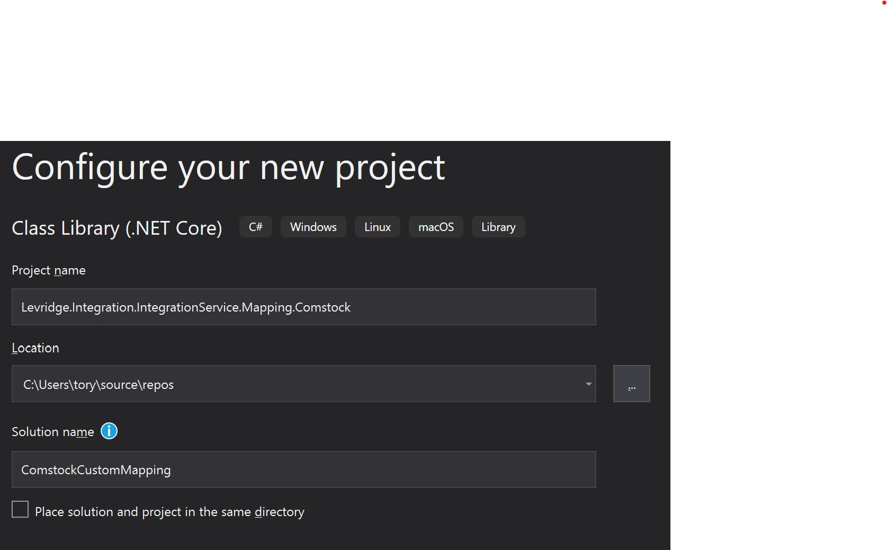
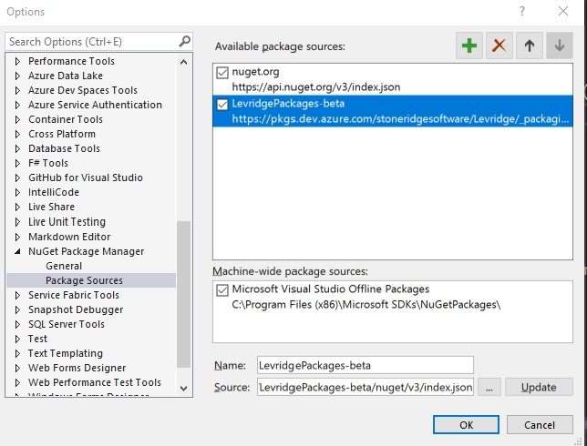

<!-- -->
# Introduction
In many implementations a client will have specific needs that require custom fields to be added to
existing entities. This document shows how to create a custom field extension to have those custom
fields integrated when the entity is being integrated.

# Overview
In order to integrate custom fields you will need to create a Visual Studio solution with three
projects:

* Custom Source Proxy Project

  Contains the proxy for the source datasource with the custom fields in the entities

* Custom Destination Proxy Project

  Contains the proxy for the desitination datasource with the custom fields in the entities

* Custom Mapping Project

  Contains the code need to map the integration for the custom fields between the source and 
destination entities

# Tutorial
## Create the Solution
The first step is to create a Visual Studio solution for the custom mapping.
In Visual Studio, create a new C# Class Library (.NET Core).


You may want to give the solution a different name than the project. In our example, the customer is Comstock
so we will name the solution "ComstockCustomMapping" and the project Levridge.Integration.IntegrationService.Mapping.Comstock.
We recommend you use this naming convention for your custom mapping project: Levridge.Integration.IntegrationService.Mapping.[clientname].


## Create the Source Proxy Project

## Create the Destination Proxy Project

## Add References to the Custom Mapping Project
The Levridge packages are published to our DevOps Artifacts so you will need to add a Nuget source for those
packages. This is done in Visual Studio from Tools/Options/NuGet Package Manager/Package Sources. 
The source is `https://pkgs.dev.azure.com/stoneridgesoftware/Levridge/_packaging/LevridgePackages-beta/nuget/v3/index.json`



You will need to add the following Nuget references to your custom mapping project:

* Levridge.EntityFramework
* Levridge.Integration.IntegrationService.Abstractions
* Levridge.Integration.IntegrationService.Mapping
* Microsoft.Extensions.DependencyInjection

## Add Destination Datasource References to Custom Mapping Project
You will need to reference the destination data source project in order to have acess to any 
Field types and other types used during mapping. If your destination is CRM you would include
the following references.

* Levridge.ODataDataSources.CRMODataDataSource

### Update the references to be excluded from deployment
These references will be needed for the build process, but we will want to use the libraries
provided by the standard deployment and not deploy our own copy of the libraries with the custom
mapping assemblies. To accomplish this, we let the msbuild system know to exclude these
libraries from the runtime deployment by adding `<ExcludeAssets>runtime</ExcludeAssets>` to the 
`<PackageReference>` node for each package. You should have an `<ItemGroup>` node that looks somthing like
this.

```
  <ItemGroup>
    <PackageReference Include="Levridge.EntityFramework" Version="2.0.10">
      <ExcludeAssets>runtime</ExcludeAssets>
    </PackageReference>
    <PackageReference Include="Levridge.Integration.IntegrationService.Abstractions" Version="1.0.0">
      <ExcludeAssets>runtime</ExcludeAssets>
    </PackageReference>
    <PackageReference Include="Levridge.Integration.IntegrationService.Mapping" Version="1.0.0">
      <ExcludeAssets>runtime</ExcludeAssets>
    </PackageReference>
    <PackageReference Include="Levridge.ODataDataSources.CRMODataDataSource" Version="2.1.15">
      <ExcludeAssets>runtime</ExcludeAssets>
    </PackageReference>
    <PackageReference Include="Microsoft.Extensions.DependencyInjection" Version="3.0.2">
      <ExcludeAssets>runtime</ExcludeAssets>
    </PackageReference>
  </ItemGroup>
```

## Add a reference to the two datasource proxy projects
Your custom mapping mehtods will need to access the source and data entities so you will need to 
add a reference to the two proxy projects you created in sections [Create the Source Proxy Project](#Create-the-Source-Proxy-Project)
and [Create the Destination Proxy Project](#Create-the-Destination-Proxy-Project)

## Create An EntityMapBuilderExtension class
We need to have a class that will contain the necessary mapping methods for the custom
fields being added to the integration.

1. Create a public static class 
2. Name the class 
    We recommend using something like [client]CustomFieldsEntityMapping. The actual name is
    not important, orther than to be clear the purpose of the class. In our example
    we named the class `ContosoCustomFieldsEntityMapping`.
3. Add a public static void method that takes a single `IServiceCollection` parameter.
   In our example we added the following method:
   `public static void AddContosoCustomMaps(IServiceCollection services)`
4. Add a private static method that a single `IEntityMapBuilder` parameter and returns an `IEntityMapBuilder`
    and takes two generic parameters.
    In our example we added the following method:
    `private static IEntityMapBuilder AddContosoCustomFieldsToMaps<TSource, TTarget>(IEntityMapBuilder builder)`
5. Add the following code to the public static method created in step 3 above:

       var builder = new EntityMapBuilder(services);
       ContosoCustomFieldsEntityMapping.AddContosoCustomFieldsToMaps<AxEntities.CustomerV3, CRMEntities.lev_customer>(builder);`

    The second line should reference the current class and the method you created in step 4 above.
    Here is our complete method in the example:

       public static void AddLandusCustomMaps(IServiceCollection services)
       {
           var builder = new EntityMapBuilder(services);
           ContosoCustomFieldsEntityMapping.AddContosoCustomFieldsToMaps<AxEntities.CustomerV3, CRMEntities.lev_customer>(builder);
       }

6. Add the following code to the private static method created in step 4 above:

       if (builder == null)
       {
           throw new ArgumentNullException(nameof(builder));
       }
       return EntityMapBuilderHelper.InvokeMappingMethods(builder, typeof(ContosoCustomFieldsEntityMapping));

    The first block validates the parameter. The last line calls a method on a helper class to invoke all 
    the mapping methods on the class we are now building.
    Here is our complete method in the example:

       private static IEntityMapBuilder AddContosoCustomFieldsToMaps<TSource, TTarget>(IEntityMapBuilder builder)
       {
           if (builder == null)
           {
               throw new ArgumentNullException(nameof(builder));
           }
           return EntityMapBuilderHelper.InvokeMappingMethods(builder, typeof(ContosoCustomFieldsEntityMapping));
       }

7. Create mapping methods
   1. Create a private static method that a single `IEntityMapBuilder` parameter and returns an `IEntityMapBuilder`
      Name the method Map[SourceEntity]_[DestinationEntity]. 

      In our example we added the following method:
      `private static IEntityMapBuilder MapCustomerV3_lev_customer(IEntityMapBuilder builder)`
      This method will add the custom field mapping for CustomerV3 to lev_customer

   2. Add an [EntityMapMethod] Attribute to the map method
   3. Add mapping code in the map method
      The mapping code is split into two levels:
        - [AddEntityMap](EntityMapBuilderExtensions.AddEntityMap.md)
          The structure of the `AddEntityMap` is an extension method on `IEntityMapBuilder` that takes
          two generic parameters for the source and target entities and an `Action` method parameter used 
          to configure the EntityMap by adding field maps for the entities.
        - [AddFieldMap](EntityMap.AddFieldMap.md)
          `AddFieldMap` is a method on `EntityMap`. There are several that takes
          two generic parameters for the source field type and target field type and an `Action` method parameter used 
          to configure the EntityMap by adding field maps for the entities.

      Here is an example method that adds mapping for CustomerV3 to lev_customer:


            private static IEntityMapBuilder MapCustomerV3_lev_customer(IEntityMapBuilder builder)
            {
                builder.AddEntityMap<AxEntities.CustomerV3, CRMEntities.lev_customer>(em =>
                {
                    em.AddFieldMap<String, String>(
                        new JSONField<String>(nameof(AxEntities.CustomerV3.LevPrintName)),
                        new CRMODataField<String>(nameof(CRMEntities.lev_customer.lev_name)),
                        (a, b) =>
                        {
                            String printName = a.Value;
                            String organizationName = (String)a.FieldEntity[nameof(AxEntities.CustomerV3.OrganizationName)].Value;

                          return String.IsNullOrEmpty(printName) ? organizationName : printName;
                        },
                        (b, a) =>
                        {
                            throw new IntegrationNotSupportedException();
                        });

                    em.AddFieldMap<String, String>(
                        new JSONField<String>(nameof(AxEntities.CustomerV3.LevInCareOf)),
                        new CRMODataField<String>(nameof(CRMEntities.lev_customer.lev_incareof)));

                    em.AddMapReferencedField(nameof(AxEntities.CustomerV3), nameof(AxEntities.CustomerV3.LevPrintName));
                });
                return builder;
            }


### Example Mapping 

    using System;
    using Microsoft.Extensions.DependencyInjection;
    using Levridge.EntityFramework;
    using Levridge.ODataDataSources;
    using Levridge.Integration.IntegrationService.Abstractions;
    using AxEntities = ContosoCustomFields.Microsoft.Dynamics.DataEntities;
    using CRMEntities = ContosoCustomFields.ODataDataSources.DynamicsCRM;

    namespace Levridge.Integration.IntegrationService.Mapping.ContosoCustomFields
    {
        public static class ContosoCustomFieldsEntityMapBuilderExtensions
        {
            public static void AddContosoCustomMaps(IServiceCollection services)
            {
                var builder = new EntityMapBuilder(services);
                ContosoCustomFieldsEntityMapBuilderExtensions.AddContosoCustomFieldsToMaps<AxEntities.CustomerV3, CRMEntities.lev_customer>(builder);
            }

            private static IEntityMapBuilder AddContosoCustomFieldsToMaps<TSource, TTarget>(IEntityMapBuilder builder)
            {
                if (builder == null)
                {
                    throw new ArgumentNullException(nameof(builder));
                }
                return EntityMapBuilderHelper.InvokeMappingMethods(builder, typeof(ContosoCustomFieldsEntityMapBuilderExtensions));
            }

            [EntityMapMethod]
            private static IEntityMapBuilder MapCustomerV3_lev_customer(IEntityMapBuilder builder)
            {
                builder.AddEntityMap<AxEntities.CustomerV3, CRMEntities.lev_customer>(em =>
                {
                    em.AddFieldMap<String, String>(
                        new JSONField<String>(nameof(AxEntities.CustomerV3.LevPrintName)),
                        new CRMODataField<String>(nameof(CRMEntities.lev_customer.lev_name)),
                        (a, b) =>
                        {
                            String printName = a.Value;
                            String organizationName = (String)a.FieldEntity[nameof(AxEntities.CustomerV3.OrganizationName)].Value;

                            return String.IsNullOrEmpty(printName) ? organizationName : printName;
                        },
                        (b, a) =>
                        {
                            throw new IntegrationNotSupportedException();
                        });

                    em.AddFieldMap<String, String>(
                        new JSONField<String>(nameof(AxEntities.CustomerV3.LevInCareOf)),
                        new CRMODataField<String>(nameof(CRMEntities.lev_customer.lev_incareof)));

                    em.AddMapReferencedField(nameof(AxEntities.CustomerV3), nameof(AxEntities.CustomerV3.LevPrintName));
                });
                return builder;
            }

            [EntityMapMethod]
            private static IEntityMapBuilder MapCustomerV3_account(IEntityMapBuilder builder)
            {
                builder.AddEntityMap<AxEntities.CustomerV3, CRMEntities.account>(em =>
                {
                    em.AddFieldMap<String, String>(
                        new JSONField<String>(nameof(AxEntities.CustomerV3.LevPrintName)),
                        new CRMODataField<String>(nameof(CRMEntities.account.name)),
                        (a, b) =>
                        {
                            String printName = a.Value;
                            String organizationName = (String)a.FieldEntity[nameof(AxEntities.CustomerV3.OrganizationName)].Value;

                            return String.IsNullOrEmpty(printName) ? organizationName : printName;
                        },
                        (b, a) =>
                        {
                            throw new IntegrationNotSupportedException();
                        });
                });
                return builder;
            }

            [EntityMapMethod]
            private static IEntityMapBuilder MapInventSite_lev_companysite(IEntityMapBuilder builder)
            {
                builder.AddEntityMap<AxEntities.InventSite, CRMEntities.lev_companysite>(em =>
                {
                    em.AddFieldMap<String, String>(
                        new JSONField<String>(nameof(AxEntities.InventSite.LevRegionId)),
                        new CRMODataField<String>(nameof(CRMEntities.lev_companysite.stn_region)));
                });

                return builder;
            }
        }
    }
