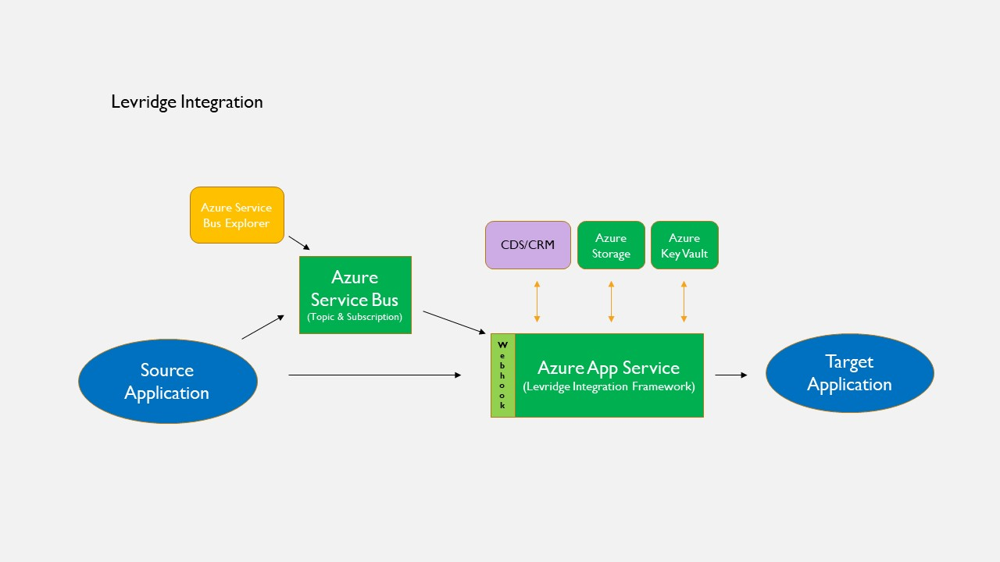

# Introduction
The Levridge integration framework provides integration between Dynamics365 Finance and SCM
and Dynamics 365 Customer Engagement and 3rd party applications.

This document provides and overview of the integration framework and links to the documents
that exist for the framework.

## Overview
Levridge has created an integration framework to handle all the integrations between systems.  This framework uses json entities to exchange information. The integration framework uses Microsoft [Azure Service Bus](https://azure.microsoft.com/en-us/services/service-bus/) to provide a [Publish and Subscribe messaging pattern](https://en.wikipedia.org/wiki/Publish%E2%80%93subscribe_pattern). Levridge has created an event framework in D365 Finance that will publish entity data to the service bus based on Creates, Deletes and Updates. Information/messages sent to the service bus can be subscribed to by 3rd party applications or by the Levridge integration framework and sent to 3rd party applications like AgSync. The data entities in D365 Finance and can be filtered so only certain records are sent.

All integrations that use the framework follow the same pattern:
  1. A data source has an integration event
  2. The data source responds to the integration event by sending one or more entities to the service bus.
  3. The service bus publishes the message(s) to each subscription
  4. An instance of the integration framework receives the message(s) from a subscription
  5. The integration framework transforms the message if needed
  6. The integration framework sends the message to the target data source

The Levridge Integration Framework is most commonly run in the cloud as an 
[Azure App Serivce](https://azure.microsoft.com/en-us/services/app-service/). It can also run as a windows service or 
as an IIS application. See [this article](./Deploying-Integration-Framework.md) to learn more about the deployment options.

## Integrations

Currently we support the following integrations:  

 - [D365 F&O to D365 CRM](./D365-F&O-to-D365-CRM.md)
 - [D365 CRM to D365 F&O](./D365-CRM-to-D365-F&O.md)
 - [Scale](./Scale-Overview.md)
 - [Agsync](./Agsync.md)
 - [Kahler](./Kahler.md)
 - [Surety](./Surety.md)
 - [oneWeigh](./oneWeigh.md)
 - [Field Reveal](./Field-Reveal.md)
 - [Levridge CRM Remote Printing Service](./Levridge-CRM-Remote-Printing-Service.md)

## Environments Planning
A standard D365 implementation is used when launching a Levridge environment plan. The D365 F&O System Requirements and what one needs to start a project are outlined in [Environments Planning](.\EnvironmentsPlanning.md).

## Levridge Integration System Requirements
- Azure App Registrations
  - One each for the Production and Test environments
  - [Azure App Registrations](https://docs.microsoft.com/en-us/azure/active-directory/develop/app-registration-portal-training-guide)
- Azure Service Bus Namespace
  - One each for the Production and Test environments
    - Configure both using the Standard Pricing Tier
  - Topics/Subscriptions will be determined based on integration within scope for the project
  - Documentation
    - [Azure Service Bus Overview](https://docs.microsoft.com/en-us/azure/active-directory/develop/app-registration-portal-training-guide)
    - [Azure Service Bus topics and subscriptions](https://docs.microsoft.com/en-us/azure/service-bus-messaging/service-bus-queues-topics-subscriptions)
- Azure App Service Plan
  - One each for Production and Test environments
    - Use a Standard tier for the Test environment
    - Use a Premium V2 tier for the Production environment
      - Additional sizing will be reviewed during the implemenation
    - [Azure App Service Plan overview](https://docs.microsoft.com/en-us/azure/app-service/overview-hosting-plans)
    - Individual Azure App Services will be deployed to these App Service Plans
- Azure App Services
  - Separate App Services will be deployed for each integrating application
    - Once deployed and configured we will then deploy the Levridge Integration Framework to each
    - Separate Levridge Integration Framework configuration will be required
  - App Services pricing is included in the App Service Plan tier pricing (see App Service Plan overview above)
- Azure Storage Account
  - Levridge Integrations utilize Azure Storage Accounts in multiple areas
  - One each required for the Production and Test environments
  - Use the General Purpose V2 account type
  - [Azure Storage Account overview](https://docs.microsoft.com/en-us/azure/storage/common/storage-account-overview)
- Azure Key Vault
  - One key vault is required.  Can be used by both the Production and Test environments
  - [Azure Key Vault overview](https://docs.microsoft.com/en-us/azure/key-vault/general/basic-concepts)

