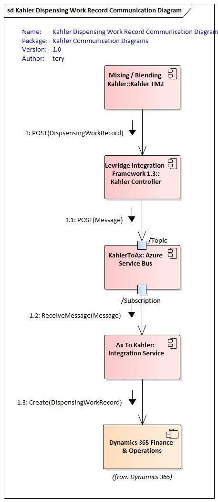

<!-- 
Add instance config reference
Matt - Add service bus setup reference (move from bottom)
Matt - Specific documentation for what Entities to setup in F&O. Include information on filtering customers, operations & sites
  -- Caveat on dependent entities will not necessarily be changed so they won't trigger change control

Add reference to azure key vault setup
Document Kahler JSON objects
 -- Dispensing Work Order
 -- Dispensing Work Record
 -- Levridge.Integration.Host.KahlerController
Document URI setup in F&O

-->

# Kahler Integration
The Kahler integration is a bidirectional integration that consists of a Topic for
Dispensing Work Orders that go from D365 F&O to Kahler and Dispensing Work Records that go from 
Kahler to D365 F&O with the goal of margin control and recognizing revenue across site locations.

# Overview
Because this is a bidirectional integration there are two instances of the integration running
to handle the entire integration. There is one integration instance for each direction.

One aspect of Kahler that is different from other integrations is the D365 F&O to Kahler
instance must run on premise because the Kahler system runs behind the firewall. This
should be deployed as a service.

Another aspect that is different is that each location should only get the messages from the 
topic that apply to that location. This is done with a filter on the service bus topic subscription.
In order for the filter to work the Levridge Entity Event must be configured to expose
the branch property on the message.

### Required Resources
  - Security permissions to access sales orders, transfer orders, and transportation maangement system in D365 F&O
  - Security permissions and access to Kahler's system

## Setup
To integrate to and from Kahler and D365 F&O you will need to:
 
 - [Create an Azure Service bus topic for Dispensing Work Orders (D365 F&O to Kahler)](https://docs.microsoft.com/en-us/azure/service-bus-messaging/service-bus-quickstart-topics-subscriptions-portal)
 - [Create an Azure Service bus topic for Dispensing Work Records (Kahler to D365 F&O)](https://docs.microsoft.com/en-us/azure/service-bus-messaging/service-bus-quickstart-topics-subscriptions-portal)
 - [Create a subscription on the Dispensing Work Order topic for each Branch that has a Kahler mixer](https://docs.microsoft.com/en-us/azure/service-bus-messaging/service-bus-quickstart-topics-subscriptions-portal)
 - [Create a filter on the subscription for each Branch](https://docs.microsoft.com/en-us/azure/service-bus-messaging/topic-filters)
 - [Create a subscription on the Dispensing Work Record topic for integration back to F&O](https://docs.microsoft.com/en-us/azure/service-bus-messaging/service-bus-quickstart-topics-subscriptions-portal)
 - [Configure Event Endpoint in F&O](./Configuring-Levridge-Entity-Event-Endpoint.md)
 - [Configure Levridge Entity Events]("./Configuring-Levridge-Entity-Events.md")
   - You will need to be sure to provide properties on the event to allow filtering by Branch
 - [Create an application ID](https://docs.microsoft.com/en-us/azure/active-directory/develop/quickstart-register-app) for the integration framework to authenticate to D365 F&O
 - [Create an Azure Active Directory Application in D365 F&O](https://docs.microsoft.com/en-us/dynamics365/unified-operations/dev-itpro/data-entities/services-home-page#authentication)
 - [Set up Azure Key Vault / Overview](https://docs.microsoft.com/en-us/azure/key-vault/general/basic-concepts) 
 - [Deploy the Levridge Integration Framework as a service](./Deploy-Integration-As-A-Service.md) at each Branch that has a Kahler mixer

## Configuration for Kahler on Premise
This configuration will need to be on premise with the Kahler mixer. The on-premise instance will handle the Dispensing Work Order from D365 F&O to Kahler  and the Webhook that receives Dispensing Work Records from Kahler.

The configuration of D365 F&O is required to release to Kahler. Within the release product itself, default warehouses must be defined to ensure that under Manage Inventory default warehouses are set up with a dispensing method to be able to ship to a Kahler. The dispensing method is a 1:1 ration (1 warehouse 1 dispensing method). This configuration produces a URL that is an identifier for each Kahler. Each Kahler instance has its own URL and that URL must be attached to the product to ensure it is sent to the correct web hub. 

In the appsettings.json you will need to define the [InstanceConfig](./InstanceConfig.md)  [SourceConfig](./SourceConfig.md) and [TargetConfig](./TargetConfig.md) nodes as follows:

        "InstanceConfig": {
            "AzureTableConfiguration": "[section name to Azure Table Configuration",
            "LogRequestsAndResponses": [true or false]
            "EnableAppInsightsAdaptiveSampling": [true or false]
        },
        "SourceConfig": {
            "ServiceBusConfigName": "[section name with Dispensing Work Order service bus topic]",
            "ODataConfigName": "[section name with F&O data configuration]",
            "SystemName": "DynamicsAX",
            "Direction": "Source"
        },
        "TargetConfig": {
            "ODataConfigName": "[section name with Kahler data configuration]",
            "CDSConfigName": "[section name with CDS data configuration]",
            "SystemName": "Kahler",
            "Direction": "Target"
        }

Here is a sample template for the entire appsettings.json file used for the on-premise deployment
of the integration from FinOps to Kahler:

    {
        "Controllers": {
            "HostController": "Levridge.Integration.Host.DefaultController",
            "KahlerConroller": "Levridge.Integration.Host.KahlerController"
        },
        "Logging": {
            "Debug": {
                "LogLevel": {
                    "Default": "Information"
                }
            },
            "Console": {
                "IncludeScopes": true,
                "LogLevel": {
                    "Default": "Information"
                }
            },
            "LogLevel": {
                "Default": "Information"
            }
        },
        "AllowedHosts": "*",
        "ApplicationInsights": {
            "InstrumentationKey": "08f05bc5-e901-4c19-8358-286bdcedf35e"
        },
        "InstanceConfig": {
            "AzureTableConfiguration": "[section name to Azure Table Configuration",
            "LogRequestsAndResponses": [true or false]
            "EnableAppInsightsAdaptiveSampling": [true or false]
        },
        "SourceConfig": {
            "ServiceBusConfigName": "Dispensing Work Order", //[section name with Dispensing Work Order service bus topic]
            "ODataConfigName": "DynamicsAX", //[section name with F&O data configuration]
            "SystemName": "DynamicsAX",
            "Direction": "Source"
        },
        "TargetConfig": {
            "ODataConfigName": "Kahler End Point", //[section name with Kahler data configuration],
            "CDSConfigName": "[section name with CDS data configuration]",
            "SystemName": "Kahler",
            "Direction": "Target"
        },
        "DynamicsAX": {
            "UriString": "[URL to D365 F&O]",
            "ActiveDirectoryResource": "[URL to D365 F&O]",
            "ActiveDirectoryTenant": "https://login.microsoftonline.com/[Customer_Tenant_ID]",
            "ActiveDirectoryClientAppId": "[Application ID used to register the application in AD]",
            "ActiveDirectoryClientAppSecret": "[Client Secret generated for the Application ID in AD]",
            "ODataEntityPath": "[URL to D365 F&O]/data/"
        },
        "Kahler End Point": {
            "UriString": "[URL to Local Kahler]"
        },
        "Dispensing Work Order": {
            "ConnectionString": "[connection string to Dispensing Work Order Topic]",
            "TopicName": "[Dispensing Work Order Topic Name]",
            "SubscriptionName": "[Subscription Name for the Branch]",
            "RequiresSession": true
        },
        "CDS": {
            "UriString": "[URL to CDS or Localhost]",
            "ActiveDirectoryResource": "[URL to CDS]",
            "ActiveDirectoryTenant": "https://login.microsoftonline.com/[Customer_Tenant_ID]",
            "ActiveDirectoryClientAppId": "[Application ID used to register the application in AD]",
            "ActiveDirectoryClientAppSecret": "[Client Secret generated for the Application ID in AD]",
            "ODataEntityPath": "[URL to CDS]/api/data/v9.0/",
            "AssemblyName": "Levridge.ODataDataSources.CDS",
            "ClientClassesNameSpace": "Levridge.ODataDataSources.CDS",
            "MetadataResource": "CDSMetadata.xml"
        },
        "Levridge.Integration.Host.KahlerController": {
            "ConnectionString": "[connection string to Dispensing Work Record Topic]",
            "TopicName": "[Dispensing Work Record Topic Name]",
            "RequiresSession": true
        }
    }

### Controllers
This section contains a list of controllers that will be loaded by the current instance. In addition to the default 
controller that we always want to load, we want the system to load the Kahler controller. The names (on the left) are not
significant and are used only for debugging. The values (on the right) are significant. It must be the name of the assembly
that should be loaded for the controller.

### [InstanceConfig](./InstanceConfig.md)
InstanceConfig is an object in the appsettings.json file used by the Levridge Integration Framework
to define the configuration for the Current Instance of the integration framework.

### [SourceConfig](./SourceConfig.md)
The source config will represent the data being send from D365 F&O. Currently, the Dispensing Work Order is the only entity
sent from F&O. In the future the topic may also include master data that is sent to Kahler.

The ODataConfigName is not currently being used but is a required value. So point it to the section that contains the connection
information to D365 F&O.

### [TargetConfig](./TargetConfig.md)
The target config will represent the data endpoint for the local Kahler mixer. The "ODataConfigName" should point to a section
that contains the Kahler REST endpoint.

### Levridge.Integration.Host.KahlerController
This section is used by the Kahler controller to be able to send messages to the proper topic to be handled by the integration framework and written to D365 F&O.

## Configuration for Kahler in Azure
This instance can be a single instance running in the cloud. This instance will handle the Dispensing Work Record from Kahler to D365 F&O.

In the appsettings.json you will need to define the [InstanceConfig](./InstanceConfig.md)  [SourceConfig](./SourceConfig.md) and [TargetConfig](./TargetConfig.md) nodes as follows:

        "InstanceConfig": {
            "AzureTableConfiguration": "[section name to Azure Table Configuration",
            "LogRequestsAndResponses": [true or false]
            "EnableAppInsightsAdaptiveSampling": [true or false]
        },
        "SourceConfig": {
            "ServiceBusConfigName": "[section name with Dispensing Work Record service bus topic]"
            "ODataConfigName": "",
            "SystemName": "Kahler",
            "Direction": "Source"
        },
        "TargetConfig": {
            "ODataConfigName": "[section name with F&O data configuration]",
            "CDSConfigName": "[section name with CDS configuration]",
            "SystemName": "DynamicsAX",
            "Direction": "Target"
        }

Here is a template of the full appsettings.json file used for the Kahler integration from the Webhook to FinOps:

    {
        "Controllers": {
            "HostController": "Levridge.Integration.Host.DefaultController"
        },
        "Logging": {
            "ApplicationInsights": {
                "LogLevel": {
                    "Default": "Trace"
                }
            },
            "Debug": {
                "LogLevel": {
                    "Default": "Information"
                }
            },
            "Console": {
                "IncludeScopes": true,
                "LogLevel": {
                    "Default": "Information"
                }
            },
            "LogLevel": {
                "Default": "Information"
            }
        },
        "AllowedHosts": "*",
        "InstanceConfig": {
            "AzureTableConfiguration": "[section name to Azure Table Configuration",
            "LogRequestsAndResponses": [true or false]
            "EnableAppInsightsAdaptiveSampling": [true or false]
        },
        "SourceConfig": {
            "ServiceBusConfigName": "Dispensing Work Record", //[section name with Dispensing Work Record service bus topic]
            "ODataConfigName": "",
            "SystemName": "Kahler",
            "Direction": "Source"
        },
        "TargetConfig": {
            "ODataConfigName": "DynamicsAX", //[section name with F&O data configuration]
            "CDSConfigName": "CDS",
            "SystemName": "DynamicsAX",
            "Direction": "Target"
        },
        "DynamicsAX": {
            "UriString": "[URL to D365 F&O]",
            "ActiveDirectoryResource": "[URL to D365 F&O]",
            "ActiveDirectoryTenant": "https://login.microsoftonline.com/[Customer_Tenant_ID]",
            "ActiveDirectoryClientAppId": "[Application ID used to register the application in AD]",
            "ActiveDirectoryClientAppSecret": "[Client Secret generated for the Application ID in AD]",
            "ODataEntityPath": "[URL to D365 F&O]/data/"
        },
        "Dispensing Work Record": {
            "ConnectionString": "[connection string to Dispensing Work Record Topic]",
            "TopicName": "[Dispensing Work Record Topic Name]",
            "SubscriptionName": "[Subscription Name for Integration to D365 F&O]",
            "RequiresSession": true
        }
    }

### Dispensing Method Configuration
1. Release Products Grid
2. Highlight line
3. Manage Inventory
4. Warehouse Tab
5. Warehouse Items
6. Dispensing Method field
7. Select the warehouse that should be tied to the dispensing method
8. Select the appropriate configure dispensing method
9. Add Kahler specific URL

If the URL is not setup properly for each product, the product could be sent to an incorrect Kahler location. This step is critical to ensure the setup and configurations are accurate. 

### Sales Order Statuses
1. Planned (generated sales order)
2. Booked
3. Released (order is sent to dispatcher work board)
4. Scheduled (generates dispensing work record and assigns application site)
5. Completed

Once the order is in a scheduled status, it will generate a dispnsing work record which kicks off the integration to send the product to Kahler. Once Kahler completes the dispatching of product and the onsite work is completed, the work order status is updated to either completed, pending, or review. Data is populated in the work order completion tab in F&O. 

### Work Order Completion
1. Rolling stock ID (task completion equipment)
2. Weather information
    - Humidity
    - Temperature
    - Wind speed
    - Wind direction
3. Pests
4. Acreage completed
5. Start and end times
6. Acmount of actual product applied

Once the work is completed by the dispatcher, the work order status updated to the final completion stage (complete/verify). 

### Picking List
Within each order, there is a possibility of multiple picking lists. Picking lists annotate the amount of batches/truck loads left Kahler and the mix in each truck. 

Picking lists allow one to know how many loads are being used. There are two bill options: 
1. Bill what Kahler said was used
2. Bill for what the machine stated was used

Transportation Management System (TMS) has the ability to generate a freight bill after Kahler sends the picking lists to ensure the third party contractor delivering the product is paid. The steps below outline the process:
1. Data from Kahler creates a picking list
2. Load creation in TMS
3. Generate freight bill invoiceable to the third party contractor

### Packing Order
A packing slip is generated for the work order in an invoiceable status. Packing orders can take place either in the complete, pending, review status or in the complete, verify status. 

### Generate Order Manually
The below outlines the steps required to generate a manual order. 
1. Create a sales order. 
The information collected in the sales order includes: 
    - Who the grower is
    - The inventory location the product is being picked up at
2. Generate product to be shipped to Kahler
    - Individual products
    - Custom configuration BOM
    - Select configuration BOM
    - Product and supply
    - Configure line
    - Configure selected item (product type and amount)
    - Click OK (BOM is generated)
    - Select blending site
    - Save
    - Explode BOM back out
3. Warehouse items tab
    - Release for dispensing
    - Generates dispensing ID
    - Order is sent to Kahler
4. Manually pack, slip, and post

### Manual Transfer Order
Transfer orders allow product to be moved from one site to another. The below outlines the process: 
1. Inventory management
2. Transfer order
3. Populate "From" and "To" warehouses
4. Add line
5. Select product and amont of product to be transferred
6. Save Ship
7. Release for dispensing
8. Transfer order is sent to Kahler to act on physical shipping of the product. 

