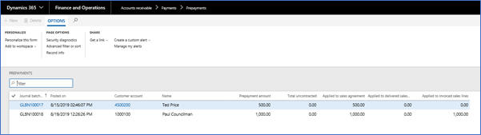
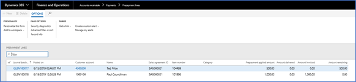

# Prepayments
Prepayments may be tracked against a sales agreement instead of an invoice. Levridge may hold the approval of a sales agreement until an appropriate prepayment has been met.  
For example, a user may accept a prepayment such as $10,000 toward fertilizer.  This allows you to lock in the pricing as of the day of the prepayment.

The prepayment resides in the AR account as an unapplied value.  There are list pages that allow you to see the sales agreements that require a prepayment.  The remaining balance of the prepayment will be displayed along with contact information for collection.  

Prepayments may be collected and entered as uncontracted (not specific to a sales agreement) or specified for a specific item or item category (such as chemical).  Price date may be captured as of the uncontracted prepayment date to be used to capture pricing when the payment is applied to the transaction.

During the ordering process, the system will automatically find the sales agreements and prepayments and apply to the order.

Billing needs to review the information provided, making for a faster more efficient invoice processing.

Please see below example of the Prepayment summary within the Payments view in AR: 

   

Remaining balances may be viewed in the Prepayment Lines menu choice in AR:

   
