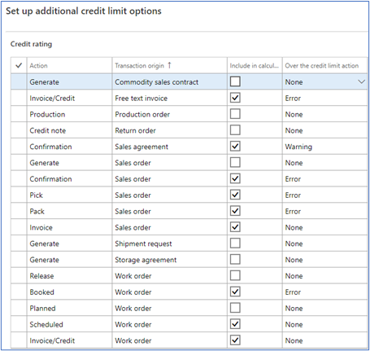

# Pricing and Discounts

The sales trade agreements have been expanded to include method and terms of payment, zone pricing (seed), and volume pricing.

## Method and Terms of Payment
The method and terms of payment modification allows for different pricing to be used on sales orders. The sales trade agreement has the option to select this type of pricing.  For example, a standard price of $10 may be updated to $8 when method of payment is cash.

First three – can setup specific pricing. For example, John Deere Financial could provide special pricing in certain areas. Special pricing may also be based on the terms of payment.  

## Zone Pricing
Levridge now allows zone pricing based off the home address of a customer, not just the site location.  This will permit pricing specific to the county of the home address of the customer for both selling to a customer and purchasing products such as seed.  Zone pricing will allow for more precise pricing on sales orders and purchase orders and should make year-end reconciliation with the manufacturers more efficient.

### Customer Zone Sales Pricing enhancement includes:

- A new ‘Vendor Zones’ table is available to define the zones
- The ‘zone’ field is also added to all trade agreement journals
- ‘Zone Pricing Address’ is added to the customer setup > sales order defaults
- Sales forms will validate items with zone pricing, match to the customer zone and display the appropriate price.

### Site Zone Purchase Pricing enhancement includes:

- A new ‘Site Zones’ table is available under Procurement & Sourcing>Setup>Price Discounts>Site Zones
- Sites will use zone pricing for purchases from vendors with zones
- Zones are added to the trade agreement journals
- Zones are identified by manufacturer
- Purchase price trade agreements may be setup including item, zone and price.
- When the code is ran on a purchase order it will search for the sites address and match the county and state to the correct zone in the zone pricing table. The code will then  search the purchase price trade agreement journal for the item and zone and put the price on the purchase order, purchase agreement, RFQ, and purchase requisition.
- The purchase price trade agreement journal will display the appropriate pricing on forms.

## Volume Pricing
The sales trade agreements provide options for volume pricing where ranges are designated for different levels of pricing. For example, a quantity of 1-20 has certain pricing, 21-50 another price.

Volume pricing takes one step farther. Volume pricing looks at the quantities on order and quantities within a date range, then through the pricing service, will assign the appropriate price.

## Credit Limits 
Receivables>Setup> AR Parameters

Standard FinOps customer setup permits a credit limit type of None, Balance, Balance + packing slip or product receipt, or Balance + all.  

Levridge allows you to define what you want to include in the calculation for available credit. Currently FinOps looks at outstanding sales orders and accounts receivable amount due.  Levridge allows this to be expanded to include sales agreements with either hard stops or warnings. This is an overall setting for the company.

   
 
There are transactions that originate in CRM that are supported by an existing AX process. To provide a consistent user experience, the configuration selection for transactions that should be included in credit limit calculation should reflect these relationships. For example, if CRM Agronomy Contract is set to “Yes” to include, then Sales agreements should be automatically set to “Yes” to include. 

The Customer Balance List with credit limit report has also been modified to reflect a Balance that includes the balance due PLUS any pending transactions considered in calculating available credit.
