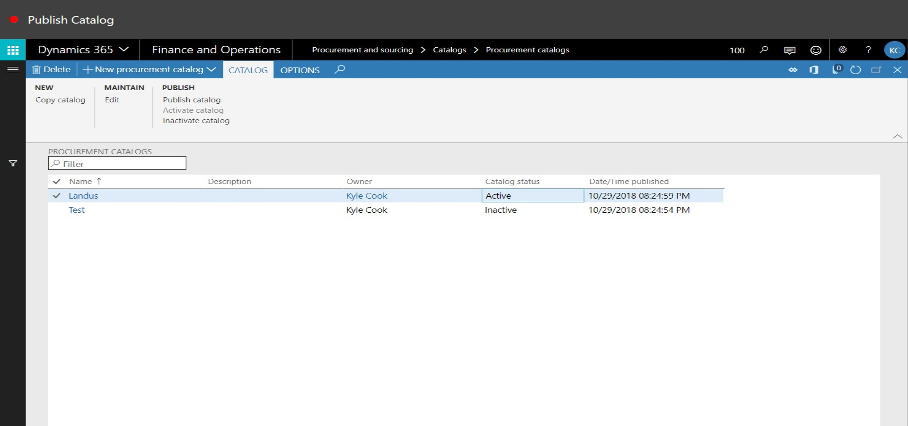
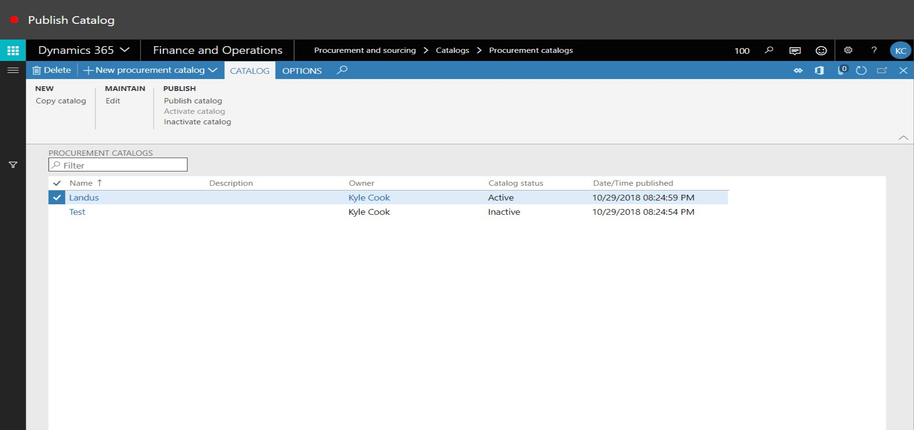
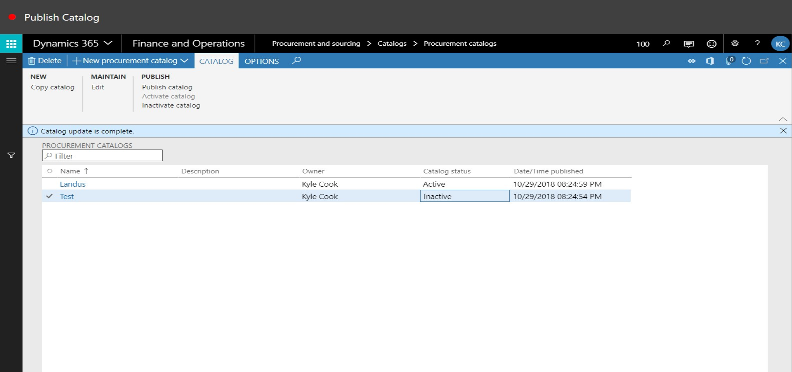

# Publish Catalog
Brief introduction of the module, component or feature being documented.

This document explains ...

## How to Publish a Catalog

1. Go to Procurement and Sourcing > Catalogs > Procurement Catalogs.

2. In the list, find and select the desired record.

3. Click Publish Catalog.

