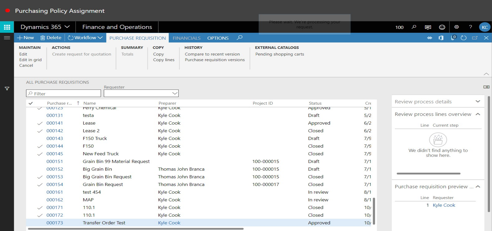
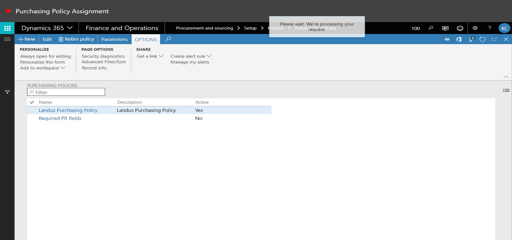
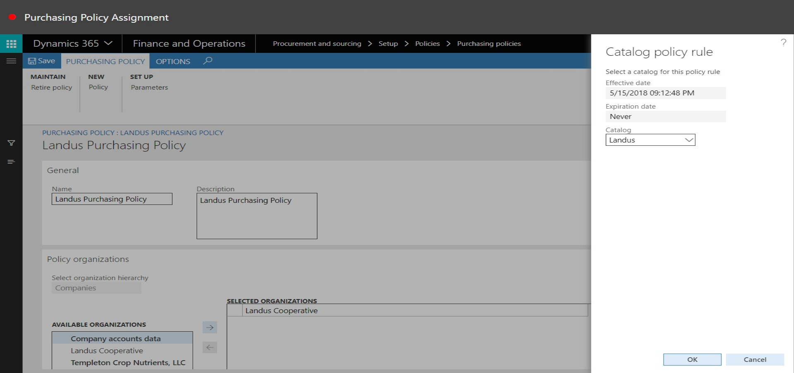
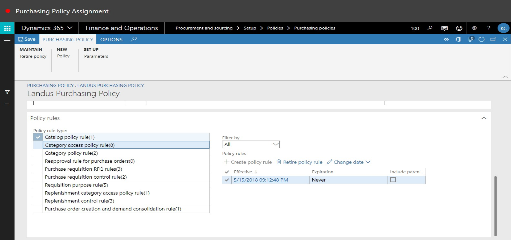
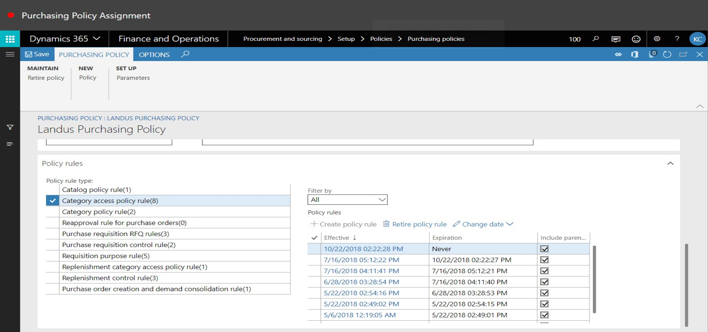
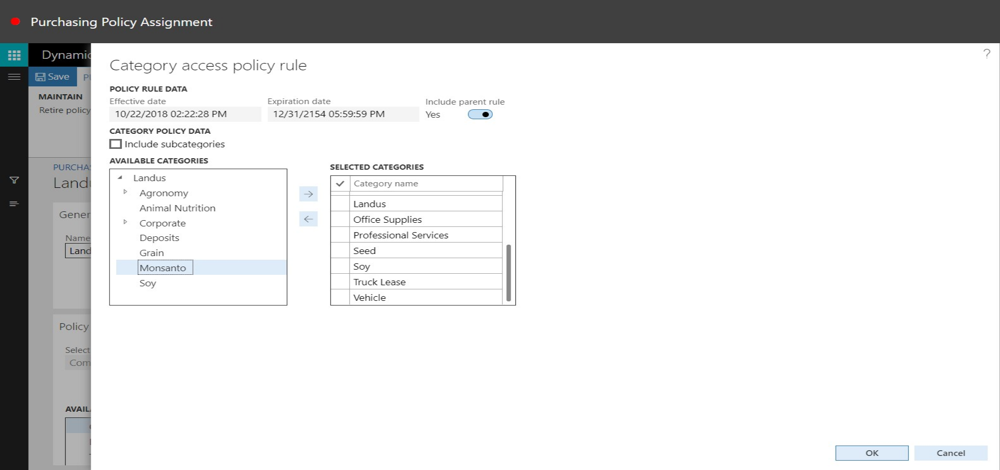
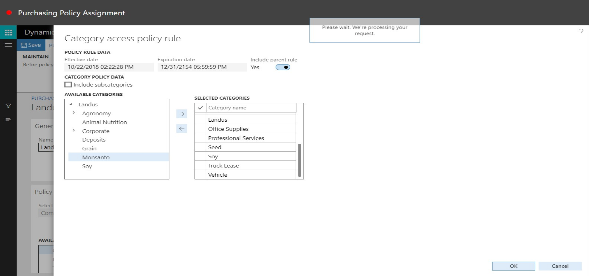
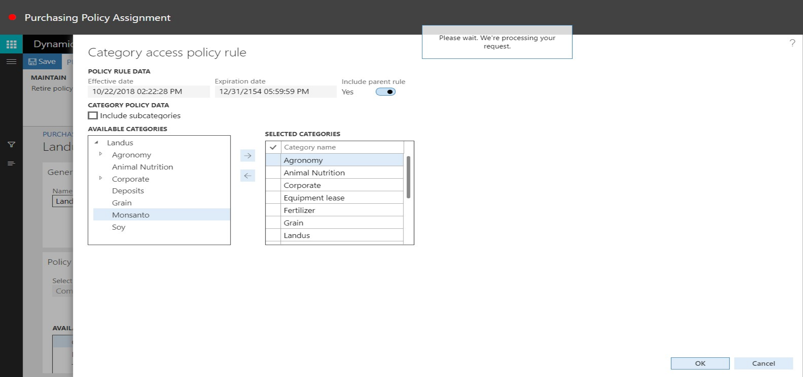
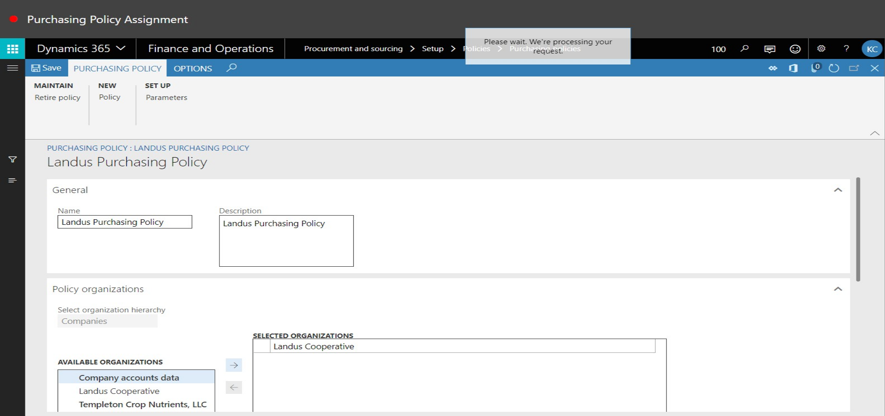
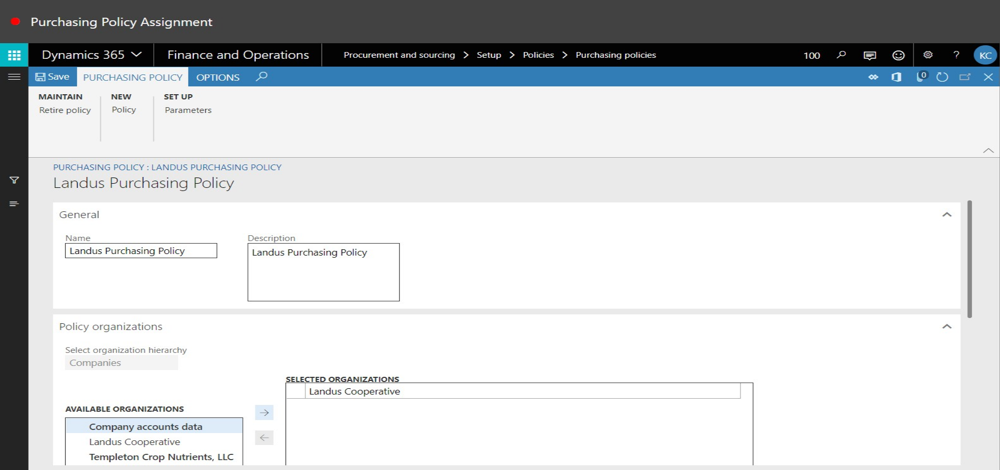

# Purchasing Policy Assignment
Brief introduction of the module, component or feature being documented.

This document explains ...

## How to Purchase Policy Assignments

1. Close the page.

2. Go to Procuremnet and Sourcing > Setup > Policies > Purchasing Policies.
3. In the list, click the link in the selected row.

4. In the list, click the link in the selected row.

5. Click Cancel.

6. In the list, find and select the desired record.

7. In the list, click the link in the selected row.

8. In the tree, select 'Landus\Monsanto'.

9. Click Add.

10. Click OK.

11. Click Save.

12. Close the page.

