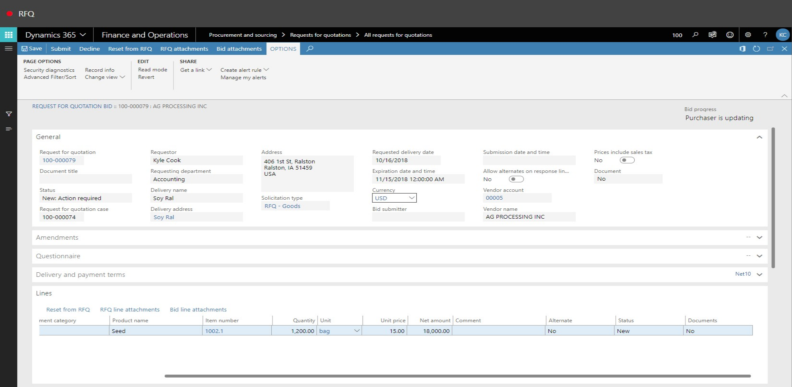

# RFQ
Brief introduction of the module, component or feature being documented.

This document explains ...

# RFQ

1. Go to Procurement and sourcing > Requests for quotations > All requests for quotations.
2. Click New.

3. In the Solicitation type field, enter or select a value.

4. In the list, click the link in the selected row.

5. In the Requesting department field, type a value.
6. In the warehouse field, type a value.
7. Click OK.

8. In the list, mark the selected row.

9. In the Item number field, type a value.
10. In the Quantity field, enter a number.
11. In the Lines or header field, select an option.
12. In the list, mark the selected row.

13. In the Vendor account field, enter or select a value.

14. In the list, click the link in the selected row.

15. Click Add.

16. In the list, mark the selected row.

17. In the Vendor account field, enter or select a value.

18. Close the page.

19. In the Vendor account field, enter or select a value.

20. In the list, select row 5.

21. In the list, click the link in the selected row.

22. Click Save.

23. Click Send.

24. In the list, mark the selected row.

25. Click OK.

26. Close the page.

27. Close the page.

28. Close the page.

29. Close the page.

30. Click Manage replies. 

31. Click Edit.

32. Click Edit RFQ reply.

33. In the list, mark the selected row.

34. In the Unit price field, enter a number. 
35. Expand the Line details section.

36. Click Submit.

37. In the list, find and select the desired record.

38. Click Edit.

39. Click Edit RFQ reply.

40. In the list, mark the selected row.

41. In the Unit price field, enter a number.
42. Click Submit.

43. Close the page.

44. Refresh the page.

45. Click Compare replies.

46. In the Show field, select an option.
47. Select the mark check box.
48. Click Accept.

49. In the list, mark the selected row.

50. Click OK.

51. In the list, mark the selected row.

52. Click OK.

53. Close the page.

54. Close the page.

55. Refresh the page.

56. Close the page.

57. Close the page.

58. Go to Procurement and sourving > Purchase orders > All purchase orders.
59. In the list, find and select the desired record.

60. In the list, click the link in the selected row.
