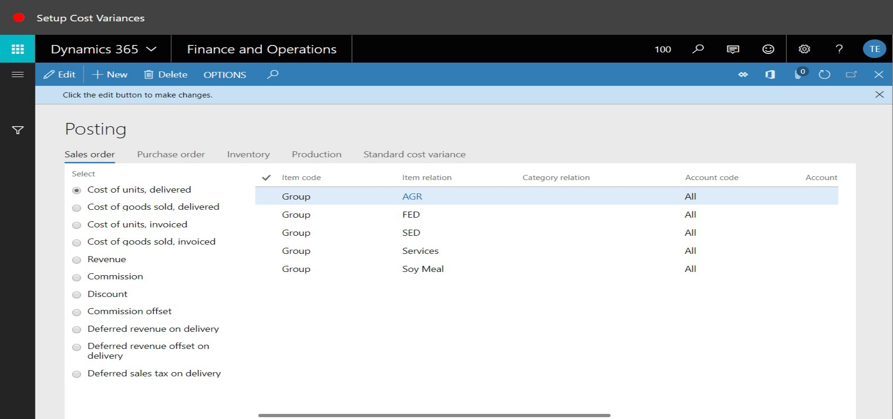
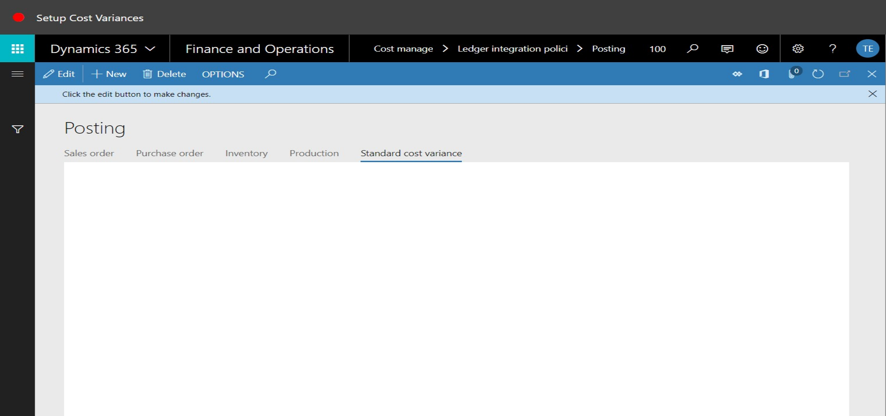

# Setup Cost Variances
Brief introduction of the module, component or feature being documented.

This document explains ...

## How to Setup Cost Variances

1. Close the page.

2. Go to Cost Management > Ledger Integration Policies Setup > Posting.
3. Click the Standard cost variance tab.

4. In the Select field, select an option.
