# Setup a Standard Cost
Brief introduction of the module, component or feature being documented.

This document explains ...

## How to Setup a Standard Cost
1. Use the Quick Filter to find records. For example, filter on the Item number field with a value of 'harness'.
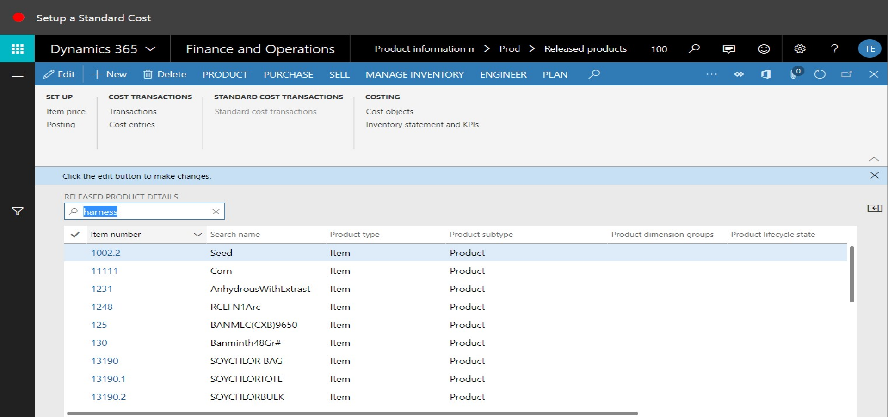
2. Click Item price.

3. Click New.
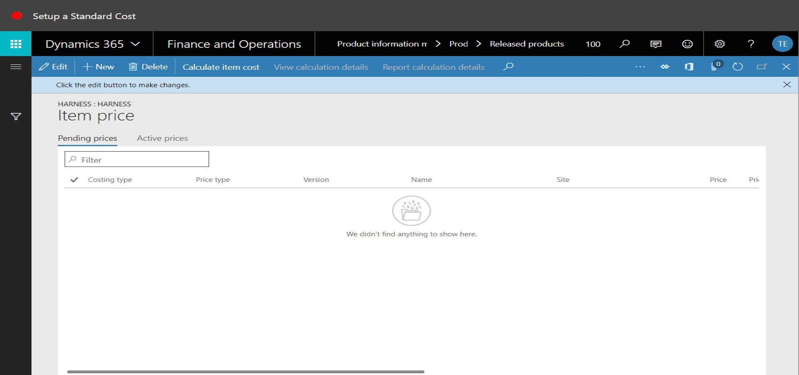
4. In the list, mark the selected row.
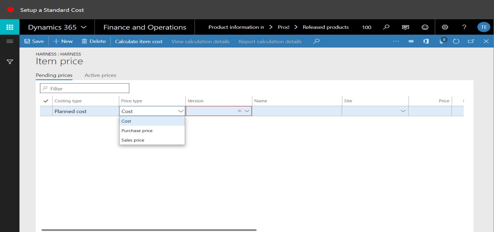
5. In the Version field, enter or select a value.
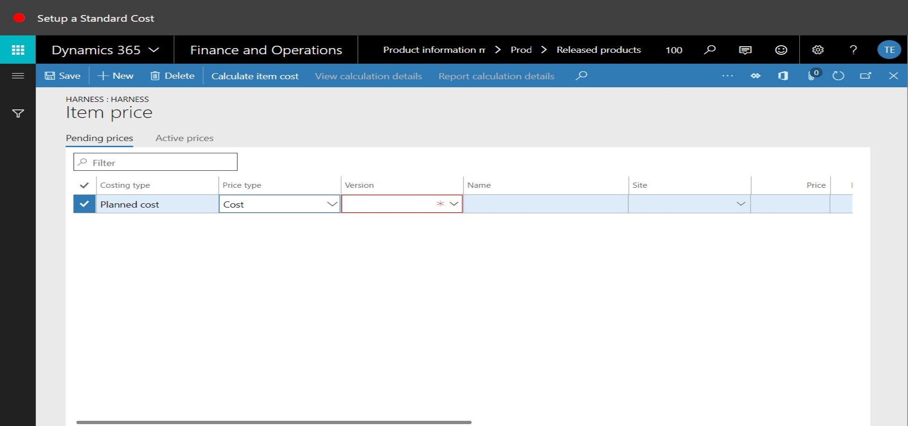
6. In the list, select row 2.
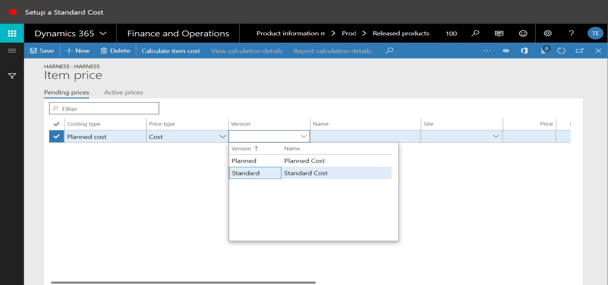
7. In the list, click the link in the selected row.

8. In the Site field, type a value.
9. In the Price field, enter a number.
10. Click Save.
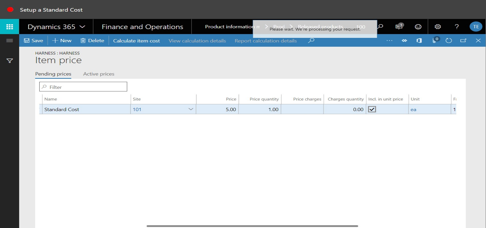
11. Click the Active prices tab.
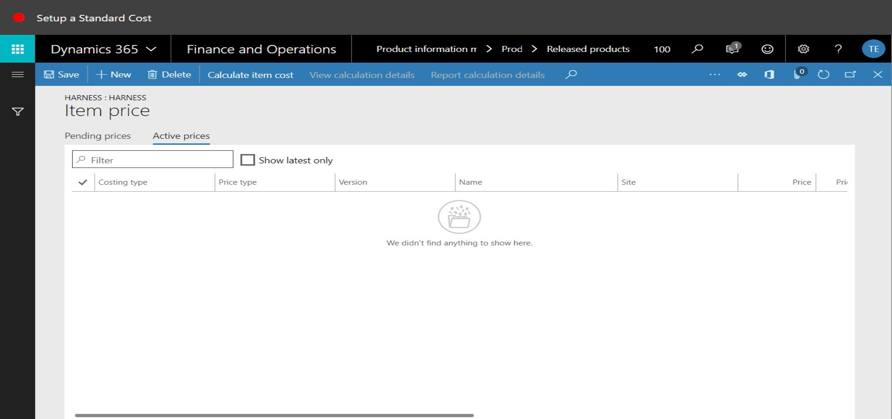
12. Click the Pending prices tab.

13. Click the Active prices tab.
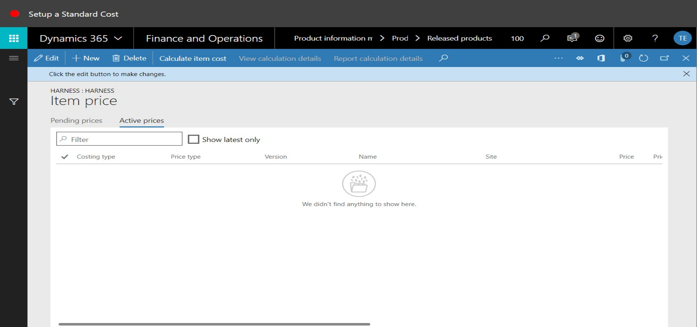
14. Click the Pending prices tab.
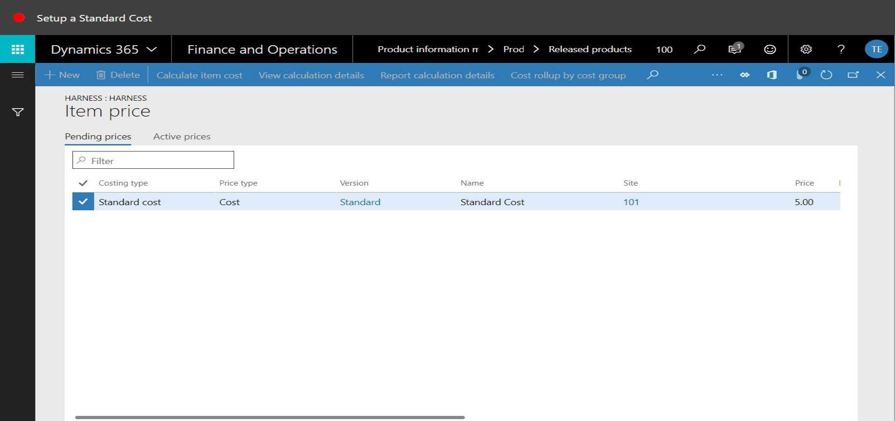
15. On the Action Pane, click Options.

16. Close the page.
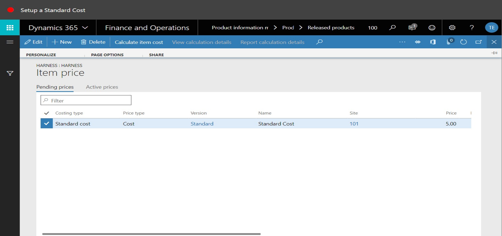
17. Refresh the page.
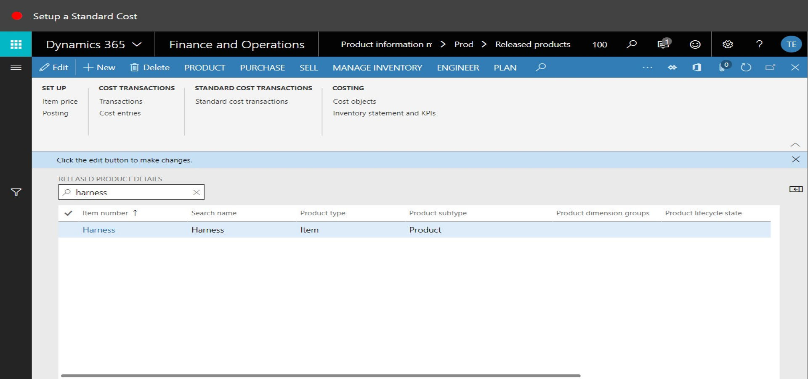
18. Click Item price.

19. Click Activate pending price(s).
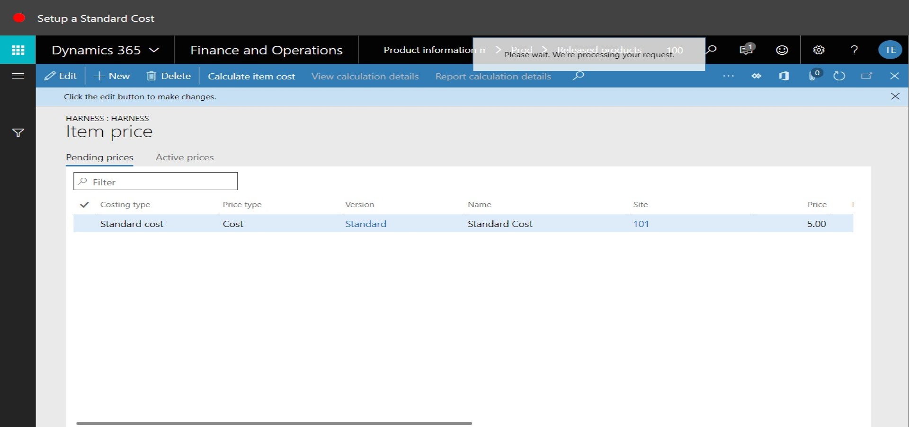
20. Click the Active prices tab.
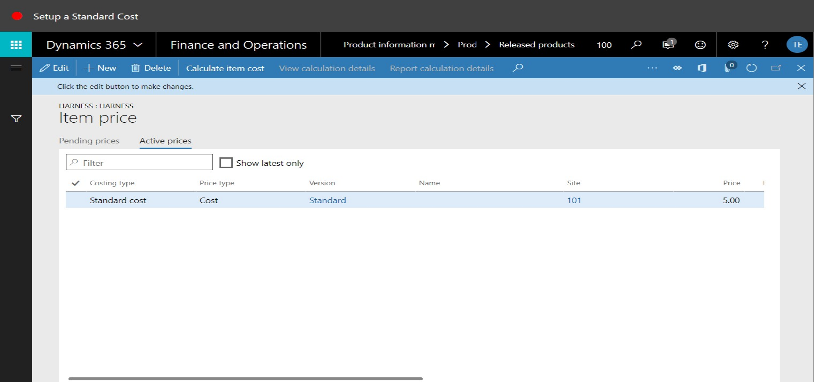