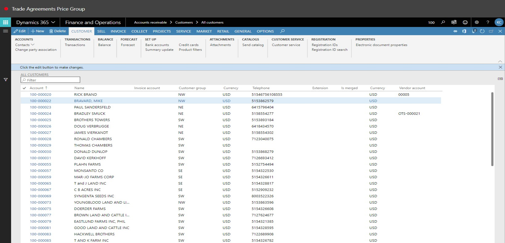
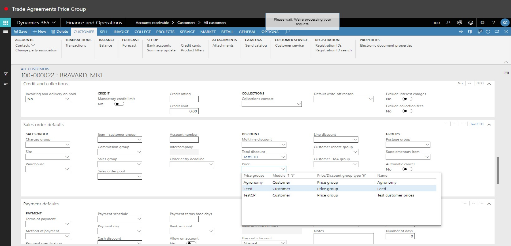
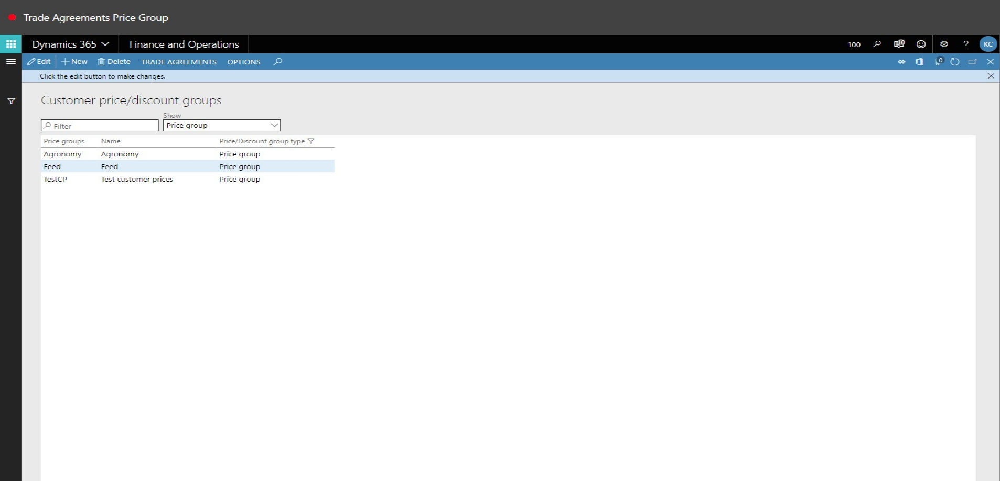

# Trade Agreements Price Group
Brief introduction of the module, component or feature being documented.

This document explains ...

## Trade Agreements Price Group

1. Go to Inventory Management > Setup > Price/Discount > Customer Price/Discount Groups.
2. Click New.

3. In the Price Groups field, type a value.
4. In the Name field, type a value.
5. On the Action Pane, click Trade Agreements.

6. Click Save.

7. On the Action Pane, click Trade Agreements.

8. Click View Sales Prices.

9. Close the page.

10. One the Action Pane, click Trade Agreements.

11. Click View Trade Agreements (sales).

12. Close the page.

13. On the Action Pane, click Trade Agreements.

14. Close the page.

15. Go to Product Information Management > Products > Released Products.
16. In the list, click the link in the select row.

17. Close the page.

18. Go to Accounts Receivable > Customers > All customers.
19. In the list, find and select the desired record.

20. In the list, click the link in the selected row.

21. Click Edit.

22. In the Price field, enter or select a value.

23. In the list, select row 2.

24. In the list, click the link in the selected row.

25. Click Save.

26. Close the page.

27. Go to Inventory Management > Setup > Price/Discount > Customer Price/Discount Groups.
28. In the list, find and select the desired record.

29. On the Action Pane, click Trade Agreements.

30. Click Create Trade Agreements.

31. Click New.

32. In the Name field, enter or select a value.

33. In the list, select row 5.

34. In the list, click the link in the selected row.

35. Click Lines.

36. In the list, mark the selected row.

37. In the Party code type field, select an option.
38. In the Account selection field, enter or select a value.

39. In the list, select row 2.

40. In the list, click the link in the selected row.

41. In the Item relation field, enter or select a value.

42. Close the page.

43. In the Item relation field, type a value.
44. In the Site field, type a value.
45. In the Warehouse field, type a value.
46. In the Amount in currency field, enter a number.
47. Click Post.

48. Click OK.

49. Refresh the page.

50. Close the page.

51. On the Action Pane, click Trade Agreements.

52. Click View sales prices.

53. Close the page.

54. Close the page.

55. Go to Accounts receivable > Orders > All sales orders.
56. In the list, find and select the desired record.

57. Click New.

