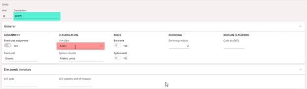
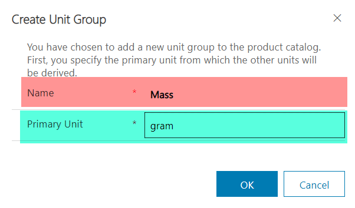

# Unit of Measure Setup
The unit of measure integration between F&O and CE does not currently include conversions. It only makes sure that each UOM in F&O has a corresponding UOM in CE and that the UOM is placed in the correct Unit Group. The Primary UOM for a unit group can not be changed after the Unit group is created. Because the integration will randomly assign the default UOM when it creates a unit group, it is important to always create the Unit group manually prior to running the integration. The following fields should be set in CE to their matching values (Including capitalization) from F&O for every Unit Class that will be integrated to CE.

   

   

Once the integration of UOM is run, outstanding UOM records should be placed into their correct Unit Group and have the correct base UOM.
