# Upload Standard Cost Pricing

## Overview

INSERT

## How to Upload Standard Cost Pricing

1. Go to Cost Management > Predetermined cost policies setup > Costing Versions.
2. In the list, find and select the desired record.
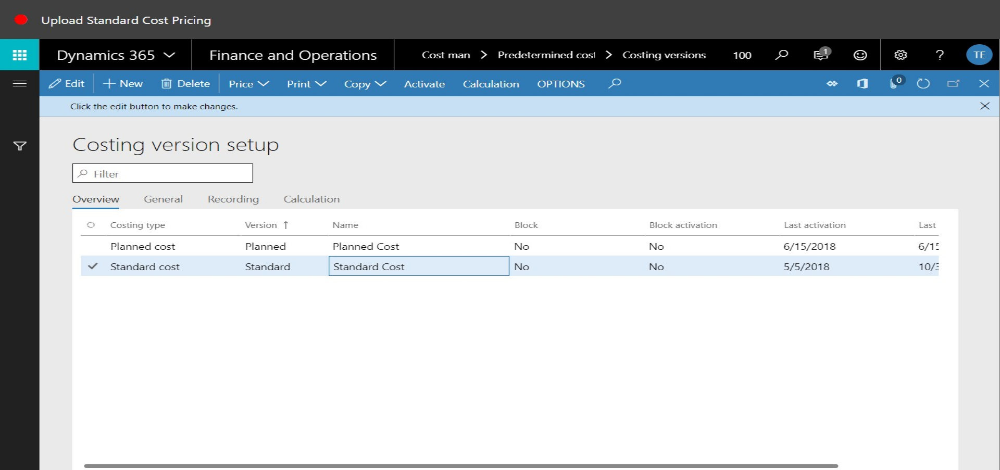
3. Click Price

4. Click Item Price.
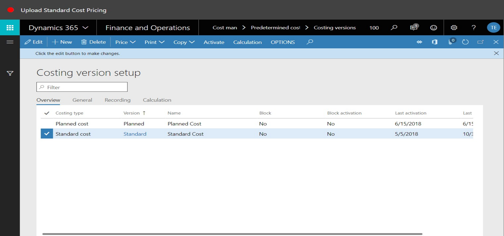
5. Click the Active Prices tab.
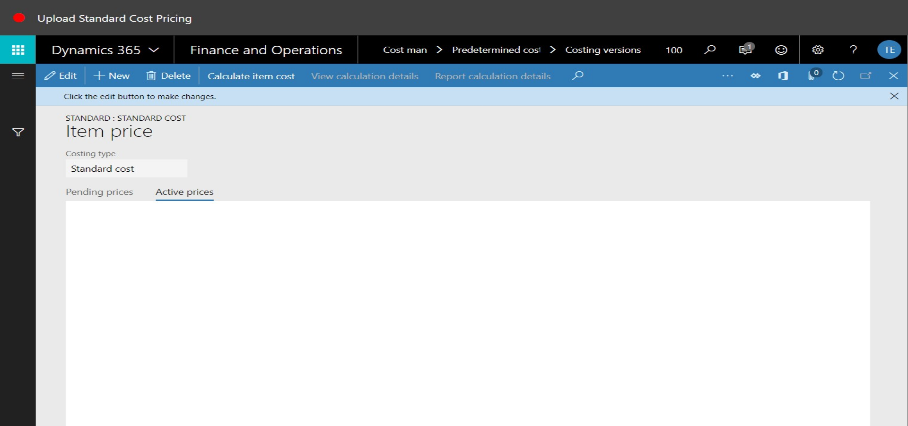
6. Click the Pending Prices tab.
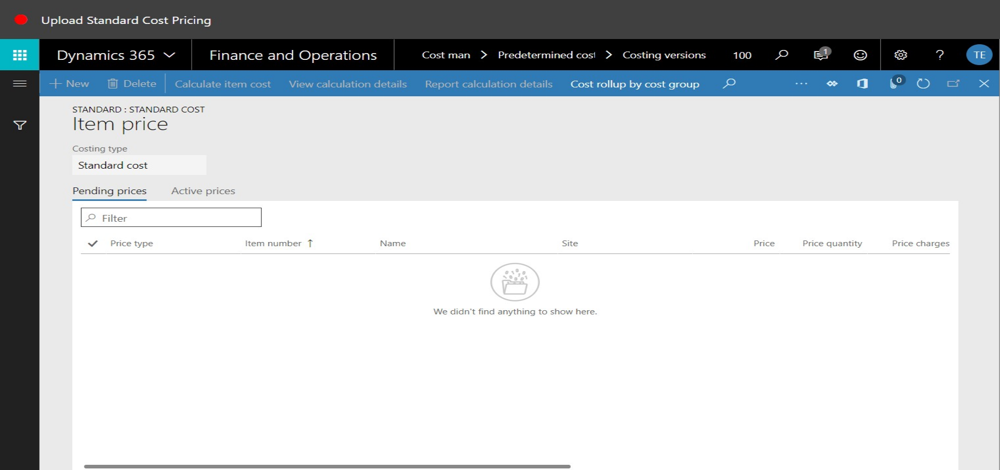
7. Click New.
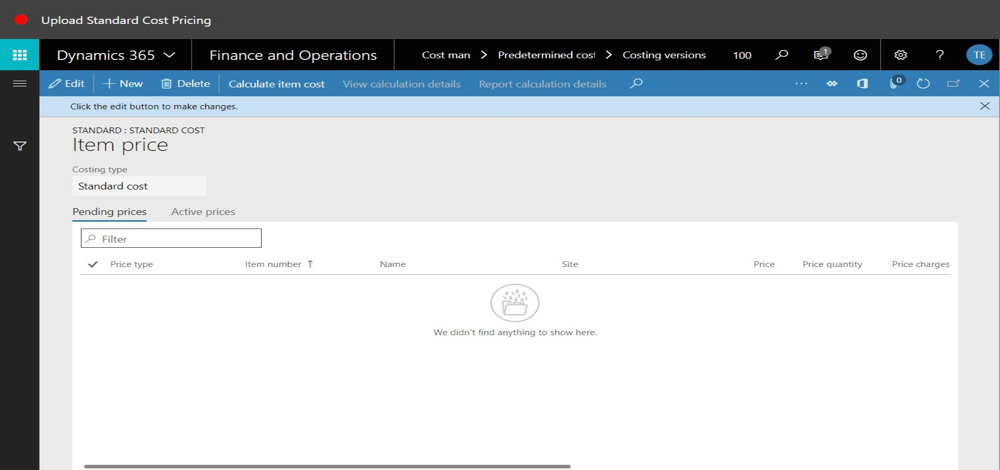
8. In the list, mark the selected row.
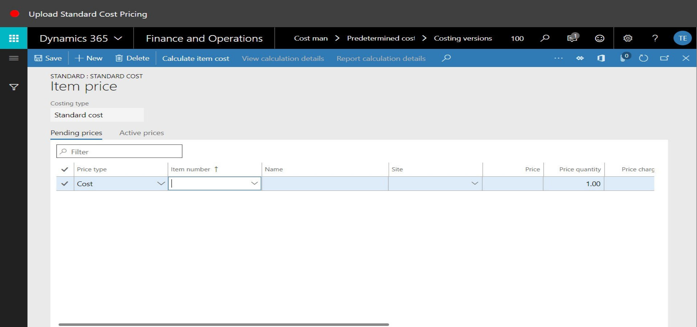
9. In the item number field, type a value.
10. In the Site field, type a value.
11. In the Price field, enter a number.
12. Click Save.
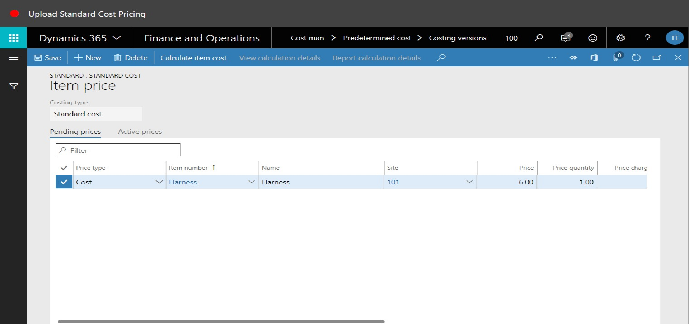
13. Click Open in Microsoft Office.

14. Click Pending item prices (100).

15. Click Download.
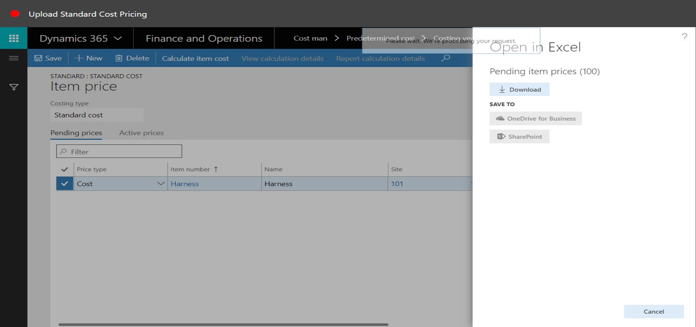
16. Click Open in Microsoft Office.
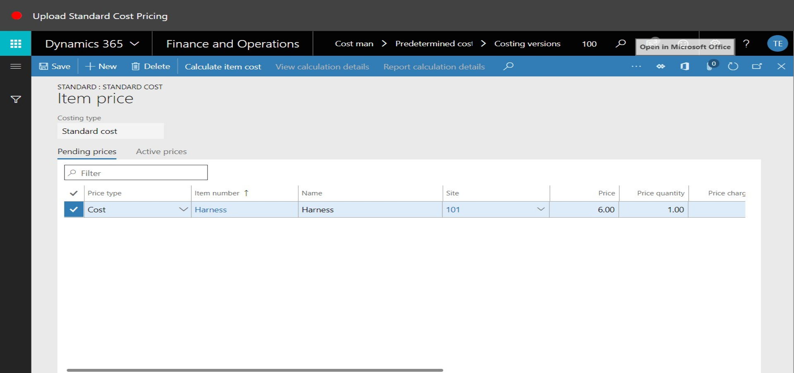
17. Click Pending Item Prices.

18. Click Download.
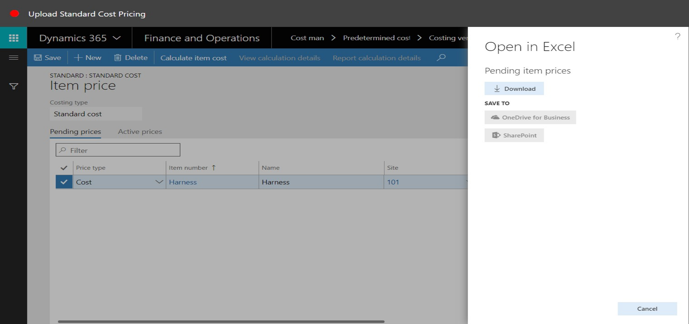
19. Refresh the page.

20. In the list, mark or unmark all rows.
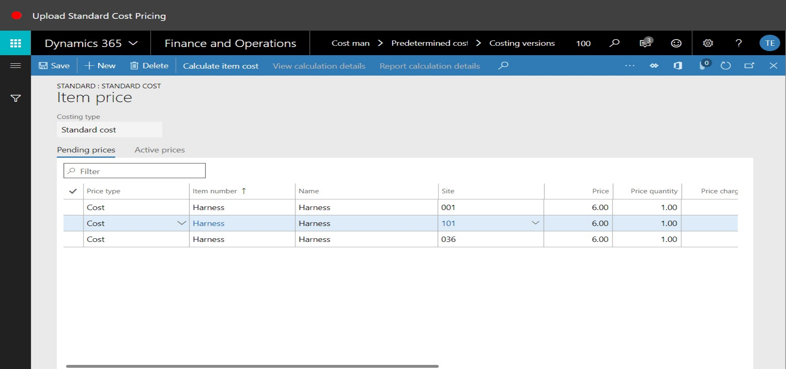
21. Click Activate pending price(s).
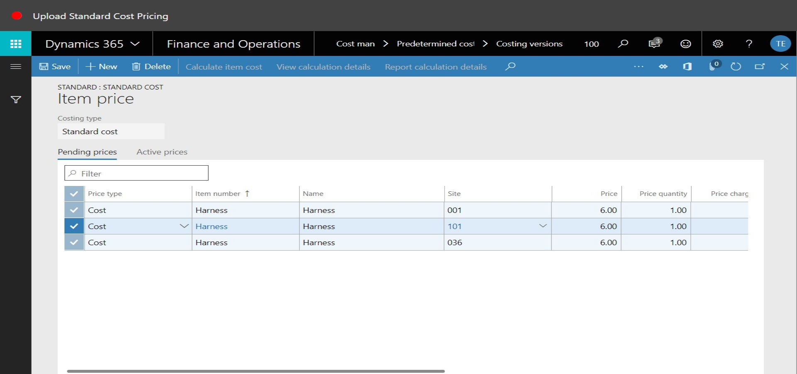
22. Click the Active prices tab.
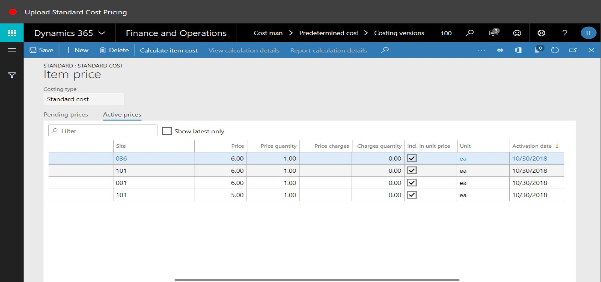
23. Close the page.
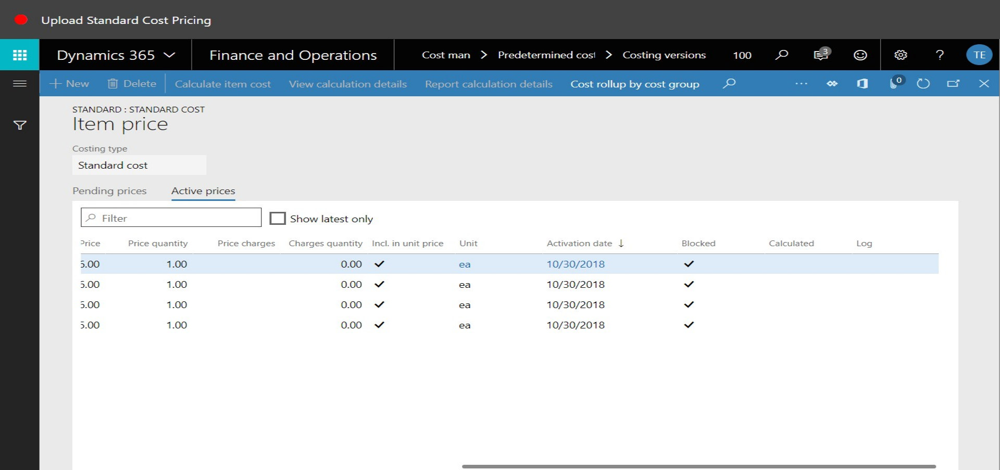
24. Close the page.
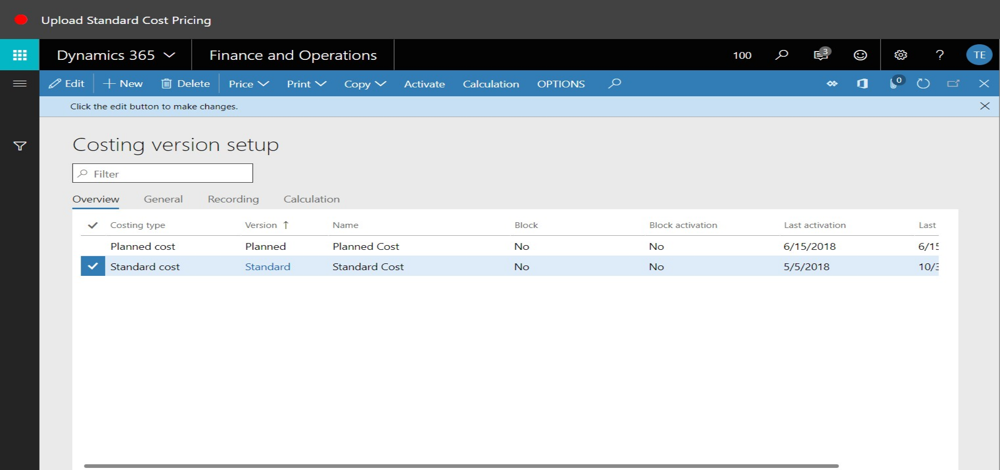
25. Go to Product Information Management > Products > Released Products.
26. Use the Quick Filter to find records. For example, filter on the item number field with a value of 'harness'.
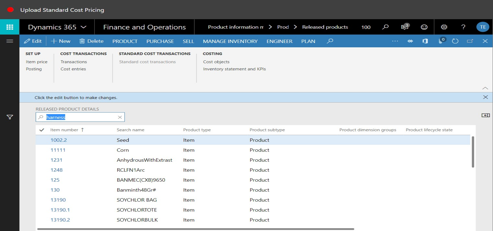
27. On the Action Pane, click Manage Inventory.
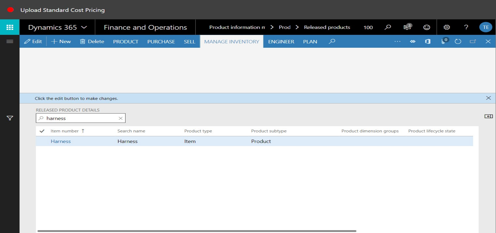
28. On the Action pane, click Manage Costs.
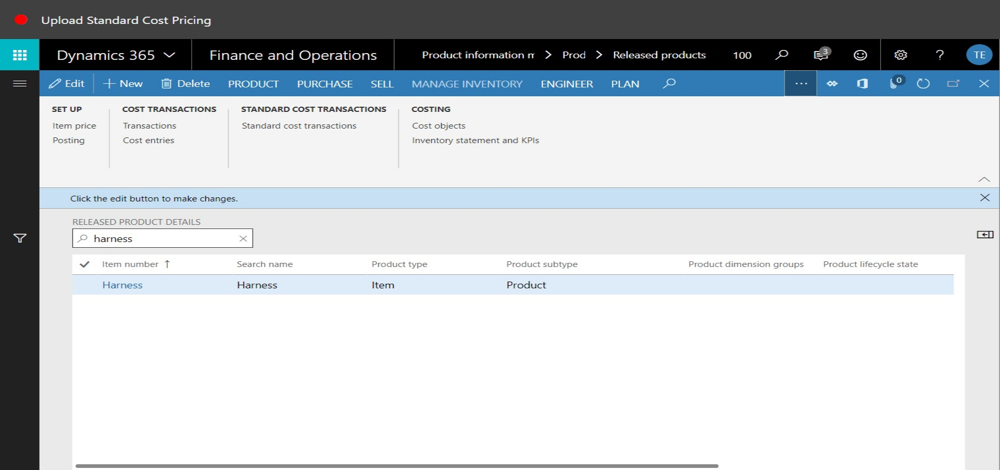
29. Click Item price.
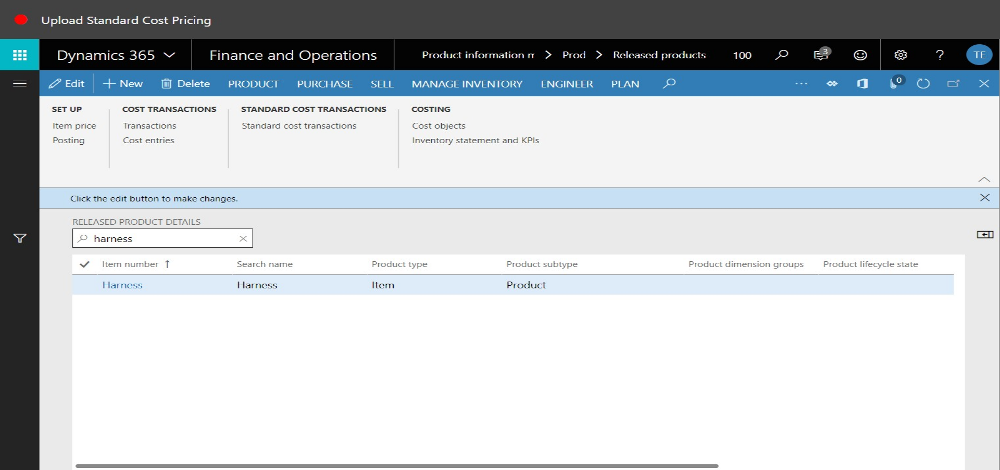
30. In the list, find and select the desired record.
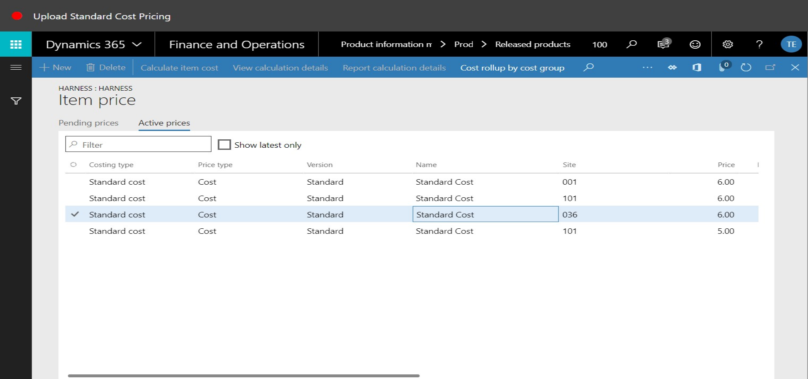