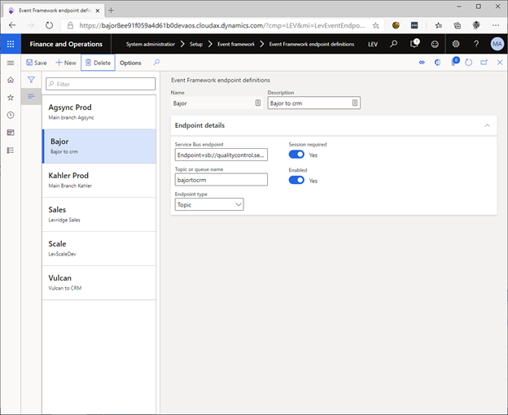
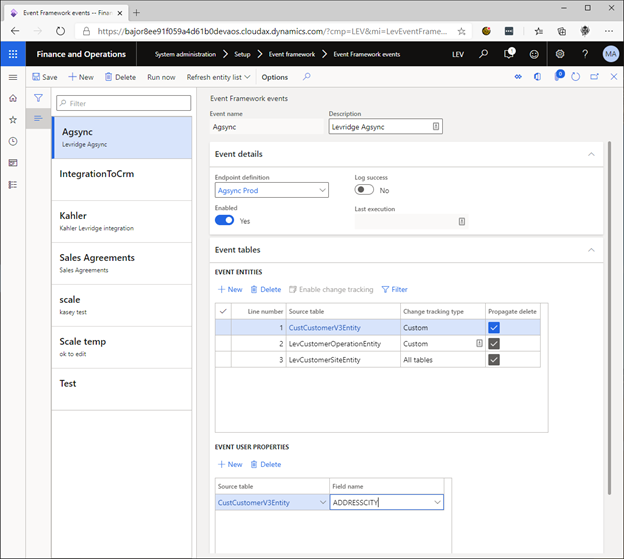
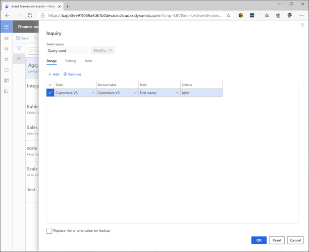

# Event Framework

## Overview
The Event Framework enables the integration of data entities with other systems by sending entity data to an Azure Service Bus endpoint.

The first time an Event Framework event is processed, all data is sent to the service bus endpoint. On subsequent runs, only entities that have changed are sent.

If the same entity is contained in two different events; each event will operate independently, sending all changes to their respective endpoints.

Event Framework events are intended to run daily as a batch service.

## Setup Event Framework Parameters

System administration > Setup > Event framework > Event framework parameters

### Set the Environment name

The Environment name is attached to Event framework messages sent from this system.  This allows administrators to determine from which system an entity originated in the event of a failure.

### Enable the Event framework

Set the Enabled switch to yes. Event framework messages will not be sent from this system when this switch is set to No.

    

## Create an Event Framework Endpoint

System administration > Setup > Event framework > Event Framework endpoint definitions

   - Click New
    - Enter a name and description.
    - Enter your Azure service bus endpoint connection string.
    - If your endpoint requires sessions, set the switch to Yes.
    - Enter the name of your topic or queue.
    - Set the endpoint type to Topic or Queue.
    - Set the Enabled switch to Yes.

    

## Create an Event Framework Event

System administration > Setup > Event framework > Event framework events

   - Click New.
   - Enter a name and description.
   - Choose your endpoint.
   - If you wish to log a message to the Event Framework event log for successful and failed Event framework messages, set the Log success switch to Yes.
   - The Last execution box contains the last execution date time.
   - Set the Enabled switch to Yes.  If this switch is No, the event will not be processed.

### Add an Entity to the Event

   - Expand the Event tables Fast Tab.
   - Click New.
   - Select your entity in the Source table column.
   - Change tracking type indicates whether all the entity’s data sources are tracked for changes.
   - Check the Propagate delete box to send a message when an instance of this entity is deleted.

Entities are processed in ascending Line number order.  Two entities with the same line number may be processed in either order.

### Add Event User Properties

For every configured entity, you may add user properties to the Event framework message.  The properties contain the value of the chosen entity field and are informational only.

This is useful for filters applied to the Azure service bus subscription because the value of the property is added directly to the properties collection on the message rather than contains somewhere within the body.

    

### Adding an Entity Filter

This filter restricts the Event framework messages that leave the system by applying a range to the query used to select the changed entities.

   - Select the entity you wish to filter.
   - Click Filter.
   - Select range criteria and click OK.
   - This will restrict the Event framework so that it only sends customers whose first name is “John”.
   - Click Reset to remove all modifications to the query.

### Propagating Deleted Entities

If you wish to send delete messages when a configured entity is deleted, you must check the Propagate delete box for that entity.  The Event Framework will then store the last Event Framework message for that entity whenever one is processed.  When the entity is deleted it will resend that stored message with an action of Delete.  

If an entity is created and deleted before the event is processed, an Event Framework message will not be generated for that entity.

    

### Advanced Options

#### Refresh Entity List

Whenever a data source is added or removed from a data entity it is necessary to refresh the entity list.  This menu item is usually found in the Data management workspace and is provided here for convenience.

#### Rebuild entity list

Under certain conditions the Refresh entity list does not adequately refresh the entity metadata.  The Rebuild entity list will first delete the entity from the entity table before calling the normal Refresh entity list functionality.

Use this option with caution.  Because rebuilding the entity list first deletes the entity metadata, change tracking information for that entity will be lost.

#### Run now

Click Run now to process the event immediately or schedule it to run in batch.

Set the Simulate initial data load switch to Yes to process the event without sending and Event framework messages to the Azure Service Bus.  This may be used to set the change tracking version to the current version.

### SQL Server Change Tracking

The Event Framework uses SQL Server change tracking to determine which entities have changed.  For more information see [Enable change tracking](https://docs.microsoft.com/en-us/dynamics365/fin-ops-core/dev-itpro/data-entities/entity-change-track) for entities and [About Change Tracking (SQL Server)](https://docs.microsoft.com/en-us/sql/relational-databases/track-changes/about-change-tracking-sql-server).

### Entity Filtering

Filters applied to the entity will prevent the Event Framework message for that entity from being sent.  Filters applied to the Azure Service Bus subscription will prevent the Event Framework message from being received.