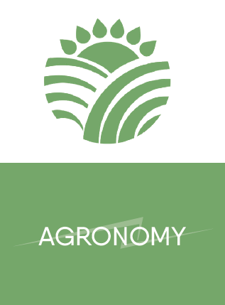
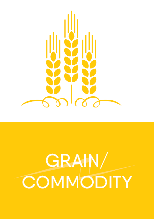
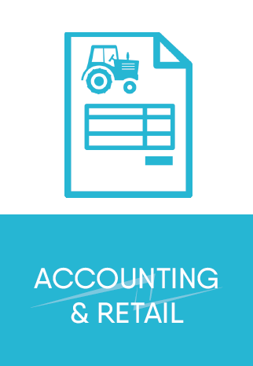
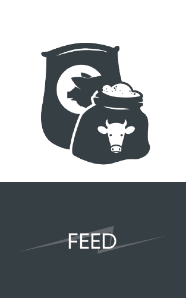
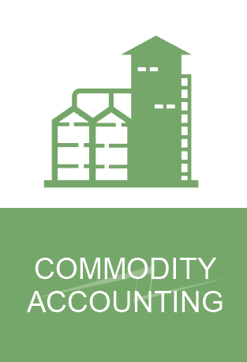
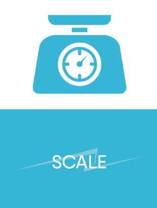
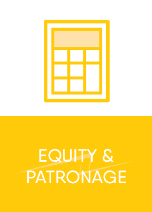

hero: Integration Overview

# Levridge

## Overview
Levridge is dedicated to building modern, user-friendly business solutions for the agricultural industry. The Levridge solution enables Ag Retailers, Ag Cooperatives and Commodity Processors to run businesses in a modern, connected way.

### Agronomy
 

This cloud-based solution infinitely increases efficiencies in agronomy through the elimination of paper and the need for manual double entries, better visibility into inventory and procurement and the opportunity for real-time invoicing. Using the many functions and features of customer relationship management Levridge has multiple tools to help the agronomist overcome challenges with tracking data related to the grower, employee and contractor. This includes providing access to vital historical information, addressing knowledge sharing amongst employees, application and chemical certifications, and licensing and DOT tracking.

Vital features for the agronomist include Outlook integration, email tracking, visibility to sales activities and follow up. Most importantly, it provides a 360-degree view of the client in a way that is accessible to all team members who need it.

[Agronomy Overview](Agronomy.md)

[Agronomist End-to-End Scenarios](AgronomistEnd-to-EndScenarios.md)

[Agronomy Implementation Activities](AgronomyImplementationActivities.md)

### Grain
 

*To be documented*

### Accounting and Retail
 

Split billing is a unique and necessary challenge for the ag industry. Levridge includes billing split management and the ability to clearly define splits by collecting data and using grower confirmation to maintain accuracy. The ag retail functionality includes the ability for customers and vendors to prepay and the opportunity to track and make adjustments based on consumption and usage.

Levridge includes a modern and integrated approach to reaching low net pricing by seamlessly handling grower rebates and pricing. By taking advantage of the commissions, rebates and trade agreement set up functions that are native to the Dynamics 365 solution.

[Agronomy Sales](AgronomySales.md)

### Feed
 

[Feed Overview](Feed.md) *to be documented*

### Commodity Processing
 

No more dealing with inflexible reporting. A modern cloud-based platform with integration to the Microsoft Office suite and the ability to work with multiple other software applications gives Levridge an enhanced commodity accounting experience. With a built-in connection to the back office and your accounting team, access to information is seamless. 

### Scale
 

With the fastest-speed on the market, the Levridge scale is built with real-time synchronization to see ticket information almost immediately. The Levridge scale can connect to any ERP system within minimal hardware and only one system to maintain and service. The Levridge scale is NTEP certified.

[Scale Overview](Scale-Overview.md)

### Equity and Patronage
 

Due to the many factors involved and difficulty tracking revolving member equity and stock allocations, this has been traditionally handled outside of the central accounting application. It is very likely stored in Excel or some other system that integrates with your accounting or agribusiness solution.

In Levridge equity and stock allocations are managed within ONE solution. Equity tracking, from build-up, to current balance to pay-out is handled within the Levridge solution.

[Patronage Overview](Patronage.md)

