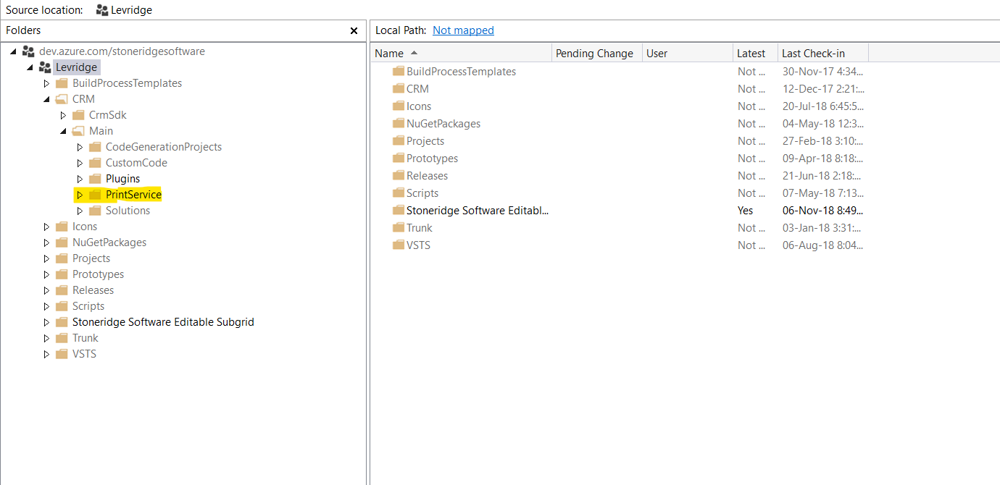
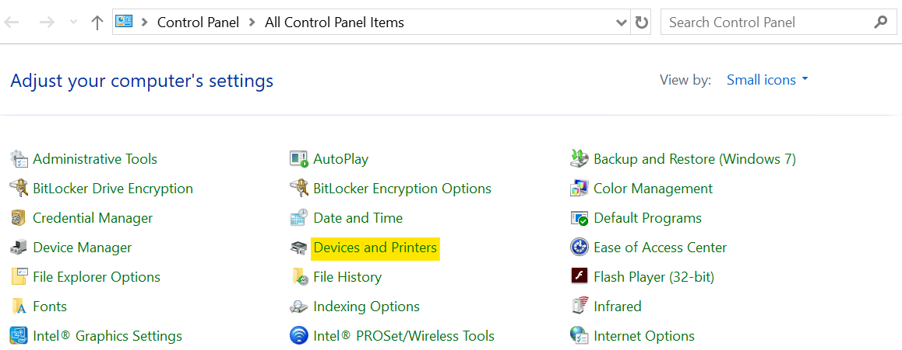
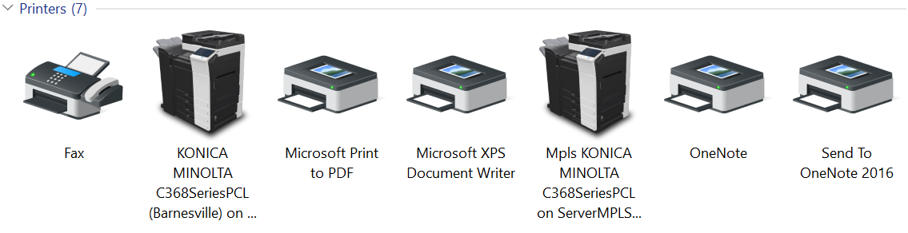
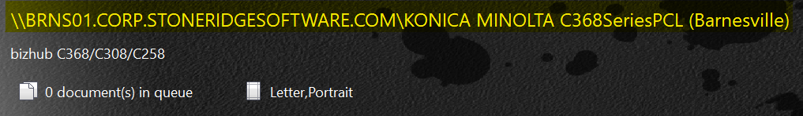
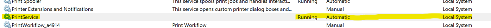
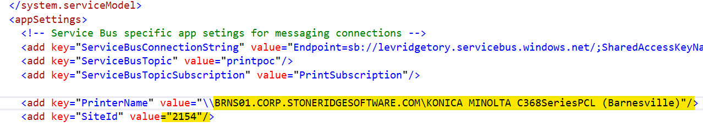
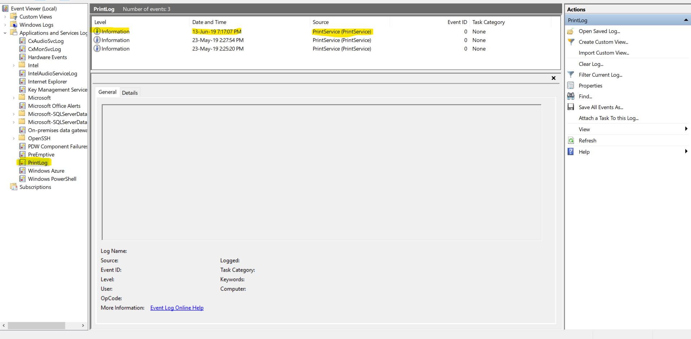

# Print Service
### Installing Print Service Application
To first install print service application, open Visual Studio.
In Visual Studio, the print service is checked-in at "$/Levridge/CRM/Main/PrintService".

Double click this and map it to a path on your machine. 

In Visual Studio, click Build > Build Solution. 
Activate the service as detailed below in PowerShell:

- Right click on the windows icon and select "Windows PowerShell (Admin)"

- Enter the following command once. Be sure to substitute the local path!
    
>     New-Service-Name"PrintService"-"{Your Local path to project}\PrintService\bin\Debug\PrintService.exe-k netsvcs"
 
### Locating Printer Network Name
If a printer is a network device, its name will be 
more difficult to locate.
Use these steps to find the name that
the Print Service application will use to print:

1. Go to control panel and locate the setting titled "Devices and Printers"
(Note: Not all setting are in this screenshot. This view is set to "Small icons")

     

2. Navigate to the list of print options on your computer and select the device of your choice.

     

3. The full network name that is required for the code is listed once you select the printer. (Highlighted in yellow below)

     

### Using Print Service Application
After initial setup, use one of the following two options
 to start the Application.

**PowerShell**

Following the first setup, you can enter the following 
command into PowerShell instead.
    
>     Start-Service-Name"PrintService"

**Services App.**

Use Windows+R to select "services.msc" to open Services 
Management Console. Right click on PrintService and 
select "start"

### Setting Up a New Printer

To set up a new printer, new parameters will 
need to be setup. To add the parameters, 
open the app.config file in the project and 
add the following:

- ServiceBusConnectionString
- ServiceBusTopicSubscription
- ServiceBusTopic
- PrinterName
- SiteID

Two parameters will also need to be updated.
These two need to be changed for the printer
that is being printed to.
The Site ID is the customer site code from CRM. 

For debugging the Service, we can use the Windows 
Event Viewer. Go to Administrative tools in the 
Control Panel and Open Event Viewer.

### Additional Information and Documentation

In CRM on the sales ordered details header, there is 
an Auto Print Field. Set to Yes and click save. 
The sales order will then print. 