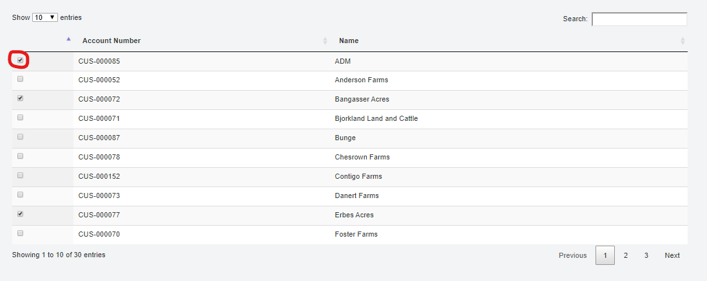

## Install Settings Instructions for Scale

### Appsettings Configuration
#### DynamicsAX block
This section "DynamicsAX" will be used throughout the appsettings files. 
```
"DynamicsAX": { 
    "UriString": "https://landusuat.sandbox.operations.dynamics.com/", 
    "ActiveDirectoryResource": "https://landusuat.sandbox.operations.dynamics.com", 
    "ActiveDirectoryTenant": "https://login.microsoftonline.com/bb671371-xxxx-xxxx-xxxx-9376b88d8f82", 
    "ActiveDirectoryClientAppId": "ef8c69c1-xxxx-xxxx-xxxx-b393810d9f48", 
    "ActiveDirectoryClientAppSecret": "4ZpHiXn0k2xxxxxxxxxxxxxxT4drRL1cJLcZKby6z6I=", 
    "TLSVersion": "", 
    "ODataEntityPath": "https://landusuat.sandbox.operations.dynamics.com/data/", 
    "DataAreaId": "100" 
  } 
```
- *Uri String*: the URL of the F&O environment 
- *Active Directory Resource*: same as the UriString, but without the forward slash at the end 
- *Active Directory Tenant, Client App ID, and Secret* provided by the appservice, used for integration 
- *TLS Version*: leave this blank as shown in the example 
- *OData Entity Path*: usually the Uri String followed by `“/data/”`
- *Data Area ID*: the Company name in F&O 

#### API and Client
```
C:\Program Files (x86)\Levridge\LevridgeScaleHouse\Servers\LevScaleAPI\appsettings.json 
C:\Program Files (x86)\Levridge\LevridgeScaleHouse\Servers\LevScaleClient\appsettings.json 
```

1. ServiceBusSettings
```  "ServiceBusSettings": { 
    "ServiceBusConnectionString": "Endpoint=sb://integration.servicebus.windows.net/;SharedAccessKeyName=RootManageSharedAccessKey;SharedAccessKey=PG5SCOfZHIKQ7xxxxxxxxxxxxxxxxxxxxxxxxxx4M0Y=", 
    "TopicName": "scaletoax" 
  },
```
2. EstimatedTicketURL
    - Enter the PC's IP address into "EstimatedTicketServiceURL"

#### Estimated Ticket
```
C:\Program Files (x86)\Levridge\LevridgeScaleHouse\Services\LevEstimatedTicket\appsettings.json
```
1.	Configure the DynamicsAX block

#### AX to Scale Integration
1. AzureTableConfiguratioNAX
2. DynamicsAX
3. ScaleOData: this section will be configured the same as the DynamicsAX block with the exception of *UriString* and *ODataEntityPath*
```
"UriString": "http://localhost:8080", 
    "ODataEntityPath": http://localhost:8080/odata 
```
4. AXtoScale
     - ConnectionString
     - TopicName
      - SubscriptionName of the service bus
#### Customer Short List
- Found under Application Configuration > Customer Short List
- This shows a list of all customers int he scale database in alphabetical order. Checking the box next to a customer will put that customer into the drop-down list on all of the scale ticket types in order to reduce load times because not all customers will be loading in the customer account drop-down. 
- To manually add a customer to he short list, check the box next to their name and click submit on the botton left corner of the page. 



#### Gross Quantity Settings
- Found under Application Configuration > Gross Quantity Settings
- This is manually set up in scale to show the gross quantity conversions of certain products, i.e. pounds to gallons

To create a new a gross quantity for a product: 
1. Click create new on the top left of the page under INDEX
2. Choose the item ID for the correct item you want to add a quantity to
3. In Factor, enter in the correct number. If you were to say a gallon of product is equal to 8 pounds you would enter in 8. The conversion is lbs./Unit of measure. The units of measure come from your FO system
4. Choose your Commodity Unit of Measure.
5. Click Create

- To edit a previously created Gross quantity, click Edit next ot the GQ that you want to change and when you have finished editing, clikc the blue "Edit" button to save. 
- To delete a previusly created GQ, click delete next to the GQ and then confirm the delete by clicking the red "Delete" button. 

#### Printer Settings
- Found under Application Configuration > Printer settings
- This window is used to choose the correct printers fore ach of your scale heads at a location, and to choose a corresponding menu color to know which scale head you are working with in your window. The printer settings you choose in this window will then default in when you choose that scale on the Application start page

To set up the Printer Settings for Scale:  
1.	Choose the scale you want to set up from the drop down on the top of the page
2.	Choose your printers for both your Tickets and BOL.
3.	Using the printer Type can change between a full page printout vs. a receipt printout.
4.	Choose the number of copies that you want to print with each completed ticket.
5.	Choose a background Color for that specific scale-head to make sure the correct scale is being used to complete and print tickets.
6.	Click save to complete these settings.

#### Settings
- Found under Application Configurations > Settings
- **Site**: Choose a site from the drop down to assign site ID to the scale app
- **Number Prefix**: Enter in the number ID of the Site in FO
- **Scale**: Leave as default value of 1
- **Company Name**: Landus Cooperative
- **Company Location/Address**: Enter in correct company address
- **Company Carrier**: Use this to Select the transport that is set up in FO to transport Transfer Tickets: **Landus Cooperative**
- **Logo**: Click on this to choose a picture file: **Sizing IS being updated for logo**
- **Printer Server**: Address of the Printer Server, Default value is: http://localhost:8081
- **PrinterService**: Address of the Printer Service, Default Value is: http://localhost:4343/printerservice
- **Report File Location**: Location of where pdf versions of tickets are stored. Default value is *C:\Temp\Reports*. Will have to create this file folder on your local machine.
- **Organization**: DataAreaID of F&O, enter in 100 For Landus Cooperative company
- **IsDriverOn**: If this is toggled on, all ticket types will default to having the flag on unless manually changed by the scale operator. If set to no, “Driver-on” flag will not be displayed on the ticket window.  
- **Enable Spot Pricing**: Further Development of Grain Functionality required. Field doesn’t need to be filled in for agronomy.
- **Enable Disposition**: Further Development of Grain Functionality required. Field doesn’t need to be filled in for agronomy.
- **Scale Unit**: Use drop down list to select LB
- **Max Weight**: Enter in the max weight of the scale head.
- **Incr. Wt.**: This is what increments the scale head will display weights, i.e. 20 Lbs.

#### Reverse Proxy
A reverse proxy is a type of proxy server that retrieves resources on behalf of a client from one or more servers. These resources are then returned to the client, appearing as if they originated from the proxy server itself.

When operating through LevScale, the two web servers are operated as a stack with the service operating as a singular standalone. The server is configured to operate as a reverse proxy. IIS communicates with all outside communication.

This enables the LevScale to run the Windows executable in the background through the Web.config. IIS needs to be configured as an out of process to ensure IIS will run the scaleticket.exe as a process outside of IIS. IIS operates as a process; however, it knows how to communicate to a different process based off the out of process hosting model, which creates a reverse proxy. 

A 500 Internal Server Error response code accessing the website is a Web.config, vsanv, and IIS issue. An IIS Issue could be how the app pool is structured or it could be permissions based, or within your specific settings. 
