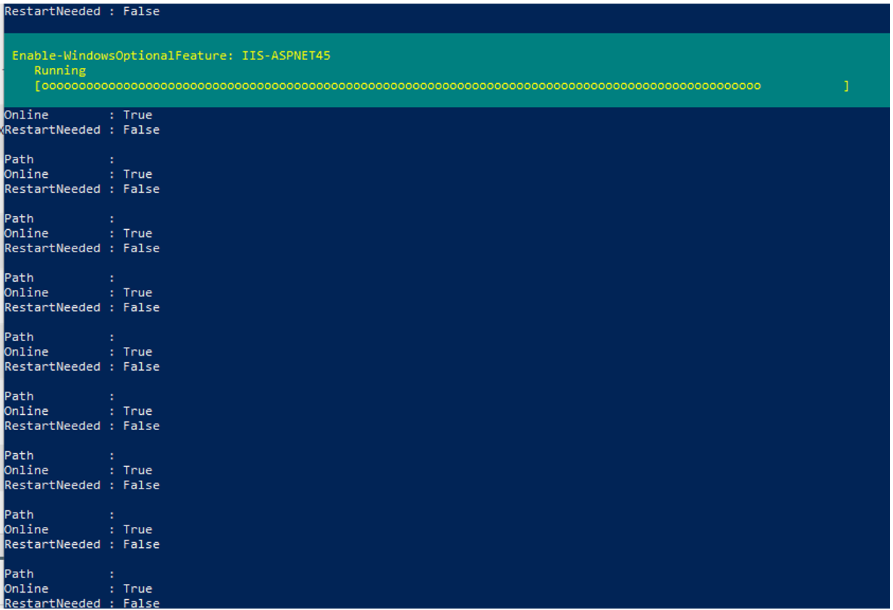
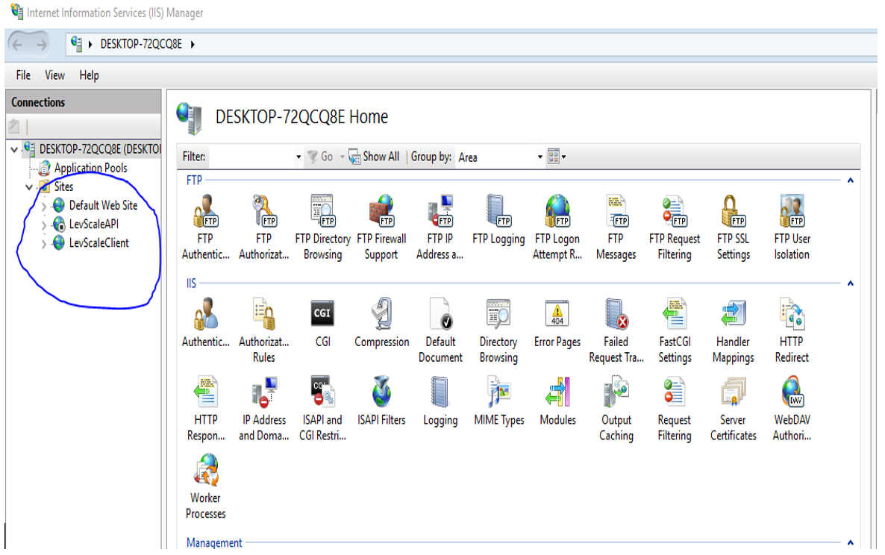

## Levridge Scale Installation

#### Prerequisites

- Windows user account needs to have local admin rights and a password
- PC needs to have an internet connection
- Disable any security add-ons (Bitdefender, etc.)
- Install SqlExpress using the "basic" installation: [SqlExpress Installation](https://go.microsoft.com/fwlink/?linkid=866658). The SQLEXPRESS connection string will default to: 
```    
 > Server=localhost/SQLEXPRESS;Database=master;Trusted_Connection=True;
```
- Enable IIS through Control panel > Programs and Features > Turn Windows features on or off > Internet Information Services. 
- Check the root box for Internet Information Services and let it select the defaults.

#### Install Levridge Scale
1. Download the file Levridge Scale House Install.exe 
2. Right click and *Run as Administrator*
3. Agree to terms and click Install (The installer will run for a while and download items)
4. Click Next on the setup Wizard
5. Accept the terms and click Next
6. Select Typical for the setup type
7. Click Install
8. When the install is complete, click Finish
9. When the installer displays “Installation Successfully Completed”, click Close


#### Configure Settings
Reference [Scale Install Settings Instructions](scale-install-settings-instructions.md). 

- Open file explorer and go to: 
```
    C:\Program Files (x86)\Levridge\LevridgeScaleHouse\Servers
```
- In the **API** and **Client** folders, configure `appsettings.json`
Open file explorer and go to: 
```
    C:\Program Files (x86)\Levridge\LevridgeScaleHouse\Services
```
- In the **LevEstimatedTicket** and **AXToScaleIntegration**, **ScaletoAXIntegration** folders configure `appsettings.json`

#### Log into Services

- Open IIS
- On the **LevScaleAPI** and **LevPrint** Application Pools, right click > Advanced settings
- In the Identify field select Custom account > Set and enter username and password
- Open (Windows) Services
- There should be six new services installed with startup Type of Automatic:
1.  LevEstimatedTicketService
2.  LevHardwareInterfaceService
3.  LevridgeAxtoScale
4.  LevridgeScaletoAx
5.  LevScaleClient
6.  LevScalePrinterService
- On the **LevHardwareInterfaceService** and **LevScaleClient** services, right click > Properties
- Click the Log On tab
- Enter account and password and click OK. If the account is part of a directory, click Brose. Then enter the username and click Check Names. 
- Restart the machine. When it restarts, the services will start automatically and the databases will be created. 

#### Access Levridge Scale
- In a web browser, go to http://localhost to access Levridge Scale


#### Sync Data from F&O
- In F&O, create an Event Framework endpoint definition for scale
```
Service Bus endpoint: 
Endpoint=sb://example.servicebus.windows.net/;SharedAccessKeyName=RootManageSharedAccessKey;SharedAccessKey=xxxxxxxxxxxxxxxxxxxxxxxxxxxxxxxxxxxxxxxxxxxxxxxxxxxxx=
Enter the Topic name
Endpoint type: Topic
Session Required: Yes
Enabled: Yes
```
- Create an Event Framework event and sync all scale entities (referenced here)


#### Merge below notes with above documentation:
Copy the folder name 'LevridgeScaleHouse' from its current location. 

- Copy it to your computers C:Drive
- This will take around 15 to 30 minutes to complete.


Once copied, open PowerShell as an administrator.

- Run command:
```
   Cd C:\LevridgeScaleHouse\
```
- Next run command:
```
     .\ScaleHouseAppInstall.ps1 -installFullPackage $true
```
- If presented with an error stating 'cannot be loaded because running scripts is disabled on this system' then run command:
```
Set-ExecutionPolicy Unrestricted
[Y] for Yes
```
For the next step, run command:
```
.\ScaleHouseAppInstall.ps1 -installFullPackage $true
```
You will see a few errors depending on your system settings.

It should then bring you to a Microsoft SQL Server Installer.

- If installation should stop during SQL Server Installation. Run command:
```
Install-module-name SqlServer
[Y]
```
After this, you should be seeing Windows IIS features being enabled.


Once this has been completed, search IIS in Windows Search. Three sites should show:


Right click the Default Web Site. Select manage web site and stop web site.

The installations should enable two window services.

- Hardware
- LevScale Printer
- Eventually some integration service

The installation will turn on IIS, .Net, and SQL windows features.
The installation will also create App Pools along with websites to run the website server. You will need to setup websites to address them. 