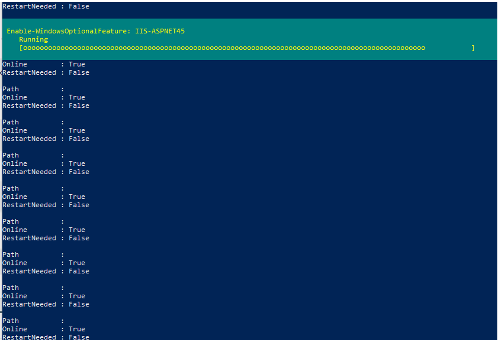
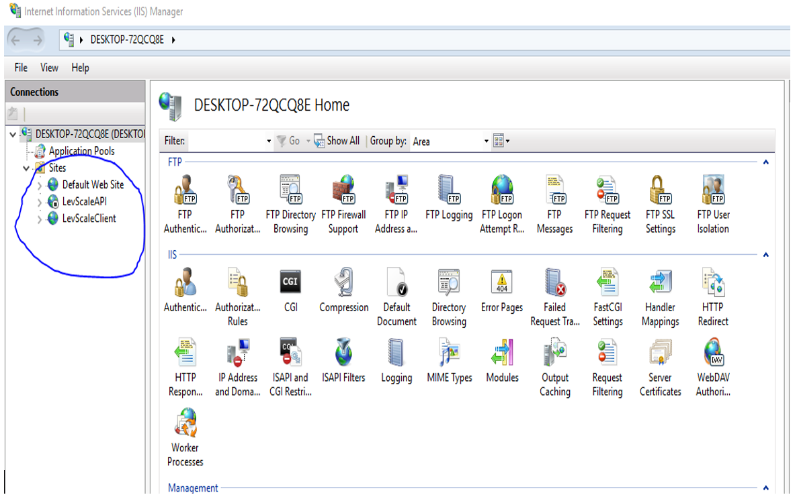

## Levridge Scale Installation

Copy the folder name 'LevridgeScaleHouse' from its current location. 

- Copy it to your computers C:Drive
- This will take around 15 to 30 minutes to complete.


Once copied, open PowerShell as an administrator.

- Run command:
```
   Cd C:\LevridgeScaleHouse\
```
- Next run command:
```
     .\ScaleHouseAppInstall.ps1 -installFullPackage $true
```
- If presented with an error stating 'cannot be loaded because running scripts is disabled on this system' then run command:
```
Set-ExecutionPolicy Unrestricted
[Y] for Yes
```
For the next step, run command:
```
.\ScaleHouseAppInstall.ps1 -installFullPackage $true
```
You will see a few errors depending on your system settings.

It should then bring you to a Microsoft SQL Server Installer.

- If installation should stop during SQL Server Installation. Run command:
```
Install-module-name SqlServer
[Y]
```
After this, you should be seeing Windows IIS features being enabled.


Once this has been completed, search IIS in Windows Search. Three sites should show:


Right click the Default Web Site. Select manage web site and stop web site.

The installations should enable two window services.

- Hardware
- LevScale Printer
- Eventually some integration service

The installation will turn on IIS, .Net, and SQL windows features.
The installation will also create App Pools along with websites to run the website server. You will need to setup websites to address them. 